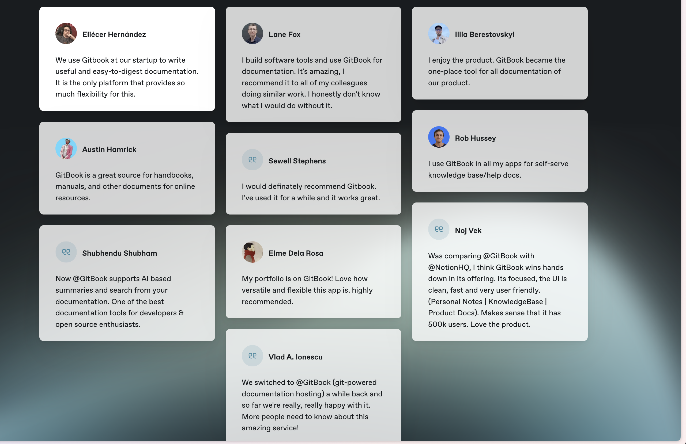

Gramax помогает IT-компаниям организовать контент в единый источник правды и поддерживать его актуальным. Технические специалисты, менеджеры, заказчики теперь могут совместно работать на единой платформе с открытым исходным кодом.

## Для чего нужен Gramax?

С помощью Gramax вы можете развернуть красивый веб-портал с документацией для вашего продукта или вашей компании. Это можно сделать быстро, бесплатно и в вашей инфраструктуре.

-  [icon:screen-share] Публичный портал документации

   Опубликуйте красивый и быстрый докпортал для вашего продукта, который полюбят пользователи.

   [Подробнее -->](./resheniya/publichnaya-dokumentaciya)

-  [icon:server] Передача документации заказчику

   Установите докпортал на сервер клиента вместе с вашим ПО. Обновляйте документацию на портале вместе с кодом.

   [Подробнее -->](./../../../../new-article/otchuzhdaemoe-po)

-  [icon:book-a] Внутренняя база знаний

   Создайте единый источник правды о процессах, системах и новостях для вашей компании.

   [Подробнее -->](./resheniya/baza-znaniy)

Перенесите документацию из Confluence и других систем в Gramax в несколько кликов.

[Узнать как -->](https://gram.ax/resources/docs/migration-confluence)

## Совместная работа

Создавайте альтернативные версии статей в ветках и согласуйте их с коллегами по простой ссылке. Коллеги смогут вносить правки и оставлять комментарии, а вы -- отслеживать и управлять изменениями.

## Редактор изображений

Добавляйте красивые аннотации, рамки, последовательности шагов и описания на скриншоты в едином стиле. С Gramax вам больше не нужна сторонняя программа для скриншотов, изображения можно обрезать сразу у нас в приложении. 

## Продвинутые диаграммы и OpenAPI

Редактор Gramax нативно поддерживает ключевые движки для построения диаграмм, которые версионируются вместе с текстом статей. А также поддерживает рендеринг спецификации OpenAPI в интерактивный интерфейс работы с вашим API.

-  Mermaid

-  PlantUML

-  Draw.io

-  Swagger

## Работайте с документацией как с кодом

Gramax работает в подходе Docs as Code. Вы можете редактировать статьи  в разметке Markdown и управлять документацией через VS Code, IntelliJ IDEA и другие среды разработки (IDE). Все изменения проходят через ваше Git-хранилище.

[О Docs as Code -->](./resheniya/docs-as-code)

## Бесплатная и корпоративная версия

-  Gramax -- это open source проект, который навсегда останется бесплатным и будет всегда получать новые функции.

-  Enterprise версия понадобится для более удобной работы на больших масштабах. [Подробнее -->](./dlya-biznesa)

## Gramax меняет работу с документацией

---

Вступайте в [сообщество Gramax в телеграм](https://t.me/gramax_chat), чтобы узнавать новости о проекте.

[Twitter](https://twitter.com/gram_ax)

[Telegram](https://t.me/gramax_chat)

[GitHub](https://github.com/Gram-ax/gramax)

---

[Реестр ПО](https://reestr.digital.gov.ru/reestr/2522994/?sphrase_id=4664373)