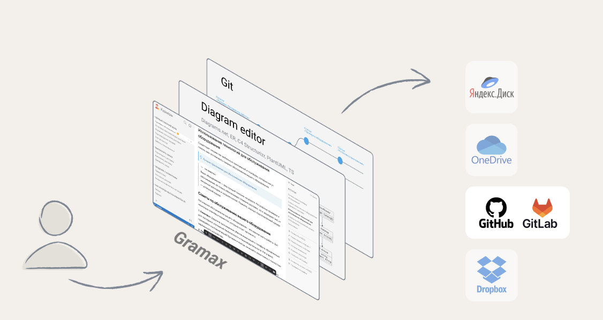
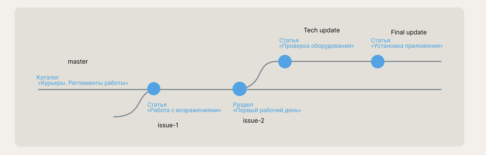
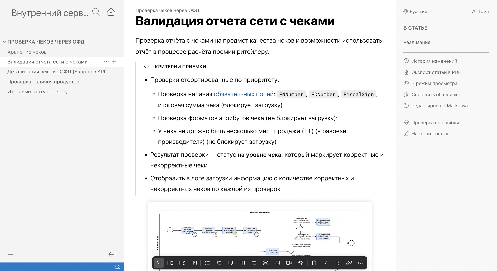
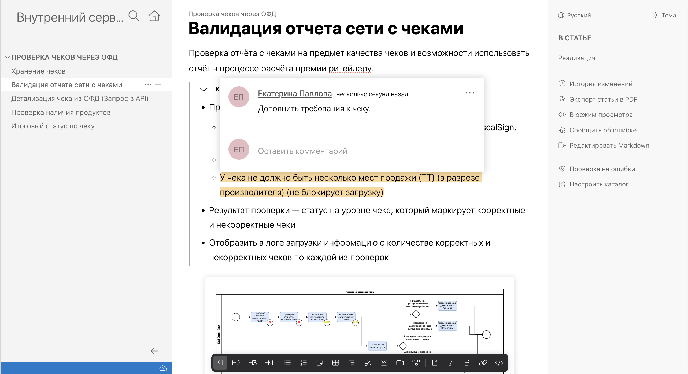
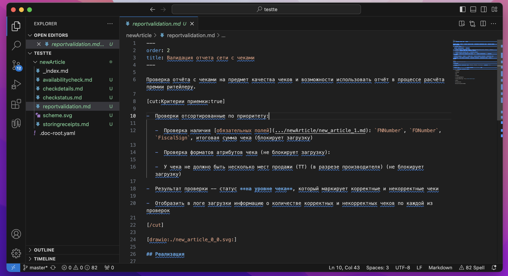
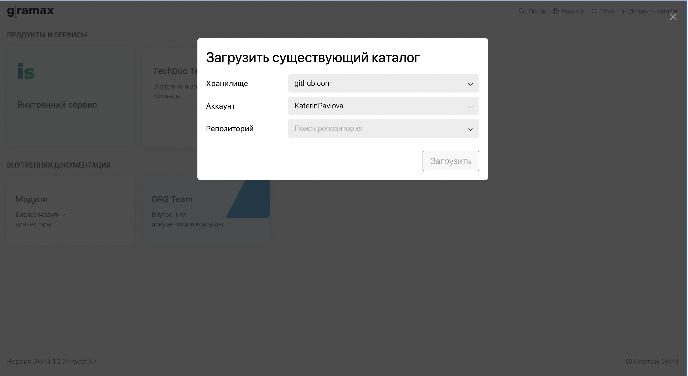
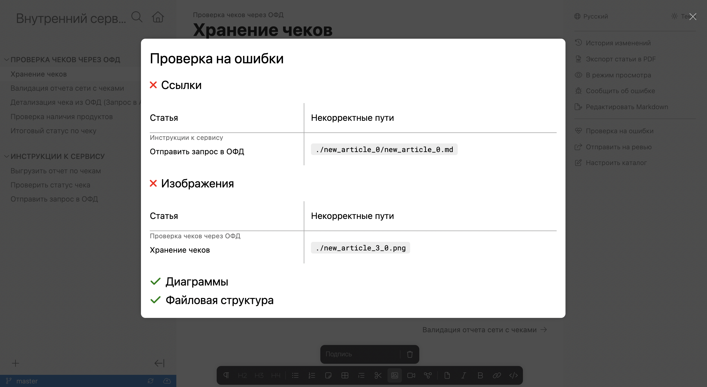
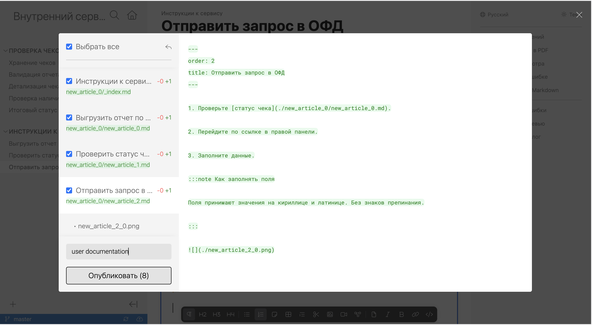
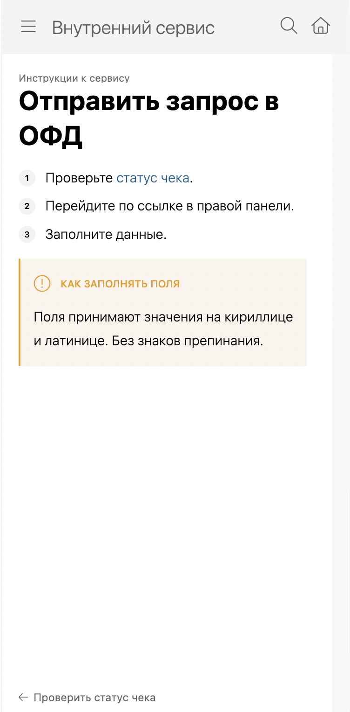
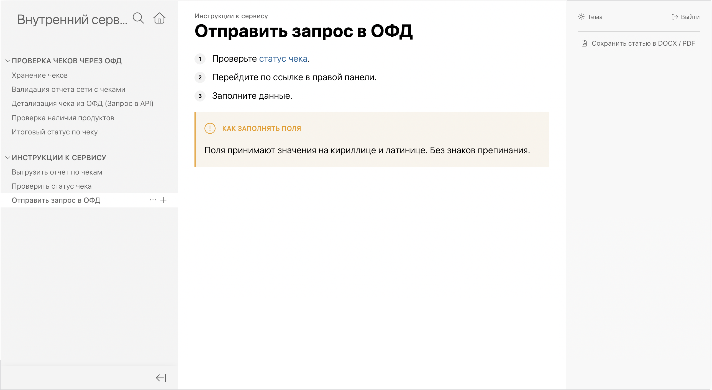

## О системе

-  Мы происследовали потребности и процессы работы в более чем 40 компаниях.

-  Изучили лучшие практики документирования систем на разных этапах.

-  Протестировали многие опенсурсные системы с подходом Docs-as-code.

-  Прочитали сотни статей о пользовательском опыте.

Все это -- чтобы разработать инструмент, совмещающий в себе лучшие инженерные практики и очевидный пользовательский интерфейс.

Основные возможности системы покажем на примере процесса подготовки документации по проекту.

## Задача

Представим, что перед департаментом стоит задача разработать внутренний сервис. Работать над документацией к этому сервису будут:

1. Аналитик. Готовит предпроектную документацию.

2. Разработчики. Сверяются и исправляют предпроектную документацию в ходе разработки.

3. Технический писатель. Готовит пользовательскую документацию.

Принимать результат будет бизнес-заказчик. Например, руководитель другого департамента.

## Этапы

### 1 этап. Создание репозитория проекта

Аналитик скачивает приложение Gramax или открывает его в браузере. Создает каталог с основной информацией о проекте -- например, с коротким описанием бизнес-потребности.

Затем подключает к приложению корпоративное хранилище (GitLab или GitHub) и создает репозиторий, который содержит только каталог с информацией о проекте.

:::note Кто имеет доступ к каталогу?

Вся логика приложения исполняется на компьютере или в браузере создателя каталога. Потому информация доступна исключительно аналитику. После публикации в хранилище каталог смогут просмотреть все, кто добавлен в репозиторий.

:::

### 2 этап. Создание ветки под задачу

Чтобы все новые документы были связаны с задачами, аналитик создает из основной ветки дополнительные. Например, для задачи ***ISSUE-1. Подготовка ТЗ*** создает ветку `issue-1`. Для этого не нужно переключаться в другой интерфейс -- все происходит в приложении.

### 3 этап. Оформление документа

Аналитик создает статью, в которой будет находиться информация по задаче. Затем наполняет ее контентом. Ему доступно:

-  Стандартные элементы оформления: заголовки, списки, примечания, скрываемые блоки текста.

-  Оформление кода с подсветкой синтаксиса.

-  Добавление и редактирование диаграмм:

   -  PlantUML, C4 -- редактируются в интерфейсе приложения с помощью puml и yaml соответственно.

   -  [Draw.io](http://Draw.io) -- редактируются в стандартном редакторе, также в интерфейсе приложения.

-  Переиспользуемые блоки. Аналитик создает в одном месте блок информации, а затем добавляет его в другие файлы.

-  Описание схемы базы данных и OpenApi. Аналитик создает yaml-файлы и добавляет их в статьи.

### 4 этап. Ревью документа

Аналитик публикует изменения в репозиторий и переходит к этапу ревью.

-  Если ревью требуется от коллеги -- предлагает ему склонировать репозиторий в Gramax у себя на компьютере.

-  Если ревью требуется от бизнес-заказчика -- формирует ссылку на ревью. По ней у ревьюера автоматически откроется браузерная версия Gramax и загрузится репозиторий на выбранной ветке, доступ в хранилище ему не понадобится. Он сможем вносить и публиковать любые изменения, но переключиться на другую ветку или смержить их -- нет.

Ревьюеры оставляют свои комментарии и публикуют их. Аналитик синхронизирует изменения и вносит исправления.

### 5 этап. Разработка по документу

Когда вся проектная документация готова, разработчик начинает работу в репозитории, который создал аналитик. Так как все файлы хранятся в Markdown, разработчик просматривает и дополняет их в своей среде разработки -- переключаться в приложение для этого не нужно.

### 6 этап. Подготовка пользовательской документации

Когда внутренний сервис готов, к процессу подключается технический писатель. Он также скачивает приложение Gramax или открывает его в браузере, а затем клонирует репозиторий.

:::note Все каталоги в одном месте

В Gramax нет ограничения на количество склонированных каталогов и количество подключенных хранилищ. Технический писатель может работать в каждом из них параллельно.

:::

Технический писатель пишет пользовательскую документацию или переоформляет проектную. Для этого использует те же инструменты оформления и ревью.

### 7 этап. Проверка пользовательской документации

Технический писатель проверяет, работают ли ссылки, отображаются ли картинки и диаграммы.

(Скоро) Также проверяет тексты на соответствие стайлгайду.

### 8 этап. Публикация документации на статический сайт

Технический писатель настраивает доступ на каталог -- указывает, какие группы из Active Directory смогут просматривать статьи. Затем публикует репозиторий на Gramax static website. 

\
После этого каталог становится доступен не только редакторам и ревьюерам, но и читателям без доступа к репозиторию.

## Ближайшие планы

До конца 2023:

-  Ссылка на ревью с зашифрованным токеном на раздел каталога или статью.

-  Докер-образ для разворачивания внешнего портала на собственном сервере.

-  Уведомления об изменениях в каталоге и подсветка узлов навигации.

-  Стабилизация приложений.

-  Передача приложений в open source.

1 квартал 2024:

-  Настраиваемые проверки на соответствие стайлгайду компании.

-  Подсветка изменений в тексте статьи после синхронизации.

-  Подключение новых хранилищ: Яндекс.Диск, Google.Drive.

-  Редактор скриншотов.

-  Публикация мобильных приложений в магазины приложений.

## Лицензии Gramax Enterprise Server (по подписке)



---

*  Лицензия «Редактор» – 1500 ₽ \
   за 1 пользователя в месяц

   Редактор пишет, публикует и проводит ревью статей.\
   Функция «Ссылка на ревью» не требует лицензий.

*  Лицензия «Читатель» – 0 ₽ \
   за пользователя в месяц

   Читатель просматривает статьи на веб-портале.



## Лицензии Gramax Enterprise Server (Stand alone)



---

*  

   Лицензия «Редактор» – 54 000 ₽ \
   за 1 пользователя в год

   Редактор пишет, публикует и проводит ревью статей.\
   Функция «Ссылка на ревью» не требует лицензий.

   \
   Продление срока предоставления обновлений и гарантии на год -- 25% от стоимости приобретенных лицензий по действующему прайс-листу.

*  Лицензия «Читатель» – 0 ₽ \
   за пользователя в месяц

   Читатель просматривает статьи на веб-портале.



## Политика лицензирования



---

*  По подписке:

   -  Закупается минимум 10 лицензий с возможностью докупить дополнительные по мере необходимости.

   -  Право пользования предоставляется на оплаченный период.

   -  Обновления ПО предоставляются бесплатно, в рамках оплаченного периода.

*  Stand alone:

   -  Закупается минимум 30 лицензий с возможностью докупить дополнительные по мере необходимости.

   -  Право использования не ограничено по времени.

   -  Обновления ПО предоставляются бесплатно в течение года после первой покупки и требуют дополнительной оплаты начиная со второго года.

