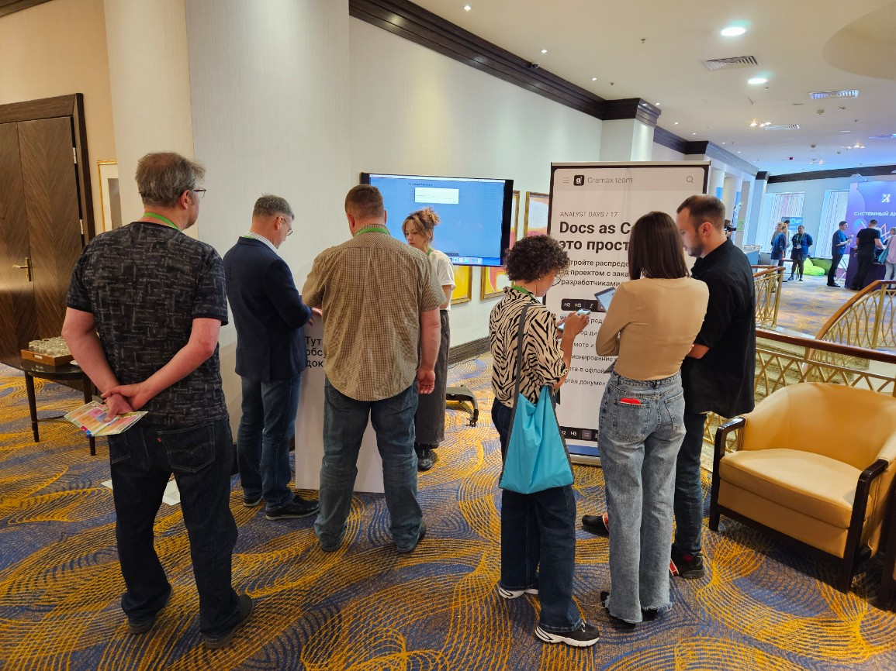
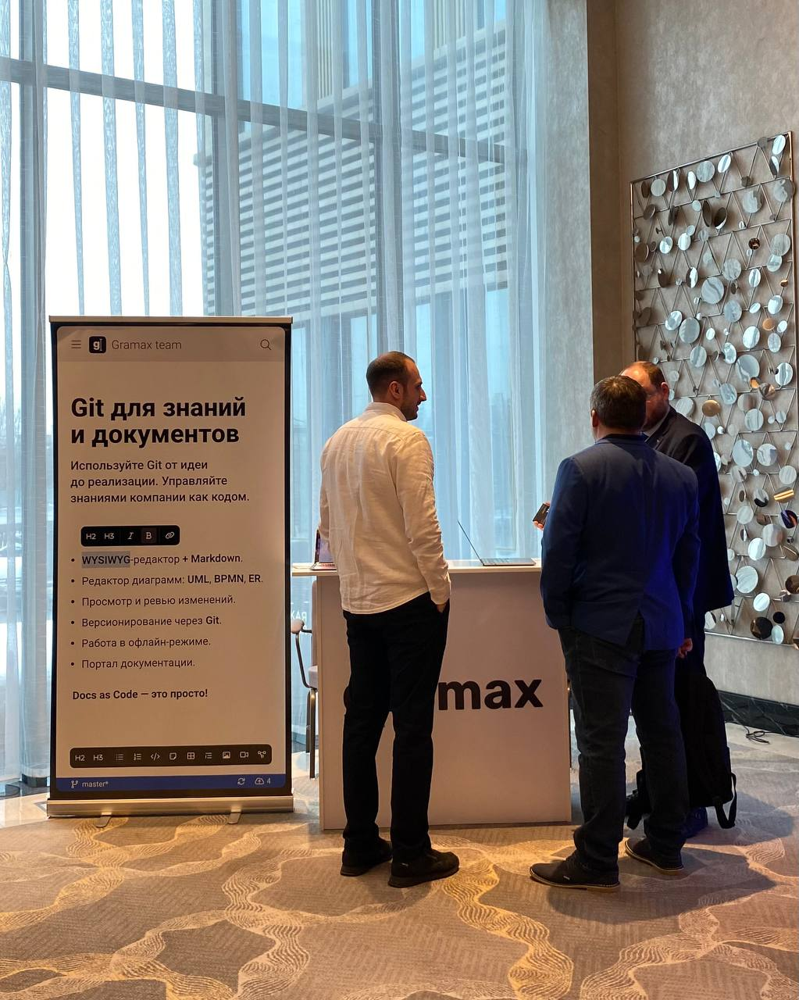
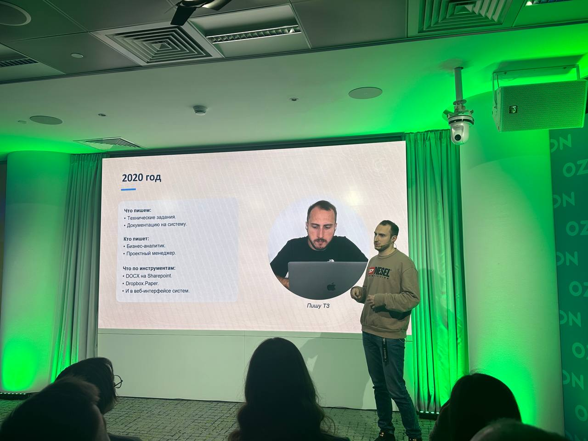
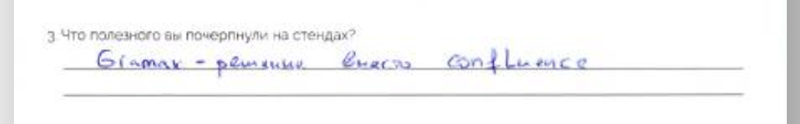
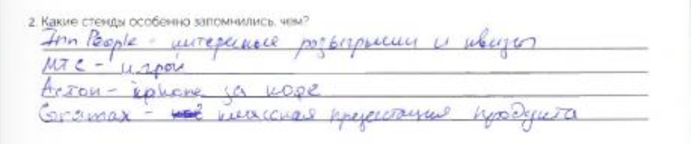
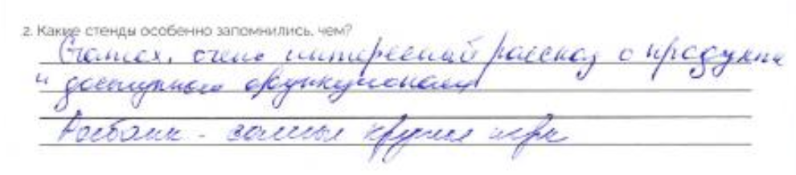

Gramax -- это бесплатный текстовый редактор для создания порталов документации, баз знаний, техзаданий и других документов.

Gramax помогает реализовать подход Docs as Code в работе, т.е. использовать лучшие инженерные практики для работы с коллегами и заказчиками.

Исходный код выложен в open source.

### Что нам необходимо

-  Небольшое место под стенд из роллапа, стойки и 2 участников.

-  Упоминание Gramax в постах в социальных сетях.

-  Если необходимо, готовы подготовить интересный доклад. Нам есть что рассказать :)

Бюджет -- 200 000₽.

### Плюсы от парнёрства

Участники запомнят, что на вашей конференции узнали о Gramax, так как:

-  Мы эксперты, мы готовимся и интересно рассказываем о продукте.

-  Подход Docs as Code сейчас в тренде, но аналогов Gramax в России и за её пределами нет.

-  Показываем систему на стенде и участники могут сразу же начать ей пользоваться уже со своих устройств.

И поэтому вокруг нашего стенда всегда очередь и он не затеряется среди остальных.

### 

## Отзывы о нашем стенде и о нас

---

Telegram, Twitter, GitHub

<https://gram.ax>

ОГРН: 1237700526249