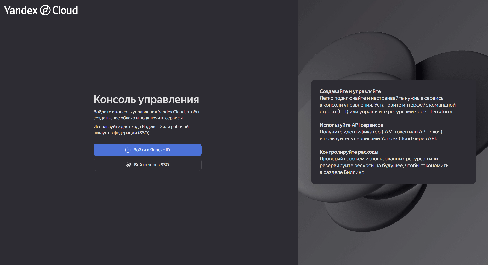
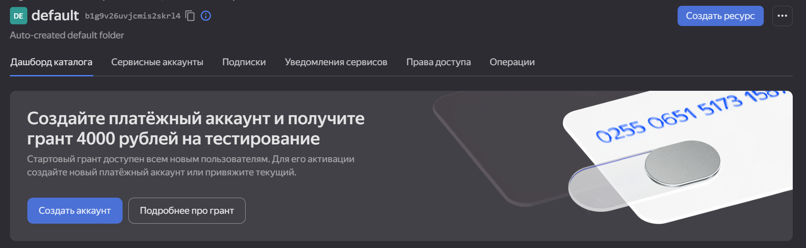
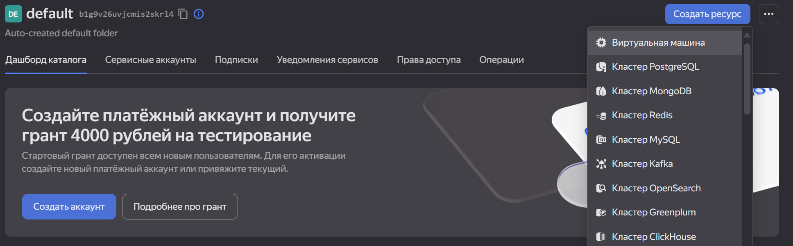

### Создание виртуальной машины в Yandex Cloud

1. [Войти в аккаунт яндекса и создать платежный аккаунт для Yandex Cloud](https://cloud.yandex.ru/ru/docs/getting-started/individuals/registration).

   

   

2. Создайте ресурс *Виртуальная машина*.

   

3. Настройки операционной системы, дисков, вычислительных ресурсов можно оставить без изменений. Или [скорректировать на свое усмотрение](https://cloud.yandex.ru/ru/docs/compute/quickstart/quick-create-linux).

4. Задать любое имя и сгенерировать SSH-ключ.

   ```
   ssh-keygen -t ed25519 -f ~/.ssh/yandex_cloud_gramax
   ```

5. Нажмите *Создать ВМ*.

### Установка docker на виртуальную машину

1. Скопировать ip адрес из настроек виртуальной машины.

2. Подключение к виртуальной машине, используя `ssh {логин из настроек доступа ВМ}@{скопированный ip адресс} -i {путь до SSH-ключа}`. Например -- `ssh admin@158.160.128.224 -i ~/.ssh/yandexcloud`.

3. Установка `docker`, `docker compose` и зависимости для них командой

   ```
   sudo apt install docker.io docker-compose-v2 dbus-user-session uidmap
   ```

4. Перевод докера в rootless режим (следующие 3 шага можно заменить на использование `sudo -E` перед каждой командой докера)

   ```bash
   curl -fsSL https://get.docker.com/rootless | sh
   ```

5. Разрешение использования докером портов ниже 1024

   ```bash
   sudo setcap cap_net_bind_service=ep $(which rootlesskit)
   ```

6. Перезапуск докера для применения изменений

   ```
   systemctl --user restart docker
   ```

### Установка портала для чтения Gramax

1. Разверните Gramax  [по инструкции](https://gram.ax/resources/docs/quick-start).

2. Откройте портал по пути `http://{ip адрес}:{PORT}/admin` (например -- `http://158.160.128.224:1025/admin`) и введите логин и пароль из настроек переменных среды.

3. Подключите хранилище и загрузите каталоги для чтения. Они будут доступны по ссылке `http://{ip адрес}:{PORT}/` (например -- `http://158.160.128.224:1025/`).