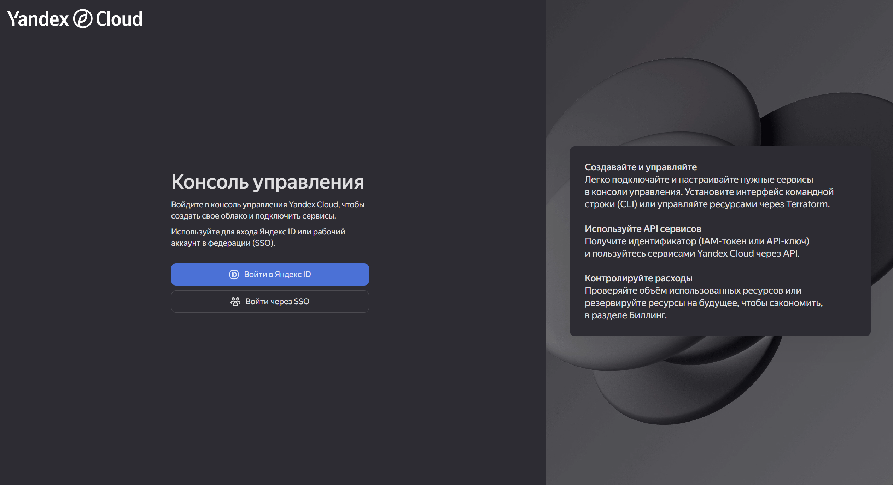
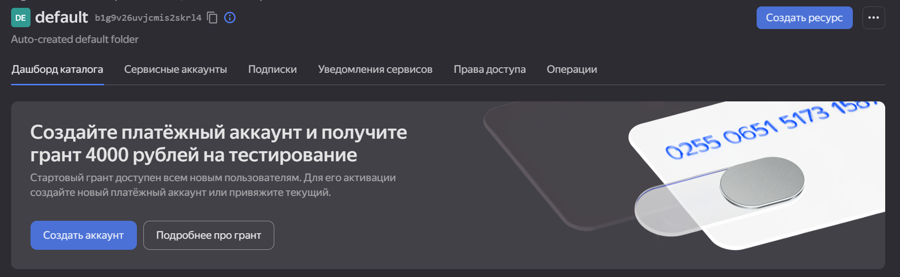
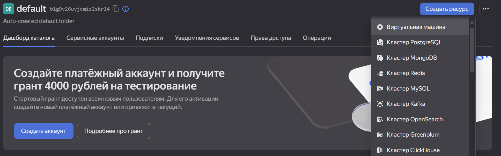
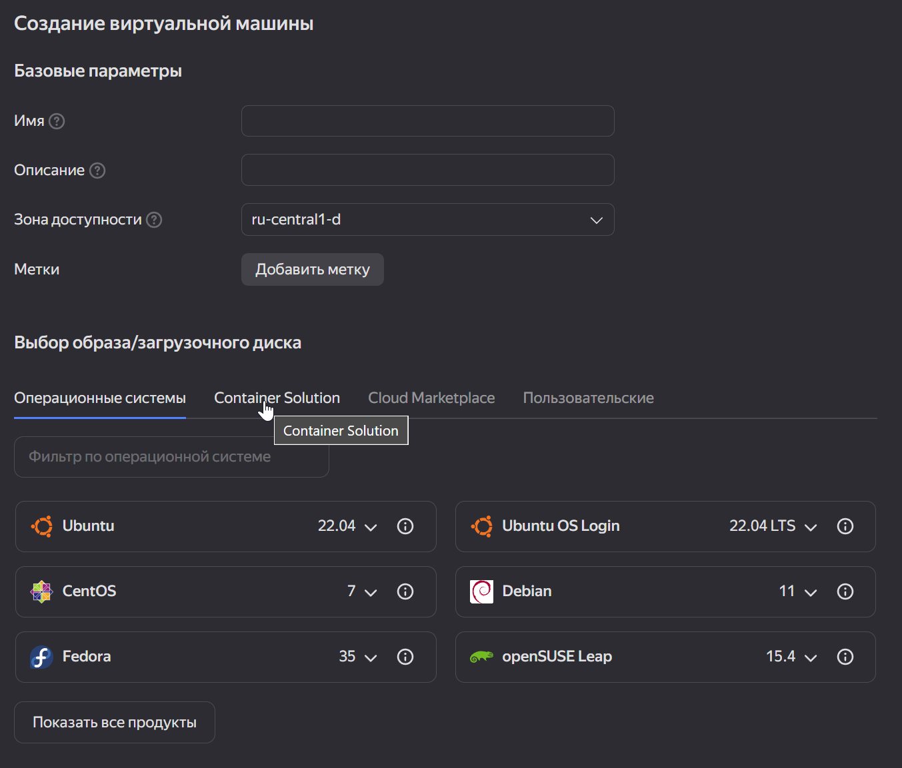
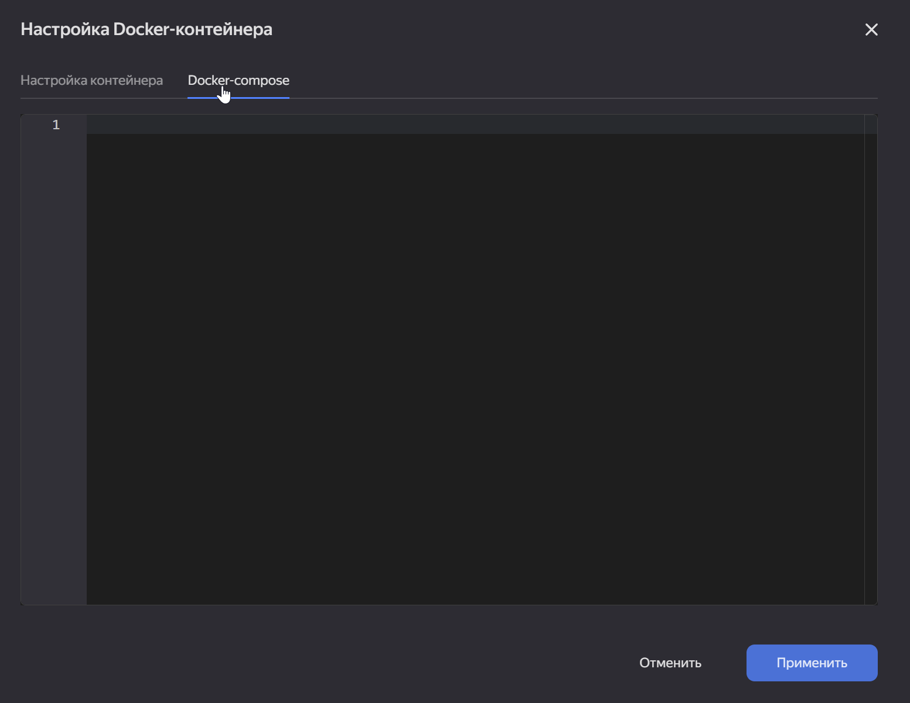
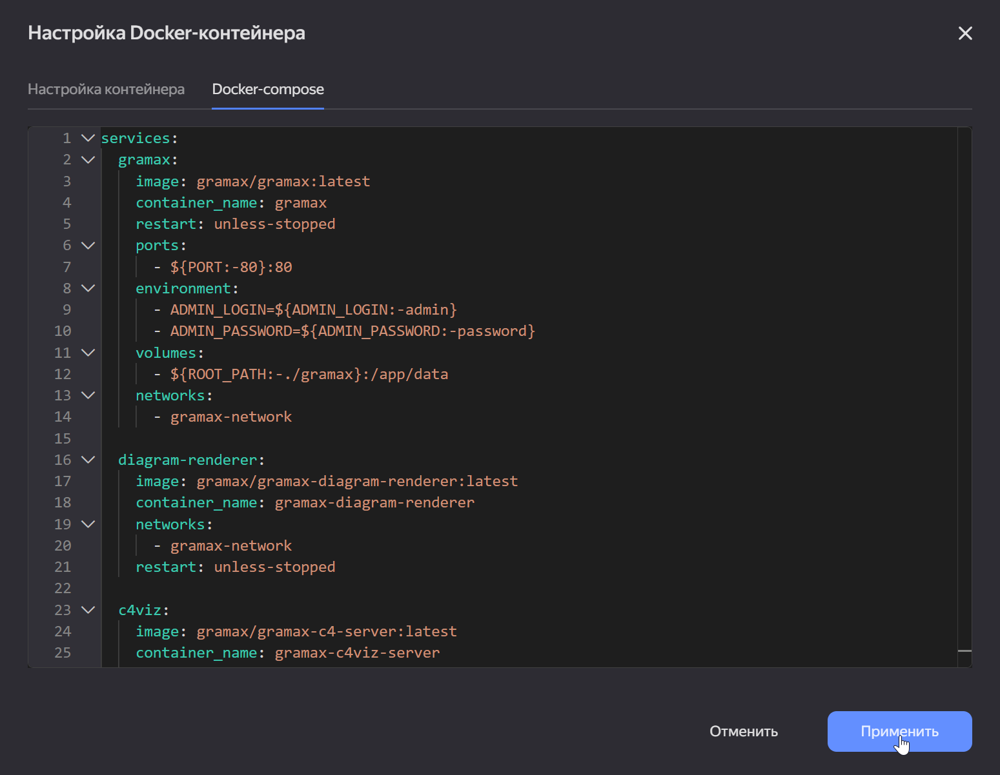
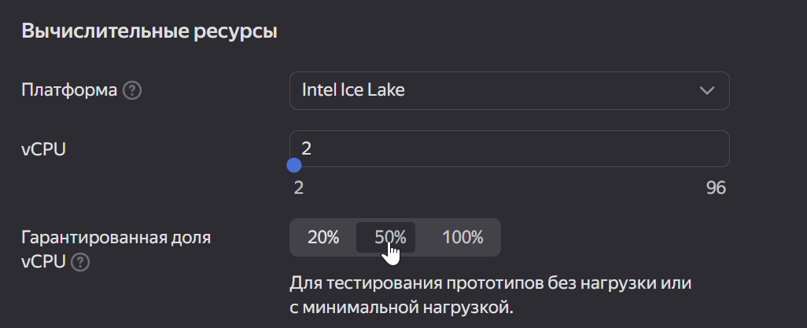

### Создание виртуальной машины в Yandex Cloud

1. Войти в свой яндекс аккаунт для yandex cloud'а

   

2. Создать платежный аккаунт

   

3. Создать ресурс “виртуальная машина”

   

4. Выбрать пункт “container solution”

   

5. Загрузить `docker-compose.yaml` в меню настройки `container solution` (docker-compose находится в [gram.ax/docker-compose.ya-cloud.yaml](http://gram.ax/docker-compose.ya-cloud.yaml)) и заменить необходимые параметры

   

   

6. (Опционально) Можно понизить гарантированную долю vCPU, чтобы снизить стоимость машины

   

7. Создать виртуальную машину

8. Зайти по ip адресу

   ```
   http://{ip адрес}:{порт}/
   ```


Не нужно

1. Создать ssh-ключ для входа ***(нужно узнать надо ли это для докер контейнеров*** 🤔)

   Пример команды для генерации ключа:

   ```
   ssh-keygen -t ed25519 -f ~/.ssh/yandex_cloud_gramax
   ```

   Где, `~/.ssh/yandex_cloud_gramax`  - имя ключа и путь куда сохранить файл с ключом

2. Скопировать ssh-ключ

   ```
   cat ~/.ssh/yandex_cloud_gramax.pub | clip
   ```