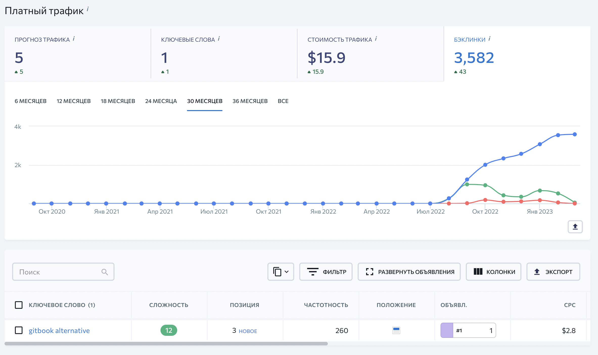
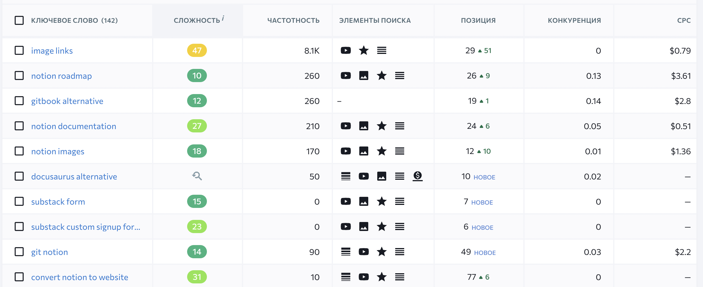
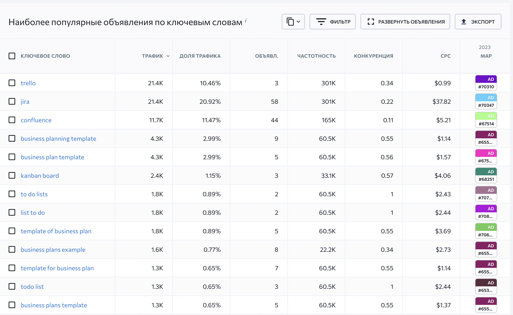
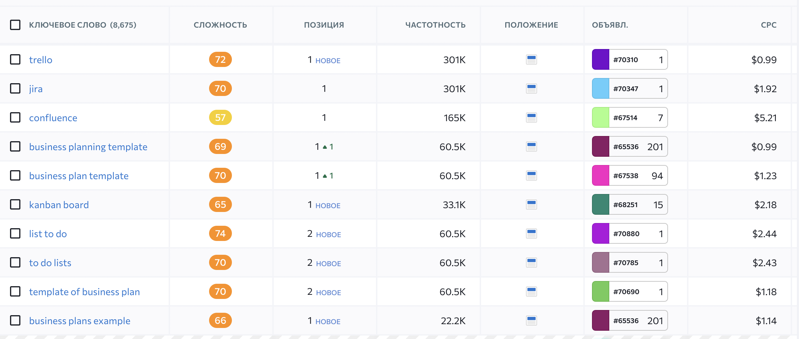
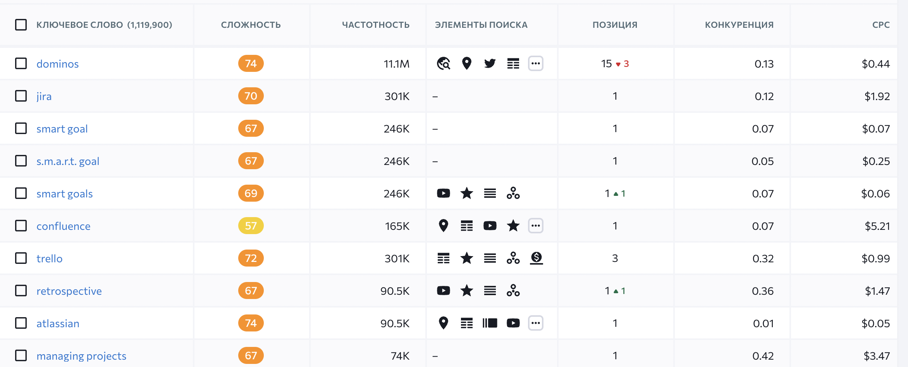
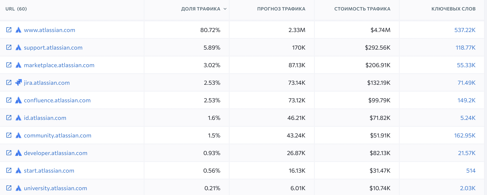
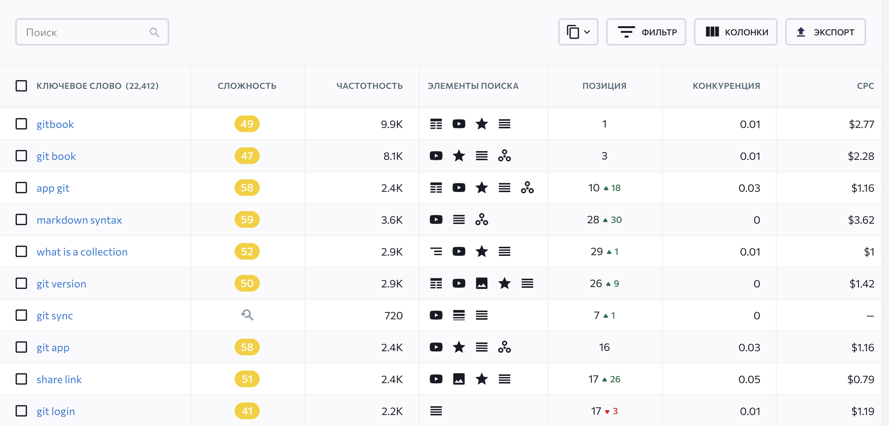
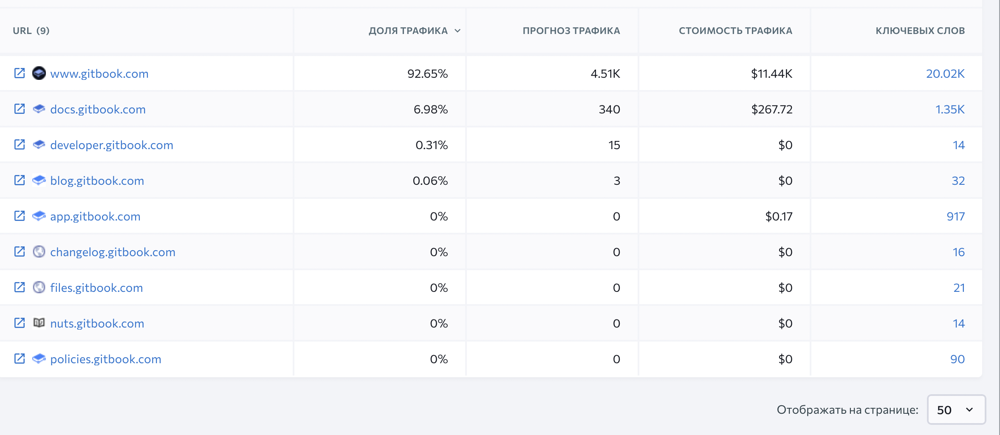
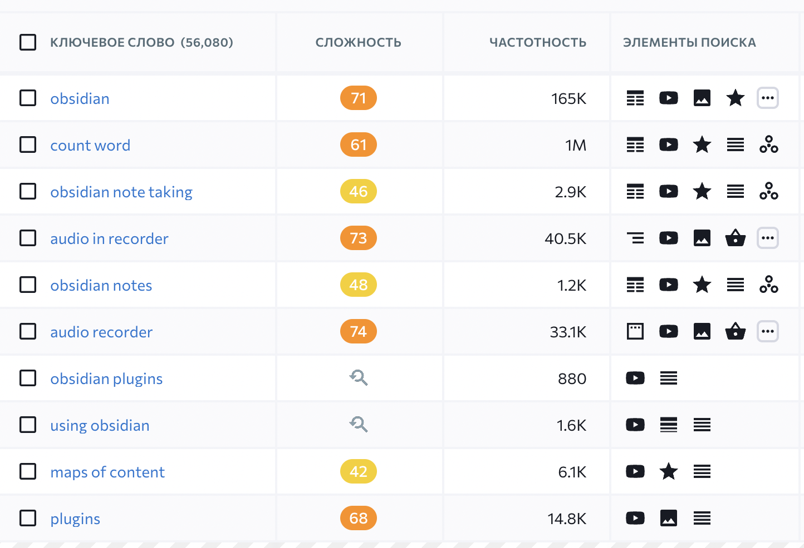
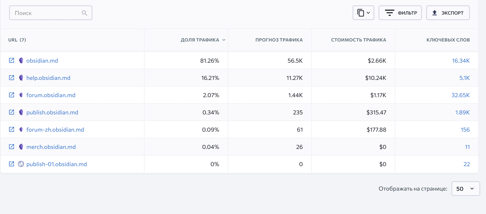

Ресурсы:

-  Статистика -- [https://ahrefs.com/ru/backlink-checker ](https://ahrefs.com/ru/backlink-checker)

-  Бэклинки -- [https://online.seranking.com/research.competitor.html/](https://online.seranking.com/research.competitor.html/?input=obsidian.md&mode=base_domain&source=worldwide&globalRegion=worldwide)

## Notaku

Это генератор из страниц в пейпере -- <https://notaku.so/>

-  Пытаются продвигаться как альтернатива гитбука:

   

-  Также есть органический трафик альтернатив:

   

-  Лендингов других нет.

-  В списке конкурентов есть похожие инструменты:

   -  <https://super.so/>

   -  [https://www.](https://www.notioneverything.com/)[simple.ink](http://simple.ink)[/](https://www.notioneverything.com/)

### Бэклинки

-  Рейтинг домена -- 44.

-  Бэклинки -- 4.6 тыс.

-  Ссылающиеся веб-сайты -- 246. В табличке ниже самые популярные.



---

*  

   #### **DR**

*  

   #### **Ссылающаяся страница**

*  

   #### **Анкор и целевой URL**

---

*  13

*  [Військові звання ЗСУ - база знань для військової підготовки](https://jablunia.org/vijskovi-zvannya-zsu-86122eb43135459189d6fe2c24904bd4)

   <https://jablunia.org/vijskovi-zvannya-zsu-86122eb43135459189d6fe2c24904bd4>

*  [Notaku](https://notaku.so/)

   <https://notaku.so/>

---

*  52

*  [The Complete Notion API Crash Course for Beginners](https://thomasjfrank.com/notion-api-crash-course/)

   <https://thomasjfrank.com/notion-api-crash-course/>

*  website (like Braydon Coyer does – though you can also use [Notaku](https://notaku.so/) for this instead of building a site from scratch)

   <https://notaku.so/>

---

*  33

*  [Free Developer Stuff](https://freestuff.dev/)

   <https://freestuff.dev/>

*  Alternatives Edit [Visit Link](https://notaku.so/?ref=freeStuffDev)

   <https://notaku.so/?ref=freeStuffDev>

---

*  2

*  [Qu'est-ce qu'un data Layer (Google Tag Manager) - UnNest](https://insights.unnest.co/dossiers-par-cas-d'usage/plan-de-taggage/qu'est-ce-qu'un-data-layer-(google-tag-manager))

   <https://insights.unnest.co/dossiers-par-cas-d'usage/plan-de-taggage/qu'est-ce-qu'un-data-layer-(google-tag-manager)>

*  [Notaku](https://notaku.so/?via=nicolas)

   <https://notaku.so/?via=nicolas>

---

*  54

*  [Notaku - Build Your Docs and KnowledgeBase Sites With Notion](https://pitchground.com/products/notaku)

   <https://pitchground.com/products/notaku>

*  <https://notaku.website/>

   [https://notaku.website/\[br\]301](https://notaku.website/%EF%BF%BC301) <https://notaku.so/>

---

*  90

*  [Notion Icons Generator - Product Information, Latest Updates, and Reviews 2022 | Product Hunt](https://www.producthunt.com/products/notion-icons-generator)

   <https://www.producthunt.com/products/notion-icons-generator>

*  [Visit website](https://notaku.so/notion-icons-generator?ref=producthunt)

   <https://notaku.so/notion-icons-generator?ref=producthunt>

---

*  8

*  [Markdown, Asciidoc, or reStructuredText - a tale of docs-as-code - Dewan’s Blog](https://www.dewanahmed.com/markdown-asciidoc-restructuredtext/)

   <https://www.dewanahmed.com/markdown-asciidoc-restructuredtext/>

*  Besides these five frameworks, [Notaku](https://notaku.so/) gets an honorable mention that uses Notion as CMS to

   <https://notaku.so/>



## Confluence

-  Сайт один для всех продуктов, продвигаются разные страницы. Вот статистика:

   

-  Ключевые слова платного трафика:

   

-  Ключевые слова органического:

   

-  Лендингов других нет. Поддомены:

   

### Бэклинки



---

*  

   #### Рейтинг домена

*  

   #### **Ссылающаяся страница**

*  

   #### **Анкор и целевой URL**

---

*  93

*  [Windows 10 Activator Free Download For 32-64Bit \[April 2021\] - Apache Trafodion - Apache Software Foundation](https://cwiki.apache.org/confluence/pages/viewpage.action?pageId=181306341)

   <https://cwiki.apache.org/confluence/pages/viewpage.action?pageId=181306341>

*  Powered by [Atlassian Confluence](https://www.atlassian.com/software/confluence)

   <https://www.atlassian.com/software/confluence>

---

*  73

*  [Best Skills for Your Resume (Examples + How to List)](https://resumegenius.com/blog/resume-help/skills-for-resume)

   <https://resumegenius.com/blog/resume-help/skills-for-resume>

*  ( Microsoft Project , [Confluence](https://www.atlassian.com/software/confluence) )

   <https://www.atlassian.com/software/confluence>

---

*  68

*  [Tooth vs. Teeth - Dentistry Clinical Reference Group - SNOMED Confluence](https://confluence.ihtsdotools.org/display/DT/Tooth+vs.+Teeth)

   <https://confluence.ihtsdotools.org/display/DT/Tooth+vs.+Teeth>

*  Powered by [Atlassian Confluence](https://www.atlassian.com/software/confluence)

   <https://www.atlassian.com/software/confluence>

---

*  67

*  [Bejelentkezés a KRÉTA rendszerbe - KRÉTA - KRÉTA Tudásbázis](https://tudasbazis.ekreta.hu/pages/viewpage.action?pageId=2425346)

   <https://tudasbazis.ekreta.hu/pages/viewpage.action?pageId=2425346>

*  Támogatja az [Atlassian Confluence](https://www.atlassian.com/software/confluence)

   [http://www.atlassian.com/software/confluence\[br\]301](http://www.atlassian.com/software/confluence%EF%BF%BC301) <https://www.atlassian.com/software/confluence>

---

*  91

*  [Bitbucket Overview | Bitbucket](https://bitbucket.org/product/guides/getting-started/overview)

   <https://bitbucket.org/product/guides/getting-started/overview>

*  \* Integrates easily with Jira Software , [Confluence](https://www.atlassian.com/software/confluence) and Bamboo

   <https://www.atlassian.com/software/confluence>

---

*  79

*  [Harmonic Balance Basics - ADS 2009 - Keysight Knowledge Center](https://edadocs.software.keysight.com/display/ads2009/Harmonic+Balance+Basics)

   <https://edadocs.software.keysight.com/display/ads2009/Harmonic+Balance+Basics>

*  Powered by [Atlassian Confluence](http://www.atlassian.com/software/confluence)

   <http://www.atlassian.com/software/confluence>

---

*  89

*  [The Power of Figma as a Design Tool | Toptal®](https://www.toptal.com/designers/ui/figma-design-tool)

   <https://www.toptal.com/designers/ui/figma-design-tool>

*  is needed in bug tracking tools and community software like [Confluence](https://www.atlassian.com/software/confluence) or SharePoint .

   <https://www.atlassian.com/software/confluence>

---

*  86

*  [How to Create a Wiki - Collecting and Sharing Knowledge at Work](https://www.mindtools.com/aqhifgz/how-to-create-a-wiki)

   <https://www.mindtools.com/aqhifgz/how-to-create-a-wiki>

*  wikis on your existing servers. Other services, like the paid-for [Confluence](https://www.atlassian.com/software/confluence) , host your wiki pages on their own systems.

   <https://www.atlassian.com/software/confluence>

---

*  96

*  [What is eSignature](https://ec.europa.eu/digital-building-blocks/wikis/display/DIGITAL/What+is+eSignature)

   <https://ec.europa.eu/digital-building-blocks/wikis/display/DIGITAL/What+is+eSignature>

*  Powered by [Atlassian Confluence](http://www.atlassian.com/software/confluence)

   <http://www.atlassian.com/software/confluence>

---

*  73

*  [Best Mac apps I can't live without in 2023 (OS + app tweaks)](https://woorkup.com/best-mac-apps/)

   <https://woorkup.com/best-mac-apps/>

*  documentation in regards to my business, I also heavily use [Confluence](https://www.atlassian.com/software/confluence) . They don’t have a Mac app yet, but there

   <https://www.atlassian.com/software/confluence>

---

*  73

*  [Technical Documentation in Software Development: Types and Tools | AltexSoft](https://www.altexsoft.com/blog/business/technical-documentation-in-software-development-types-best-practices-and-tools/)

   <https://www.altexsoft.com/blog/business/technical-documentation-in-software-development-types-best-practices-and-tools/>

*  documentation example: One web-page software requirements document created by using [Atlassian Confluence](https://www.atlassian.com/software/confluence) , the content collaboration software

   <https://www.atlassian.com/software/confluence>

---

*  78

*  [How to Become a Freelance Web Developer in 2023](https://careerfoundry.com/en/blog/web-development/freelance-web-developer/)

   <https://careerfoundry.com/en/blog/web-development/freelance-web-developer/>

*  [Confluence](https://www.atlassian.com/software/confluence)

   <https://www.atlassian.com/software/confluence>



## GitBook

-  Оплаченная реклама -- 0 за 30 месяцев.

-  Ключевые слова в поиске:

   

-  Лендингов других нет. Поддомены:

   

### Бэклинки

1. Рейтинг домена -- 91.

2. Бэклинки -- 11 млн.

3. Ссылающиеся веб-сайты -- 48 тыс. В табличке ниже самые популярные.



---

*  

   #### Рейтинг домена

*  

   #### **Ссылающаяся страница**

*  

   #### **Анкор и целевой URL**

---

*  91

*  [What is a wiki? – TechTarget Definition](https://www.techtarget.com/whatis/definition/wiki)

   <https://www.techtarget.com/whatis/definition/wiki>

*  [GitBook](https://www.gitbook.com/)

   <https://www.gitbook.com/>

---

*  66

*  [Membuat Room Google Meet · Panduan PPG DALJAB -Untuk Guru Pamong dan Dosen](https://bantuan.simpkb.id/books/simpkb-ppgdaljab-gurupamong-dosen/ch03/3-2-membuat-room-google-meet.html)

   <https://bantuan.simpkb.id/books/simpkb-ppgdaljab-gurupamong-dosen/ch03/3-2-membuat-room-google-meet.html>

*  [Published with GitBook](https://www.gitbook.com/)

   <https://www.gitbook.com/>

---

*  86

*  [webpack](https://webpack.js.org/)

   <https://webpack.js.org/>

*  [GitBook's avatar](https://www.gitbook.com/)

   <https://www.gitbook.com/>

---

*  96

*  [DuckDuckGo - Wikipedia](https://en.wikipedia.org/wiki/DuckDuckGo)

   <https://en.wikipedia.org/wiki/DuckDuckGo>

*  ["What Type of Instant Answer"](https://app.gitbook.com/o/-LX-fJ-NRlJ71b-qb5Aq/s/-LX-fJ11XvRK1_s-SckC/determining-ia-type) .DuckDuckHack Docs

   [https://duckduckhack.gitbook.io/duckduckhack-docs/determining-ia-type\[br\]302](https://duckduckhack.gitbook.io/duckduckhack-docs/determining-ia-type%EF%BF%BC302) <https://app.gitbook.com/o/-LX-fJ-NRlJ71b-qb5Aq/s/-LX-fJ11XvRK1_s-SckC/determining-ia-type>

---

*  63

*  [Project V · Project V 官方网站](https://www.v2ray.com/)

   <https://www.v2ray.com/>

*  [本書使用 GitBook 釋出](https://www.gitbook.com/)

   <https://www.gitbook.com/>

---

*  74

*  [Webmail - Panel Ferozo | Hosting](https://ayuda-panel-ferozo.ferozo.com/email/usar-mi-correo-desde/webmail)

   <https://ayuda-panel-ferozo.ferozo.com/email/usar-mi-correo-desde/webmail>

*  [Accionado por GitBook](https://www.gitbook.com/)

   <https://www.gitbook.com/>

---

*  65

*  [Rocketfy | La mejor solución para vender en internet](https://www.rocketfy.co/)

   <https://www.rocketfy.co/>

*  [API Docs v1](https://app.gitbook.com/@rocketfy-1/s/api-publica/)

   <https://app.gitbook.com/@rocketfy-1/s/api-publica/>

---

*  37

*  [Just Delete Me | A directory of direct links to delete your account from web services.](https://justdeleteme.xyz/)

   <https://justdeleteme.xyz/>

*  [GitBook URL](https://app.gitbook.com/account)

   <https://app.gitbook.com/account>

---

*  55

*  [Make a README](https://www.makeareadme.com/)

   <https://www.makeareadme.com/>

*  [GitBook](https://www.gitbook.com/)

   <https://www.gitbook.com/>

---

*  90

*  [Чари ночі - Лайфхаки з української літератури](https://edera.gitbook.io/lit-lifehacks/rozdil-8/chary)

   <https://edera.gitbook.io/lit-lifehacks/rozdil-8/chary>

*  [Powered By GitBook](https://www.gitbook.com/)

   <https://www.gitbook.com/>



## Obsidian

Смотрела тут -- [https://online.seranking.com/research.competitor.html/](https://online.seranking.com/research.competitor.html/?input=obsidian.md&mode=base_domain&source=worldwide&globalRegion=worldwide)

-  Оплаченная реклама -- 0 за 30 месяцев

-  Ключевые слова в поиске:

   

-  Лендингов других нет. Поддомены:

   

### Бэклинки

-  Рейтинг домена 77

-  Бэклинки 112тыс.

-  Ссылающиеся веб-сайты 8.9тыс. В табличке ниже самые популярные.



---

*  

   #### Рейтинг домена

*  

   #### **Ссылающаяся страница**

*  

   #### **Анкор и целевой URL**

---

*  91

*  [The 6 best note taking apps in 2023 | Zapier](https://zapier.com/blog/best-note-taking-apps/)

   <https://zapier.com/blog/best-note-taking-apps/>

*  [Obsidian](https://obsidian.md/) (Android, iOS, macOS, Windows, Linux)

   <https://obsidian.md/>

---

*  85

*  [The 14 Best Free Note Taking Apps to Use in 2023 | ClickUp](https://clickup.com/blog/note-taking-apps/)

   <https://clickup.com/blog/note-taking-apps/>

*  [Obsidian](https://obsidian.md/) is a note-taking and knowledge management app that runs as

   <https://obsidian.md/>

---

*  96

*  [Markdown - Wikipedia](https://en.wikipedia.org/wiki/Markdown)

   <https://en.wikipedia.org/wiki/Markdown>

*  ["Obsidian"](https://obsidian.md/) .[obsidian.md](http://obsidian.md). Archived from the original on 2022-07-12

   <https://obsidian.md/>

---

*  76

*  [17 Best Note Taking Apps Of 2023 | Free & Paid Tools](https://hive.com/blog/best-note-taking-apps/)

   <https://hive.com/blog/best-note-taking-apps/>

*  [Obsidian](https://obsidian.md/)

   <https://obsidian.md/>

---

*  72

*  [The 11 Best Note-Taking Apps in 2023: Evernote, Notion, and More](https://collegeinfogeek.com/best-note-taking-apps/)

   <https://collegeinfogeek.com/best-note-taking-apps/>

*  sync your notes across devices, you’ll need to pay for [Obsidian Sync](https://obsidian.md/sync) (currently $10 / month).

   <https://obsidian.md/sync>

---

*  81

*  [CodeMirror](https://codemirror.net/)

   <https://codemirror.net/>

*  [Obsidian](https://obsidian.md/)

   <https://obsidian.md/>

---

*  90

*  [Best note-taking apps of 2023 | TechRadar](https://www.techradar.com/best/best-note-taking-app)

   <https://www.techradar.com/best/best-note-taking-app>

*  [VISIT SITE](https://obsidian.md/)

   <https://obsidian.md/>

---

*  30

*  [How to use Obsidian Notes: a step-by-step guide](https://elizabethbutlermd.com/obsidian-notes/)

   <https://elizabethbutlermd.com/obsidian-notes/>

*  You can use a [number of advanced search operators within Obsidian](https://help.obsidian.md/Plugins/Search) to find precisely what you’re searching for.

   <https://help.obsidian.md/Plugins/Search>

---

*  67

*  [The Best Book Writing Software in 2023 \[You Already Have It\]](https://scribemedia.com/book-writing-software/)

   <https://scribemedia.com/book-writing-software/>

*  Many writers have begun using [Obsidian](https://obsidian.md/) . A free tool available for Mac, Windows, and Linux

   <https://obsidian.md/>


