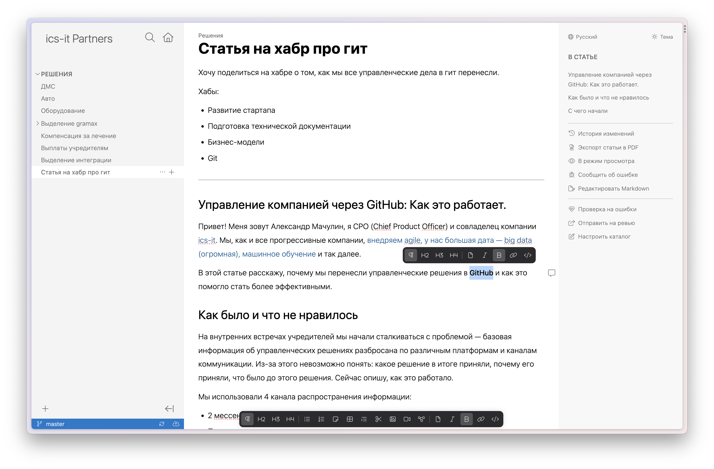

[cut:Вводные:false]

1. **Определить портрет клиента (ЦА).** Генеральные директора, C-Level управленцы, фаундеры.

2. **Сформулировать гипотезы о проблемах клиента.**

   -  Это могут быть проблемы в текущем решении: неудобно, нет возможности и т.д.

   -  Или желаемый результат: хочу делать быстрее, качественнее, хочу чтобы меня не дёргали и т.д.

3. **Выбрать каналы.** Пост в Twitter, LinkedIn с аккаунта АМ. Статьи в журналах для управленцев.

4. **Определить точки контакта.** Небольшая ссылка в тексте статьи, плюс поборемся в комментариях.

5. **Ценностное предложение.** ??

6. **Проработать опасения клиента.**

[/cut]

Привет! Меня зовут Александр Мачулин, я CPO (Chief Product Officer) и совладелец компании [ics-it](https://ics-it.ru/). В этой статье расскажу, почему мы перенесли управленческие решения в GitHub и как это помогло стать более эффективными.

## Как было и что не нравилось

Мы, как и все прогрессивные компании, [внедряем agile, у нас большая дата -- big data (огромная), машинное обучение](https://youtu.be/a-hoA97VcoU?si=RZgryZTitRRkMHKL&t=600) и так далее. Но на внутренних встречах учредителей мы начали сталкиваться с проблемой -- базовая информация об управленческих решениях разбросана по различным платформам и каналам коммуникации. Из-за этого невозможно понять: какое решение в итоге приняли, почему его приняли, что было до этого решения. Сейчас опишу, как это работало.

Мы использовали 4 канала распространения информации:

-  2 мессенджера (т.к. недавно переехали с MS Teams).

-  Почта.

-  Таск-трекер.

-  Notion/Paper/Google Docs -- кому что удобнее.

В каждый канал мы могли писать информацию на темы:

-  Концепция развития организации на 1-3 года вперед.

-  Решения о старте новых продуктов и направлений.

-  Варианты разграничения полномочий и зон ответственности внутри компании.

-  Правила выделения самостоятельных направлений в отдельные юрлица.

Выходит приличное количество комбинаций “тема/канал”, где приходилось искать информацию и это нужно исправлять.

## С чего начали

Начали с перечня критериев для будущей системы. Нет, конечно. Кто так вообще делает?

Мы устно проговорили, кто что хочет. Но сейчас, если посмотреть ретроспективно, эти “хотелки” вполне себе критерии. Основные из них:

-  **Ограниченный доступ к информации.** Доступ должен иметь ограниченный, но достаточно постоянный круг лиц, поэтому важно:

   -  Чтобы нельзя было быстро сформировать ссылку для кого-то, кто не попадает в круг управления.

   -  Чтобы админы компании не могли просматривать материалы. Сейчас у них неограниченный доступ ко всему.

-  **Контроль над историей изменений.** Обычно эта возможность редко используется, но если вдруг захотим посмотреть историю и она есть -- это супер.

-  **Офлайн режим.** Часто хорошие идеи приходят в местах, где нет интернета. Например, в пути до нашего чебоксарского офиса на трассе М12 или в самолёте, в отпуске и других интересных местах.

## Этап отбора

Самый простой вариант решения проблемы -- договориться использовать только один канал распространения информации. Но договориться мы не смогли. Ниже тезисы, что не устраивало.

-  **Мессенджер или почта.** Тут всё понятно: шансы найти что-то через полгода стремятся к нулю.

-  **Таск-трекер (YouTrack).** Пробовали оформлять управленческие задачи в эпики и юзер стори. Не взлетело. Всем лень. Плюс, таск-трекер не очень удобный инструмент для быстрого извлечения знаний.

-  **Внутренняя база знаний.** Надо делать надстройку над нашими админами, чтобы они не видели эту конкретную базу знаний. И кто-то должен её поддерживать в техническом плане. Никто из нас этим заниматься не захотел.

-  **Paper (Dropbox).** Популярный инструмент обмена информацией в нашей компании, но:

   -  Нет удобной навигации и структуры каталога.

   -  Поделиться ссылкой в Paper проще простого. Также нет централизованного контроля над тем, кто имеет доступ к файлам.

   -  Последнее время есть перебои в работе их облака.

-  **Notion.**

   -  Нельзя легко оплатить из РФ, из-за этого много ограничений: на просмотр истории изменений, по количеству файлов, пространств.

   -  Просто не нравится одному из совладельцев.

И есть одно противоречие -- непонятно как хранить инфу: на своем облаке или чужом. На чужом -- страшно и волнительно. Неизвестно, что с этим облаком может произойти: временно недоступно, потерялись данные, добавилось ограничение доступа со стороны облака. На своем -- не хочется, так как придется делать надстройки над админами.

## К чему пришли

Противоречие о хранении данных решили с помощью Git. Это распределённая система хранения. Контент одновременно и на моём ноутбуке, и на телефоне, и на устройствах партнёров, и на сервере GitHub. Если с GitHub что-то случится, то контент останется на наших устройствах.

Для удобства добавили еще несколько инструментов. В конечном итоге это выглядело так:

**GitHub + Markdown + VSCode + Static Site Generator.**

Если вы сразу подумали, как использовать в своем процессе -- как угодно! Любой параметр в уравнении можно поменять на тот, который более предпочтителен.

[cut:СЕЙЧАС УЖЕ ВСЕ ИНАЧЕ:false]

Чуть позже мы заменили Markdown и VSCode на [визуальный редактор с поддержкой гита](http://gram.ax), а от Static Site Generator для этого репозитория отказались и вовсе. Об этом расскажу в отдельной статье.

[/cut]

### Плюсы

-  Не так легко поделиться ссылкой с “любым” человеком.

-  Полный контроль над историей изменений со всеми прелестями работы в Git.

-  Офлайн режим.

-  Механизм ревью.

### Минусы

-  Git, Markdown и VSCode сложны в освоении. Есть порог входа.

-  Отдельная аутентификация. Во всех остальных системах используем SSO.

-  Нет мобильной версии для офлайн работы. Благо ноутбук всегда с собой.

## Заключение

Эксперимент успешный. Будем раскатывать подход на другие сферы в компании.\
В планах:

-  Внедрить подобный подход в HR, т.к. им надо хранить грейды, вилки, выводы по соискателям для руководителей и т.д.

-  Перенести репозиторий в наш GitLab с шифрованием файлов на клиенте или в корпоративный Яндекс.Диск, чтобы уменьшить количество систем и аутентификаций.