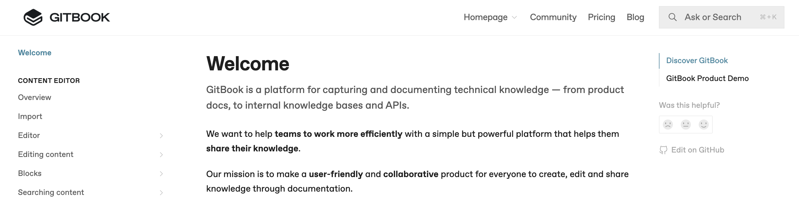
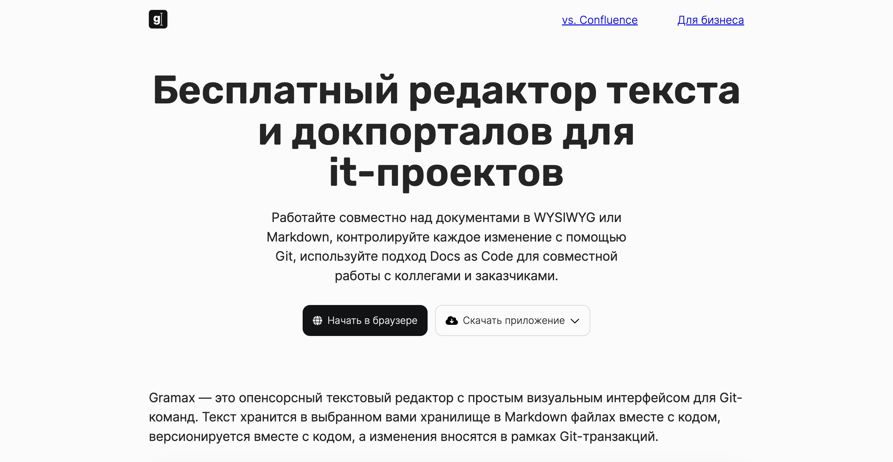

Мы уже не в первый раз слышим, что возможности Gramax похожи на возможности зарубежных коллег -- системы GitBook. Мы решили провести сравнительный анализ. Так как в GitBook мы плотно не работали, сравнение проводили на основе материалов с сайта и из документации. В этой статье приведем результаты.

Для чистоты эксперимента в сравнении участвовали только бесплатные версии продуктов.

## Что такое GitBook

Как заявляют создатели системы: GitBook -- это платформа для сбора и документирования технических знаний -- от документации по продуктам до внутренних баз знаний и API.

### Сценарии использования

-  Публичная документация

-  Описание API

-  Внутренняя база знаний

### Ключевые фичи

-  Документирование API.

-  Совместная работа через Git.

-  Интеграция с другими системами: GitHub, GitLab, Intercom, Slack, Google Analytics, Segment Embed integrations.

-  WISYWIG-редактор.

-  Встроенный механизм комментариев.

### Бесплатная версия

Только для одного пользователя.

## Что такое Gramax

Gramax -- это **бесплатный** текстовый редактор с простым визуальным интерфейсом для Git-команд. Текст хранится в выбранном вами хранилище в Markdown файлах вместе с кодом, версионируется вместе с кодом, а изменения вносятся в рамках Git-транзакций.

### Сценарии использования

-  База знаний

-  Обучение сотрудников

-  Системная архитектура

-  Техническое задание

-  Бизнес-стратегия

-  Контент для справочного сайта

### Ключевые фичи

-  WISYWIG-редактор.

-  Интеграция c GitLab и GitHub и встроенный Git-клиент.

-  OpenAPI, PlantUML, Mermaid, Draw,io.

-  Встроенный механизм комментариев.

### Бесплатная версия

Для команд любого размера.

## В чем похожи

По сути -- что Gramax, что GitBook -- это системы для упрощенной работы с подходом Docs sc Code. В них есть визуальный редактор, встроенный Git-клиент, интеграция с GitLab и GitHub. По возможностям редактора системы так же похожи.

## Чем отличаются

Но есть в системах и ключевое отличие -- это подход к хранению информации и безопасности.

### Где хранятся загруженные репозитории

-  GitBook -- в облаке GitBook.

-  Gramax -- в хранилище браузера (браузерная версия) или в локальном хранилище (десктопная версия).

### Как происходит аутентификация

-  GitBook -- через почту.

-  Gramax -- аутентификация не требуется, так как все данные хранятся на компьютере пользователя.

### Интеграция

-  GitBook -- GitHub, GitLab, Intercom, Slack, Google Analytics, Segment Embed integrations.

-  Gramax -- GitHub и GitLab.

## Вывод

В качестве российского аналога GitBook для работы по подходу Docs as Code можно использовать Gramax. Он бесплатен для команд любого размера -- от 1 человека до 1000+.

Если вы уже пользуетесь GitBook и Gramax и знаете о других отличиях бесплатных версий -- напишите нам! Дополним эту статью.