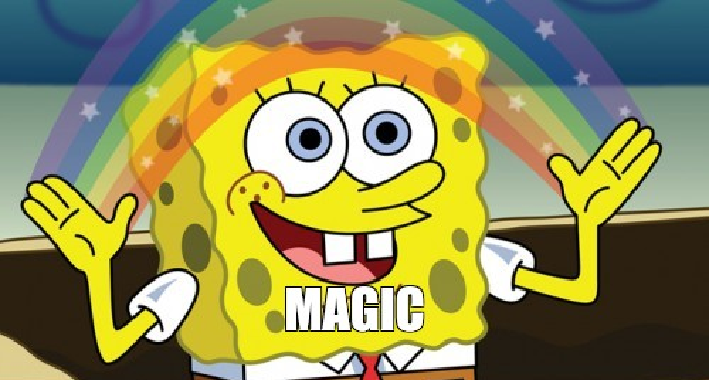
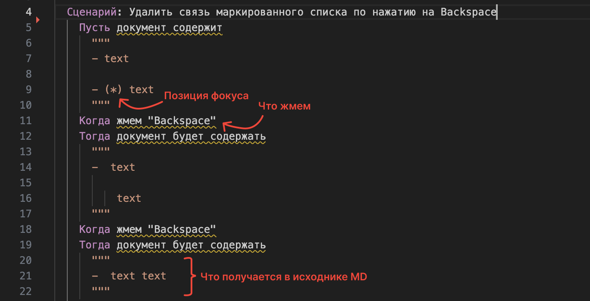
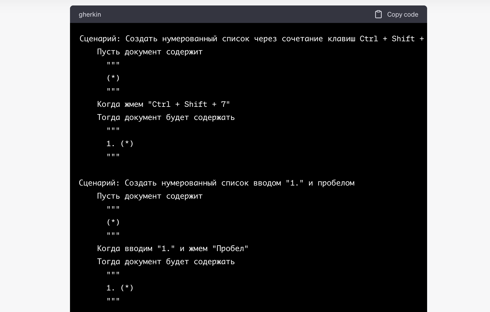

Всем привет! Меня зовут Катя, я PO приложения для подготовки документации. Мы продвигаем подход docs-as-code среди нетехнических специалистов. В этой статье я расскажу, как мы тестируем наш WYSIWYG-редактор. Вернее о том, как ChatGPT помогает в этом.

**Дисклеймер 1**: В приложении мы используем WYSIWYG-редактор Tip-Tap. Опережая волну хейта: да, мы реально верим, что визивиг может быть удобным и не глючным. И дописываем к нему логику, которая соответствует общепринятым практикам.

**Дисклеймер 2**: Тут не будет развернутого рассказа о настройке самих тестов, только о сценариях.

## Предпосылки

Как в любом стартапе, у нас небольшая команда и нет четкого разделения на аналитиков, тестеров, кодеров и так далее. Все задачи мы равномерно размазываем между друг другом.

Каждую готовую фичу мы тестируем в 3 этапа:

1. [comment:9]Ручное тестирование разработчиком на соответствие требованиям из UserStory.[/comment]

2. Ручное тестирование PO в хаотичном порядке.

3. Автоматические e2e-тесты, чтобы точно знать, что ничего вокруг не отвалилось.

Самая мощная головная боль -- тестирование визуального редактора. В отличие от многих систем, мы не ограничиваем использование разных элементов внутри друг друга. Из-за этого нам приходится четко прописывать их взаимодействие. Как вы можете догадаться, тесты нужны буквально на каждый пук.

## С чего мы начали

[comment:10]**Шаг 1. Настройка.**[/comment] Сначала, конечно, настроили сами тесты. Как -- я не знаю, это сделали разработчики.



**Шаг 2. Синтаксис.** Затем договорились о синтаксисе для сценариев. Какие требования выдвигались:

-  Понятное описание происходящего (так как я подозревала, что придется сценарии писать самой).

-  Одинаковое именование сущностей в интерфейсе (ага, сделали глоссарий).

Вот что получилось:



[comment:17]**Шаг 3. Подготовка сценариев.**[/comment] Ну, тесты настроены, синтаксис согласован, можно писать. Я сделала пару фича-файлов и забила. Долго, муторно, скучно.

## Как автоматизировали

Каждый раз, решая баг по редактору, мы говорили: “даааа, надо бы писать тесты, дааа”. И в стиле эффективного менеджера я пошла к ChatGPT со своими потребностями. Что в него загнала:

1. Промпт. Содержал следующий текст:

   ```
   Действуй как профессиональный тестировщик. 
   Тебе нужно написать e2e-тесты. Синтаксис определи по примеру: 
   	Сценарий: Удалить связь маркированного списка по нажатию на Backspace 
   	Пусть документ содержит 
   	"""
   	- text 
   	- (*) text 
   	""" 
   	Когда жмем "Backspace" 
   	Тогда документ будет содержать 
   	""" 
   	- text text 
   	""" 
   	Когда жмем "Backspace" 
   	Тогда документ будет содержать 
   	""" 
   	- text text 
   	""" 
   Я тебе отправлю описание логики каждой фичи. Тебе нужно написать сценарии тестирования,
   используя этот синтаксис. Должно получиться 22 сценария. Результат выведи сплошным сообщением.
   ```

2. Описание логики каждой фичи. Я их взяла из UserStory и оформила списком. Примерно так:

   ```
   ...
   В статье можно создать нумерованный список:
   - когда нажимаем Ctrl + Shift + 7
   - когда пишем 1. и нажимаем пробел
   - когда нажимаем на нумерованный список в панели редактирования
   
   В статье можно создать маркированный список:
   - когда нажимаем Ctrl + Shift + 8
   - когда пишем - и нажимаем пробел
   - когда нажимаем на маркированный список в панели редактирования
   
   В списке можно добавить пункты:
   - когда в конце первого пункта нажимаем Enter
   ...
   ```

**И что же получилось….**

[comment:23]А все получилось. 0 вопросов и претензий. Берем в работу, спасибо чату.[/comment]



## Резюмируем

ChatGPT молодец, мы долго тупили и потратили время на ручное написание сценариев.

Что не стоит упускать из внимания: любую работу (автоматизированную или ручную) нужно проверять. Чат, как и обычный человек, не всегда внимателен. Например, иногда терял позицию фокуса в тестах или объединял два сценария в один. Но этот парень обучаем -- важно не переделывать за ним, а просить все переписать с исправлениями. Тогда В ЭТОМ ЧАТЕ он ошибаться больше не будет.