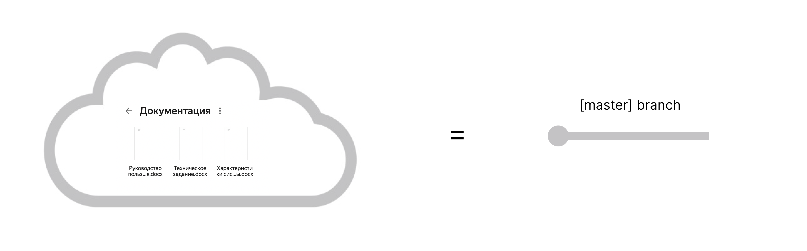
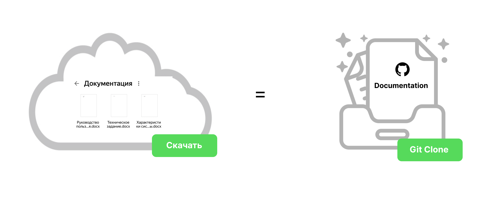
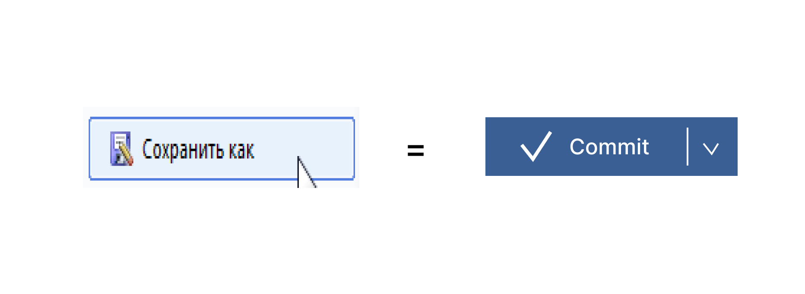
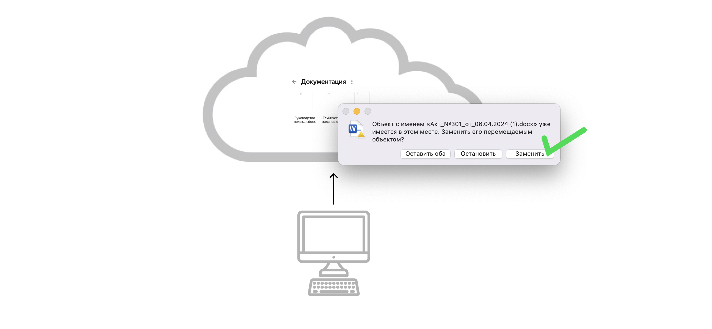
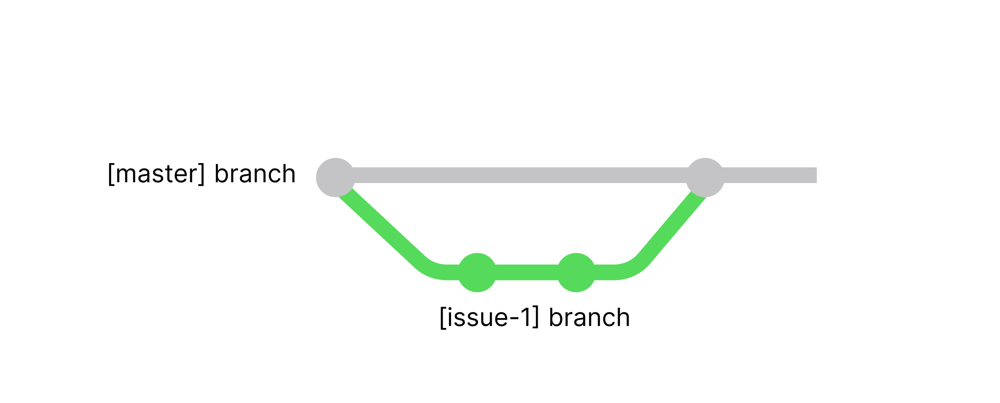
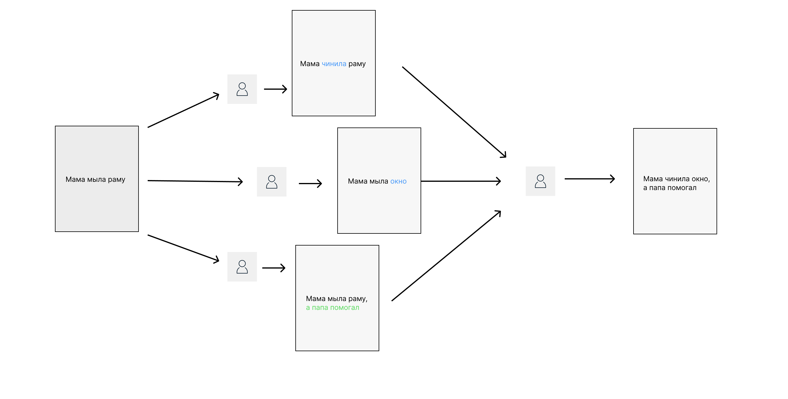
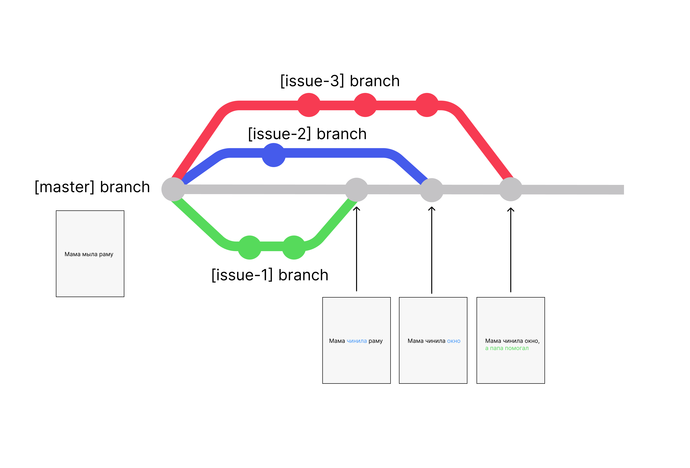
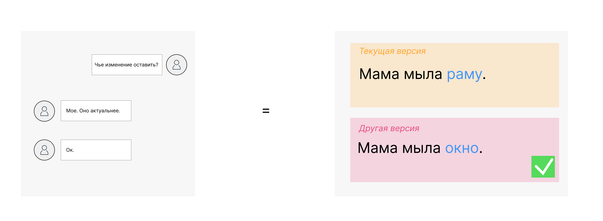
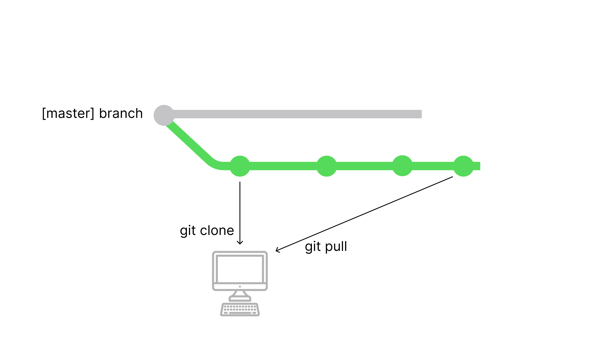
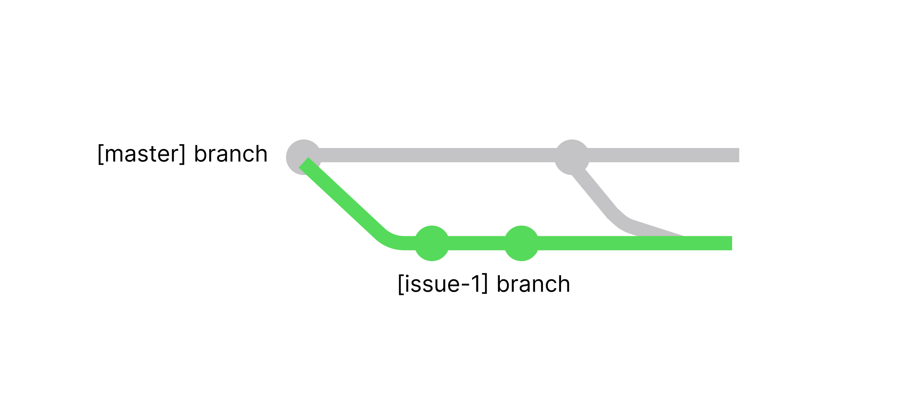

[comment:1]В it-среде все прекрасно знают про систему контроля версий Git.[/comment] Но используют ее почему-то только разработчики. За время своей работы мы убедились, что это полезно для всех, кто пишет, редактирует и публикует какие-либо тексты. Редакторам, журналистам, юристам и так далее.

Нельзя поспорить, что у Git довольно высокий порог входа -- чтобы даже понять, как переложить его на свои задачи, нужно просмотреть кучу роликов на ютубе. Чтобы упростить вам задачу, в этой статье мы рассмотрим процесс работы с Git на примере обычных операций с Word-файлом в облаке.

Статья будет полезна тем, кто хочет разобраться в концептуальной стороне вопроса. Мы не будем приводить примеры инструментов, рассказывать как выполнять команды и так далее. Если понадобится подробные методические материалы как построить свою работу с Git -- напишите в комментарии, обязательно подготовим!

## Условия

[comment:2]Для наглядности будем описывать процесс работы технического писателя. Но вы в своей голове его можете заменить на любую другую должность.[/comment]

Представим ситуацию: у вас в облаке лежит папка “Документация”. Она содержит 3 вордовских файла. Эта папка и ее файлы доступны на чтение клиентам и всей команде. На редактирование она доступна 3 сотрудникам: менеджеру, аналитику и самому техническому писателю.

## Примеры и сопоставления

Дальше все сопоставление будет описано двумя блоками:

-  “Пример” -- это действие, которое мы проводим над папкой или вордовским файлом.

-  “В Git” -- это как это действие можно сделать в Git.

### [comment:3]Хранение[/comment]

**Пример**: из условий задачи мы уже узнали, что у нас есть папка “Документация” с тремя файлами. Они находятся в облаке и доступны как клиентам, так и команде.

**В Git**: облачное хранилище = репозиторий на удаленном сервере -- например, в GitLab или GitHub.

### Публичная версия

**Пример**: в облаке может быть несколько папок “Документация”. “Документация. Версия 1”, “Документация финал” и “Документация (со всеми исправлениями)”. Но клиентам [comment:4]расшарена[/comment] только одна -- “Документация”. Она считается публичной, стабильной и самой актуальной.

**В Git**: у одного репозитория может быть [comment:5]несколько веток[/comment], но есть основная. Чаще всего ее называют мастер-веткой. Остальные ветки могут создаваться по названию задачи -- например, “issue-1” или “develop”.

### [comment:8]Копирование для редактирования[/comment]

**Пример**: представим, что техническому писателю нужно отредактировать [comment:6]какие-то файлы.[/comment] Он может это делать прямо в облаке, но это не очень [comment:7]безопасно[/comment]. Например, можно внести какие-то неправильные изменения, которые сразу станут доступны клиентам. Гораздо безопаснее сначала эту папку скачать к себе на компьютер.

**В Git**: также как и с облаком, перед редактированием нужно склонировать (скачать) репозиторий на свой компьютер. В локальном репозитории можно делать что угодно и не бояться, что какие-то изменения увидят клиенты.

### Сохранение

**Пример**: технический писатель отредактировал файл и заканчивает свои рабочий день. Чтобы не потерять изменения, он нажимает кнопку “Сохранить”.

**В Git**: чтобы сохранить промежуточную или конечную версию документа, в гит нужно выполнить команду “Commit” -- буквально сказать системе: “я хочу сохранить свои изменения на локальном компьютере, как одну из версий файла”.

### Публикация для ревью

**Пример**: технический писатель внес изменения и теперь хочет, чтобы коллеги их проверили. Конечно, можно отправлять файлы в мессенджере, но гораздо удобнее загрузить в облако дубликат папки “Документация” с другим именем. Например, “Документация. Изменения по проекту”.

**В Git**: как и в случае с облаком, технический писатель публикует в удаленный репозиторий новую версию папки с помощью команды “Push” -- буквально говорит системе: “Отправь на сервер все мои коммиты, самый последний -- новая и вычитанная версия файла”. Но чтобы эти изменения не были доступны клиентам, писатель создает новую ветку, она будет доступна на просмотр только членам команды.

Чтобы было понятнее, разберем схему ниже -- она называется Git-граф.

-  Как мы обозначали раньше, ветка Master -- публичная версия документации, она доступна клиентам.

-  Серая точка на мастере -- это коммит, из которого была создана новая ветка issue-1 (как папка “Документация. Изменения по проекту” в облаке). Она доступна на просмотр только команде.

-  Зеленые точки на ветке issue-1 -- это коммиты (промежуточные сохранения).

### Публикация в публичную версию

**Пример**: технический писатель согласовал свои изменения в версии “Документация. Изменения по проекту”. Чтобы новые файлы стали доступны читателям, писатель заменяет старые файлы в публичной папке “Документация” на новые.

**В Git:** чтобы изменения стали доступны читателям, нужно взять ветку issue-1 и влить ее в основную. Это называется Merge. Git сравнит все файлы в обоих ветках, найдет отличия, а затем заберет эти отличия в основную ветку. После этого их смогут просмотреть клиенты. Вот так это будет выглядеть на графе:

### Совместная работа

Если вы дочитали до этого момента и задались вопросом: “А зачем мне тогда гит, если все действия можно также проводить через облако?” -- вы будете отчасти правы. В случае с маленькой командой и одной папкой это удобно. [comment:9]А теперь представьте, что в команде 20 технических писателей, 10 аналитиков и 5 менеджеров. А проектов штук 10, на каждый из них -- отдельная папка с сотней файлов. Запутаетесь? Гит как раз поможет структурировать такую работу.[/comment]

**Пример**: продолжим мучать папку “Документация”. Теперь представим, что 3 технических писателя хотят внести в нее изменения по 3 разным задачам. Каждый из них также скачивает папку к себе на компьютер, а затем загружает с обновлениями в облако. Первый писатель справился за день и его изменения сразу добавили в публичную версию файла -- после этого версии у остальных  писателей стали устаревшими. Они не смогут просто заменить нужные файлы в публичной папке, так как в их файлах нет изменений от первого и самого шустрого писателя. Потому решения 2:

1. Работать с документацией ТОЛЬКО по очереди. Пока один редактирует, другие не могут. Но это существенно затормозит работу.

2. Назначить человека, который должен будет потом просмотреть все 3 версии и объединить актуальные изменения перед публикацией. Например, этим может заниматься выпускающий редактор.

**В Git**: если посмотреть на схему сверху, Git -- это и есть выпускающий редактор. Он объединяет ветки с разными изменениями в одну единственную. Даже если писатели клонировали репозитории в разное время и изменяли одни файлы.

Снова обратимся к Git-графу за пояснениями.

-  Как мы помним, ветка Master -- публичная версия документации, она доступна клиентам.

-  Ветки issue-1, issue-2 и issue-3 -- это ветки каждого технического писателя.

-  Под каждым коммитом в Master есть условное обозначение изменений. Обратите внимание, что Git добавляет изменения последовательно: у второго технического писателя не было изменений от первого писателя. Git это понял и объединил их изменения. Также получилось и с изменениями третьего писателя.

### Конфликты изменений

Становится сложнее, но сейчас вы увидите киллер-фичу гита.

**Пример:** 2 технических писателя хотят внести в один файл изменения. Каждый из них снова скачивает папку к себе на компьютер и МЕНЯЕТ ОДНО И ТО ЖЕ предложение. [comment:10]И даже не догадывается, что коллега над ним тоже работает.[/comment] Когда этот файл приходит на проверку выпускающему редактору, ему нужно разобраться, какое изменение нужно оставить -- для этого он устраивает писателям очную ставку и они вместе решают, что делать.

**В Git**: Git, как и выпускающий редактор, заметит, что изменения конфликтуют. Но так как они поступят к нему последовательно (пускай и с разницей в долю секунды), последнему писателю он скажет: “Ты хочешь поменять вот это слово, а его недавно менял другой писатель. Какое из ваших изменений мне оставить?”. И технический писатель сам пойдет разбираться к коллеге, что с этим делать. В системе это называется Merge Conflict -- его можно решить самостоятельно.

### [comment:11]Актуализация версии на редактировании[/comment]

После конфликтов будет логично задать вопрос: “А как сделать так, чтобы моя версия была самой актуальной и все изменения других писателей сразу появлялись?”.

**Пример**: в случае с вордом -- либо писать сразу в публичную версию в облаке, либо редактировать файлы строго по очереди.

**В Git**: мы можем забрать изменения других людей как из текущей ветки, так и из других веток. Но давайте по-порядку.

1. Забрать изменения из текущей ветки. Так технический писатель клонирует репозиторий на определенном коммите, после его клона другие писатели могут опубликовать в ветку новые изменения. Чтобы их забрать к себе на локальный компьютер, нужно сделать Git Fetch или Git Pull. Вот как это будет выглядеть на графе.

   

2. Забрать изменения из другой ветки. Также как писатель слил изменения из ветки issue-1 в ветку master, он может слить изменения из master в issue-1. Это также будет git merge, как в главе про публикацию в публичную версию.

   

## Итог

С помощью Git можно организовать удобную работу над текстами в большой команде. И это будет качественная асинхронная работа, в которой каждый может быть сосредоточен исключительно на контенте, а не на процессных вопросах.

И раз мы много раз посмотрели на Git-граф, на десерт оставлю его пример в нашей команде. Да, он может продолжать пугать. Но это только до первой встречи:)

###