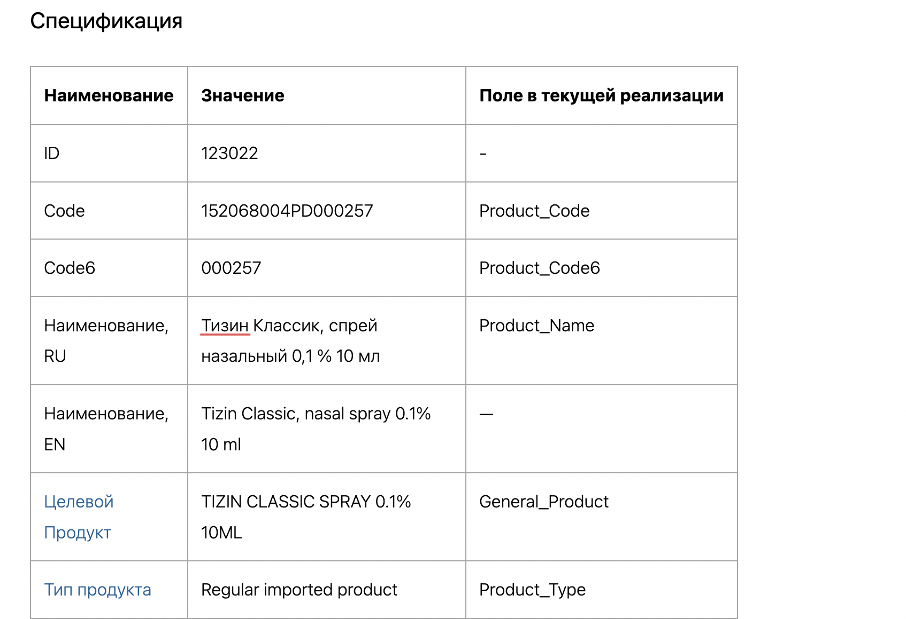
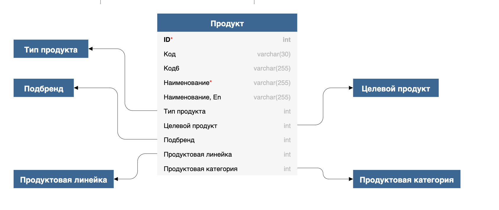

Дисклеймер: если прочитав заголовок вы сразу решили написать коммент про тэги, бэклинки, инклуды или что-то похожее -- не тратьте свое время.

В статье я затрону (возможно) не самый популярный подход к группировке информации -- объектную структуру. Но проработав много лет с разными базами знаний пришел к выводу, что любую информацию, в том числе и знания, нельзя хранить и накапливать обособлено. А как связать -- так никто и не придумал.

## Что за связи. Простой пример

Представьте, что вы пишете рецепт Английского завтрака в поваренную книгу для инопланетян. Иерархичная структура будет выглядеть так:

-  Рецепты завтраков

   -  Английский завтрак

      -  Ингредиенты

         -  Яйца

         -  Бекон

         -  Соль

         -  Масло

Инопланетянину нужно пояснить суть каждой сущности: что есть “Рецепт”, “Завтрак”, “Соль”. Пояснения можно вынести в отдельную главу, но поваренные книги не читают от корки до корки. Значит каждый рецепт = полное описание всех сущностей.

Самый удобный способ для подготовки -- описать каждую сущность, а затем как конструктор собирать в статью. Если визуализировать, структура контента будет следующей:

[plant-uml:./new_article_0_0.puml]

Один раз создав сущность “Бекон”, вы потом используете ее в других рецептах.

## Зачем это в работе. Сложный пример

Я делаю для клиента систему, в основе которой находится база данных. Как в случае с рецептами, мне нужно пояснить не только суть сущностей, но и связи между ними.

Например, у меня есть объект “Продукт”. Он включает в себя поля:

-  Продуктовая линейка

-  Продуктовая категория

-  Бренд

-  Подбренд

-  Тип продукта

-  И так далее.

Каждое поле -- отдельный объект с неменьшим набором полей. Мне нужно объяснить клиенту:

-  Что это за объект.

-  Какими полями обладает.

-  Какие значения вводятся в каждое поле.

-  С какими другими объектами связано каждое поле.

Непростая задача, да?

## Как решил я

Я создал под клиента каталог в нашей базе знаний Gramax. В каталоге создал иерархичную структуру разделов, отталкиваясь от бизнес-процесса клиента. Один бизнес-процесс -- один раздел.

В каждом разделе создал подраздел родительского объекта.

Структура статьи об объекте:

**Описание.**

**Поля.**

**Кликабельная структура базы данных.**

### Почему это плохо работает

По сути -- работает. Для каждого клиента есть такой каталог, в нем исчерпывающая информация обо всем. Но обратите внимание на ручной труд: описание, поля, структуру я прописывал обособлено. Если в табличке поменяется название поля, в структуре придется исправлять его вручную. И так как тип контента разный, переиспользовать я его не могу.

Ну и в довесок -- представьте, что поле описано в 30 статьях со связями. Конечно, я могу залезть в исходники (а исходники статей у нас лежат в репе в формате Markdown) и сделать массовую замену, но любое массовое действие нужно проверять. Устану!

### Как должно работать хорошо

В одном месте я объявляю сущность “Продукт” и ее характеристики. А затем переиспользую эту сущность в разных видах контента.

-  Изменилась сущность -- исправил в одном месте.

-  Нужно сгруппировать сущности -- накидал из готового справочника.

-  Нужно пояснение -- кликнул на сущность и полез в кроличью нору.

## Как можно решить. Сравнение систем

В поиске идеального решения я начал анализировать известные системы.

### Miro

Плюсы:

Минусы:

### Olog

Плюсы:

Минусы:

### Obsidian

Плюсы:

Минусы:

## В итоге

Поплакал.