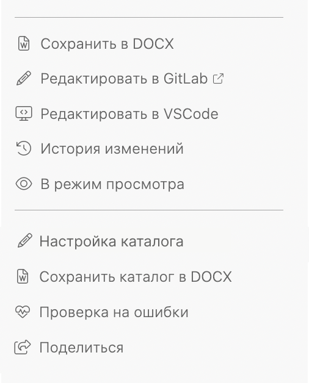
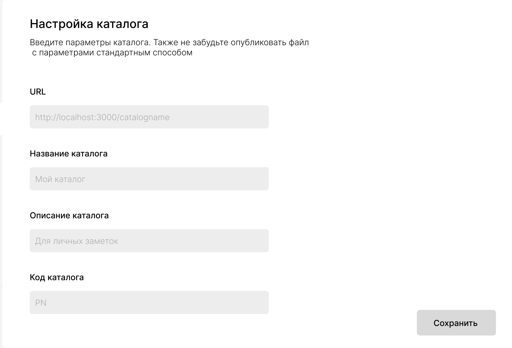

:::note 

[DR-1662](https://support.ics-it.ru/issue/DR-1662) Создание каталога в интерфейсе DR

:::

## Редактирование каталога

Как будет работать:

1. В каталоге в правой панели юзер кликает *Настройка каталога*.

   

2. Появляется модальное окно с параметрами.

   

3. После клика на *Сохранить* файл doc-root.yaml перезаписывается.

4. Юзер открывает окно публикации изменений, просматривает файл и публикует его стандартным способом.

## Создание каталога

Как будет работать:

1. На главной есть кнопка *Создать каталог*. По клику появляется выпадающее меню с пунктами: *Новый и Существующий*.

2. Если юзер нажимает:

   -  *Новый* --появляется модальное окно с параметрами каталога.

   -  *Существующий* -- появляется окно гит клона.

3. После того, как юзер нажимает *Создать*, локально создается каталог. В каталоге сразу есть:

   -  Файл doc-root.yaml с заполненными полями из предыдущей формы. Остальные поля пустые, но содержат комментарии, чтобы юзер **мог их заполнить**.

   -  Статью в корне *Добро пожаловать!*. В ней приветственное сообщение для новичка.

   -  Раздел *Начало работы*. В нем расположены статьи-инструкции со всеми элементами оформления и инструкциями (*Создать статью, Создать раздел, Создать или сменить ветку, Опубликовать изменения*).