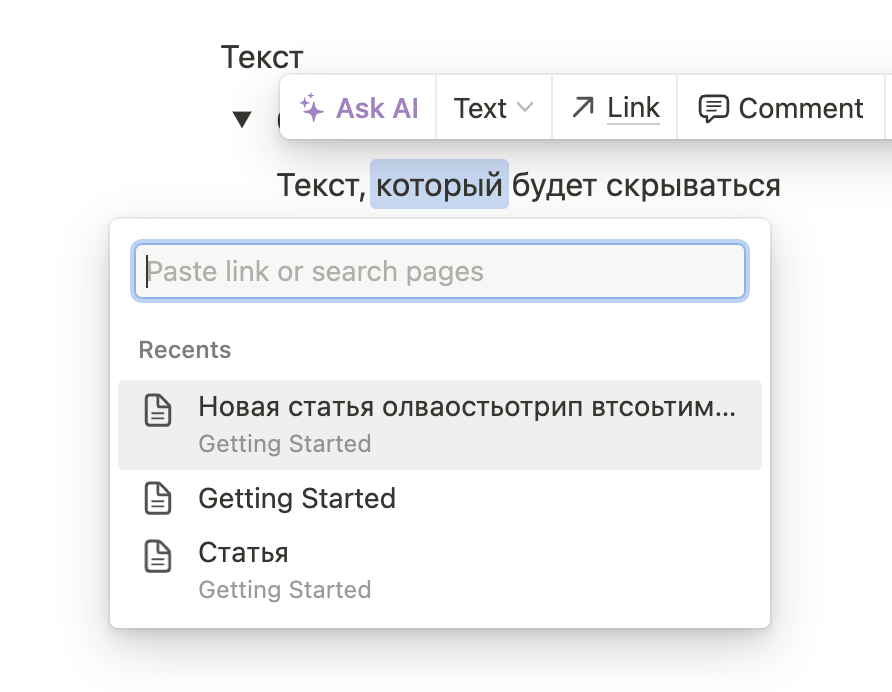

:::note 

[DR-1666](https://support.ics-it.ru/issue/DR-1666) Добавление ссылок из выпадающего меню в приложении

:::

Сейчас в интерфейсе можно добавить ссылку только путем прописывания пути к файлу. Нужно сделать процесс проще.

**Оформление**

Оформление интерфейса берем из Notion:

**Процесс использования**

1. Пользователь выделяет слово и кликает иконку ссылки в панели -- появляется выпадающее меню со всеми статьями и их путями.

2. Пользователь выбирает статью из выпадающего списка и автоматически появляется ссылка на нее.