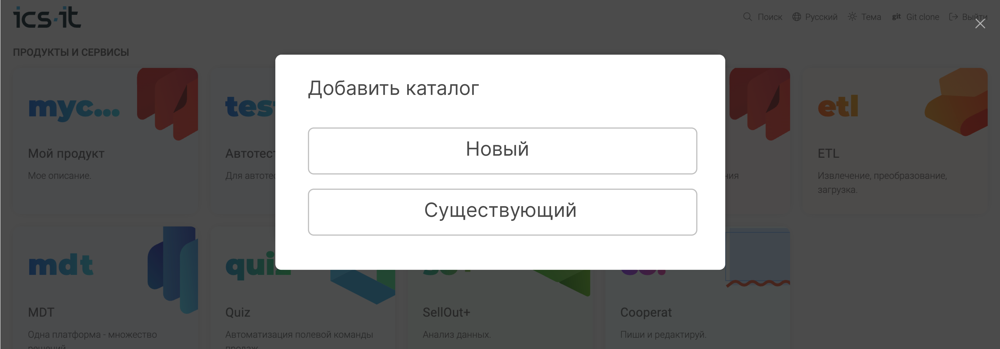
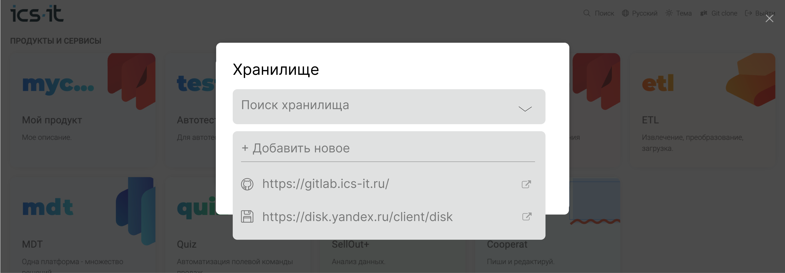
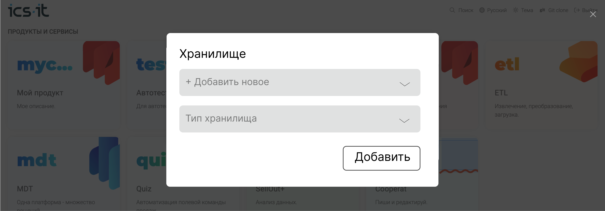

1. **Окно выбора**. Юзер на главной нажимает *Добавить каталог*. Открывается окно с вариантами выбора.

   [comment:andrey.lastochkin@ics-it.ru:2023-06-05T20|50|29.841Z]

   Может лучше два разных пункта “Создать каталог” и “Подключить существующий”. Если создать - сразу по кнопке создается новый и все. А если подключить - нужно выбрать.

   [/comment]

   

   В зависимости от выбранного варианта юзер попадает на один из двух сценариев ниже.

## Добавление существующего каталога

1. **Выбор хранилища**. Пользователь выбирает сохраненное хранилище. Либо выбирает *Добавить новое* и выполняется сценарий *Добавление нового хранилища*.

   

2. **Список папок/репозиториев**. После выбора хранилища появляется поле с выпадающим списком, который содержит:

   -  Для дискового хранилища: подпапки в корневой директории.

   -  Для git-хранилища: список репозиториев.

3. **Клонирование**. Юзер выбирает элемент и нажимает *Выбрать*. Папка/репозиторий клонируется.

   -  **Если новый -- инициализация**. Если в папке нет файла `.doc-root.yaml` возможно пользователь ошибся и у него запрашивает подтверждение “Выбранное местоположение не является каталогом. Сделать каталогом?”. При нажатии *Сделать* *каталогом* открывается окно добавления каталога с черновыми параметрами.

## Создание нового каталога

1. **Окно с параметрами каталога**. Если юзер выбирает *Новый*, открывается окно с основными параметрами каталога. Юзер их заполняет и нажимает *Создать*.

2. **Статус необлачного каталога**. Создается каталог и открывается на редактирование первая пустая статья. В строке состояния отображается зачеркнутое облако, сигнализирующее, что репозиторий пока не опубликован.

### Публикация нового каталога в хранилище

1. **Выбор хранилища**. При нажатии на иконку зачеркнутого облака открывается окно публикации. В поле *Хранилище* пользователь выбирает или добавляет новое хранилище.

2. **Выбор места хранения**. Поле ввода названия новой папки/репозитория:

## Подсценарий -- добавление нового хранилища

1. **Окно добавления хранилища**. Юзер выбирает *Добавить новое*. Появляется поле для выбора типа хранилища. Выбирает тип хранилища.

   

2. **Аутентификация в хранилище.** Юзер нажимает *Добавить* -- появляется окно входа в хранилище. Юзер входит.

3. **Сохранение нового хранилища.** Новое хранилище сохраняется для пользователя, добавляется в выпадающий список хранилищ. И автоматически выбирается.