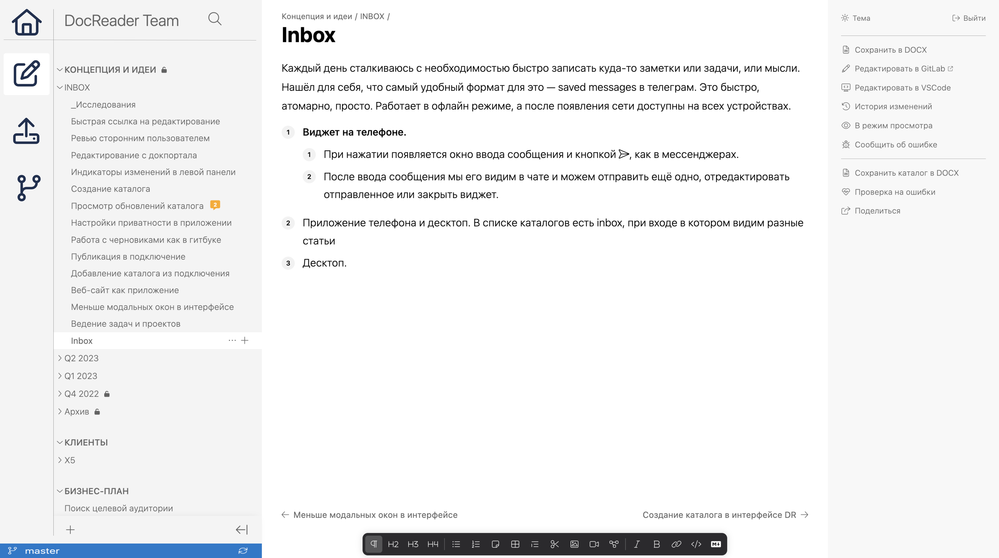
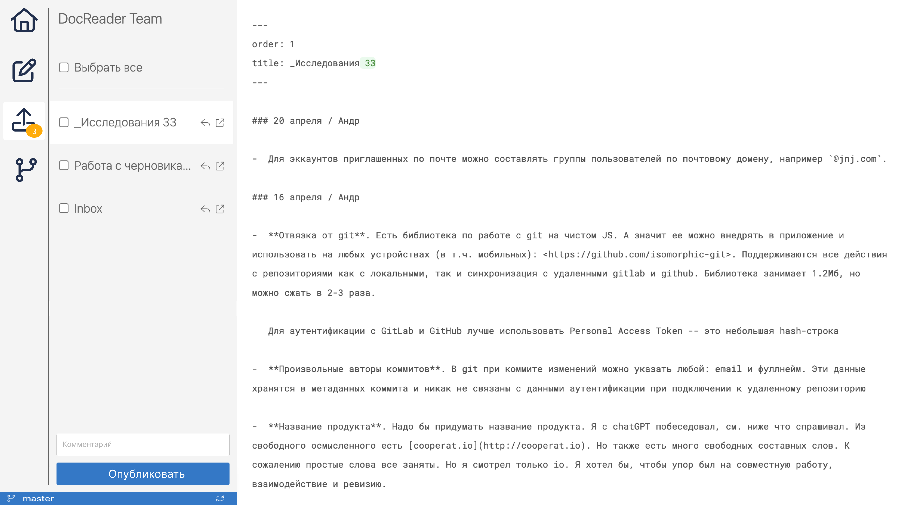
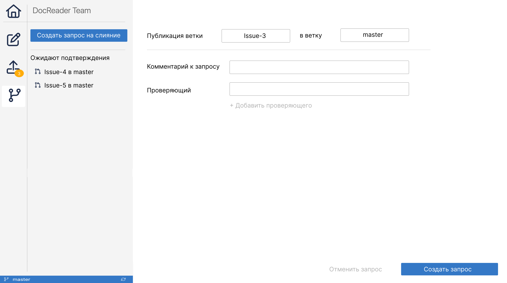
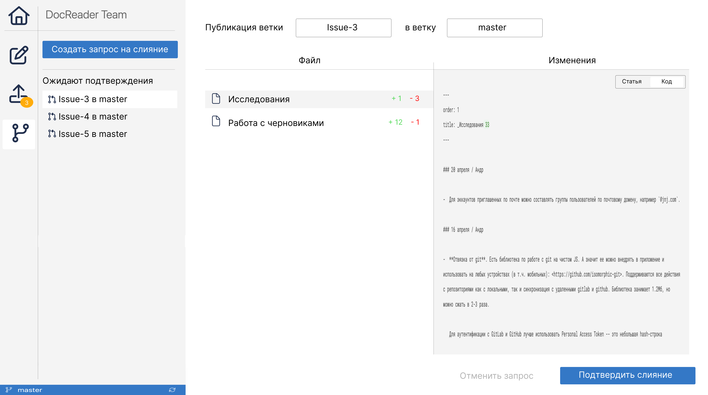

Слева добавляется панель с вкладками:

-  Редактирование

-  Публикация

-  Слияние и подтверждение

## Редактирование

В этой вкладке все выглядит ровно так, как и сейчас.

## Публикация

В этой вкладке отображаем интерфейс публикации.

## Слияние и подтверждение

В этой вкладке есть две секции:

-  Кнопка создания запроса.

-  Список запросов.

### Создание запроса

По клику открывается интерфейс создания запроса.

В нем нужно указать:

-  Какую ветку в какую нужно опубликовать

-  Кто будет проверять

-  Комментарий (нужен?)

После чего создать запрос на слияние.

### Подтверждение слияния

По клику на запрос слияния появляется интерфейс, который содержит:

-  Инфу, какую ветку в какую публикуем.

-  Список измененных файлов.

   -  По клику на файл открывается окно с изменениями. Можно просматривать в двух режимах: визуальном и коде.

Если замечаний нет, проверяющий нажимает *Подтвердить слияние*.

:::note Вопросы

-  А что делать, если есть замечания? Где их оставить?

-  Может в этом интерфейсе сделать комментарии? Где они будут храниться?

:::