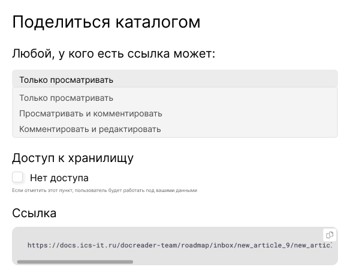
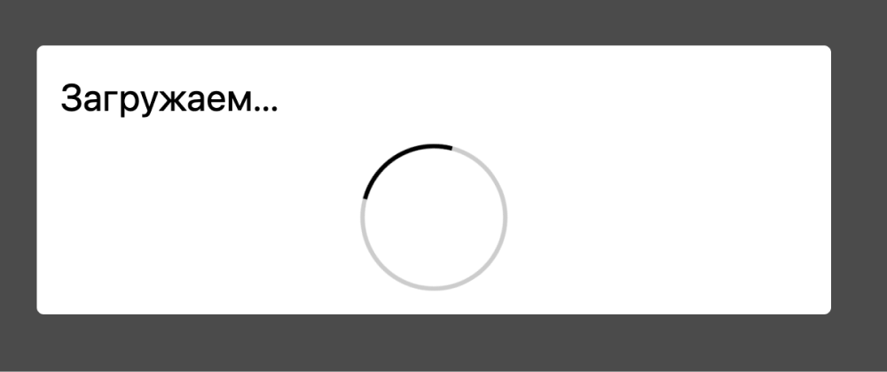
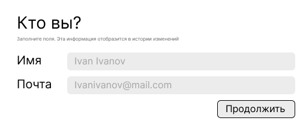
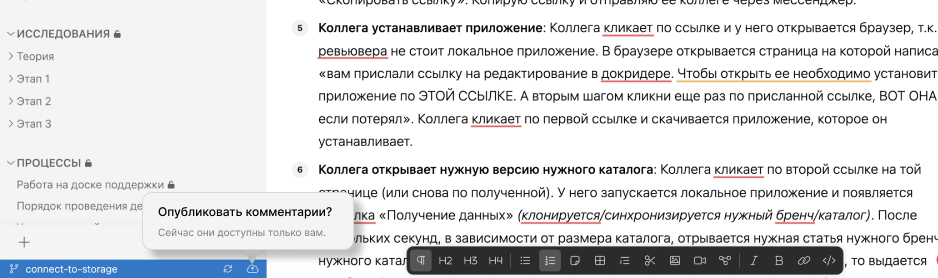
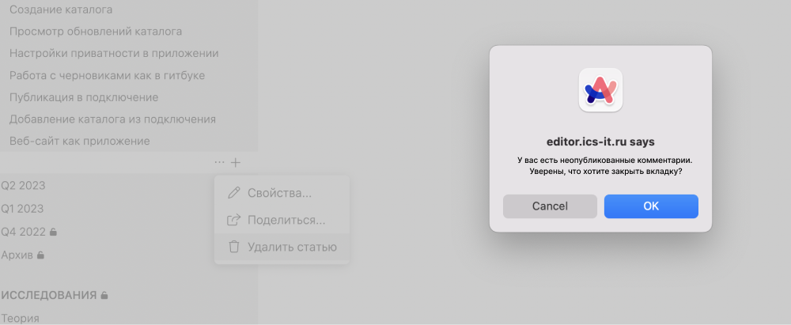

### Что решили

1. Убрать “Кому доступно” - доступно все по умолчанию.

2. 2 строчки, как в комменте Саши.

3. Сначала  форма для подключения, затем клонирование.

4. Форма для подключения, если у юзера нет доступа -- предзаполнены верхние 3 поля, нужно указать почту и имя.

5. Форма если есть доступ -- предзаполнены верхние 2 поля, нужно указать токен. По токену автоопределится имя и почта.

6. Сделать ошибку, если токен сгорел.

7. Убрать ограничения и тултипы. Добавить яркую отметку, что есть неопубликованные изменения.

8. В настройках каталога блок “Приватность”.

9. Предупреждать в интерфейсе ссылки, что она отправляется на реп, ветку и видны только опубликованные изменения.

10. Как будет выглядеть ссылка: тип системы, урл репа, ветка, закодированный токен

### Проблемы

1. Нужно отправлять ссылку на конкретную статью.

   -  Сохранять доступ по токену у ревьюера, чтобы потом можно было просто скидывать ссылки на статьи из урла браузера. Без формирования новых.

2. Ревьюер легко может изменить ветку и понаписать фигни в мастер.

3. В гитлабе нельзя отслеживать коммиты ревьюера, если он работает под моим токеном. Инфа о нем хранится только в истории изменений.

## Поделиться с правками

1. **Техпис публикует изменения и нажимает “Поделиться каталогом”** в правой панели.

   -  Выбирает, что доступно по ссылке.

      [comment:alexander.machulin@ics-it.ru:2023-07-26T11|24|17.932Z]

      Вроде договорились без этого пока сделать.

      [/comment]

   -  Указывает, есть ли доступ к хранилищу.

   -  Копирует ссылку.

      

      [comment:alexander.machulin@ics-it.ru:2023-07-26T11|25|00.948Z]

      Тут дизайн нужен. С десяток шрифтов на форме – не очень хорошо.

      [answer:alexander.machulin@ics-it.ru:2023-07-26T11|29|23.334Z]

      Предлагаю в 2 строчки написать:\
      Есть доступ к {название хранилища}(гиперссылка) ☑\
      Если у пользователя нет доступа, то будет создан \[токен для доступа к репозиторию\](гиперссылка на страницу с токенами).

      [/answer]

      [answer:alexander.machulin@ics-it.ru:2023-07-26T11|30|28.951Z]

      Предлагаю:\
      1\. Добавить кнопку “копировать ссылку”, которая закрывает окно.\
      2\. Уменьшить количество украшений для ссылки. Либо хэдер, либо блок кода тут лишние. А может и оба вместе.

      [/answer]

      [/comment]

2. **Техпис отправляет ссылку проверяющему**.

3. **Проверяющий получает ссылку для ревью**. По ссылке открывается окно браузерной версии. Так как юзер ранее не работал в системе, к нему сразу клонируется каталог на нужной ветке.

   [comment:alexander.machulin@ics-it.ru:2023-07-26T11|30|43.830Z]

   Не склонируется, пока не авторизуется

   [/comment]

   

4. **У проверяющего есть доступ к хранилищу**: открывается форма добавления с предзаполненными полями:

   

   [comment:alexander.machulin@ics-it.ru:2023-07-26T11|57|56.906Z]

   Если есть доступ, то зачем нам токен, имя, почта?\
   И где окно аутентификации?

   [/comment]

5. **У проверяющего нет доступа к хранилищу**: открывается форма для ввода данных.

   [comment:alexander.machulin@ics-it.ru:2023-07-26T11|59|04.987Z]

   А окно добавления хранилища у него будет? Если да, то туда лучше и добавить имя с почтой.

   [/comment]

   -  В полях не настроена проверка.

   -  Пока оба поля не заполнены, кнопка “Продолжить” недоступна.

   

6. **Проверяющий оставляет комментарии или редактирует** (в зависимости от доступа).

7. **Проверяющий НЕ публикует свои изменения**. В нижней панели над кнопкой публикации отображается тултип о том, что нужно опубликовать комментарии (правила появления -- юзер вошел под одноразовым токеном, есть неопубликованные комментарии). Тултип появляется в следующих ситуациях:

   -  Юзер вышел из вкладки и зашел снова.

   -  Раз в 10 минут.

      

      [comment:alexander.machulin@ics-it.ru:2023-07-26T12|01|03.682Z]

      Думаю, что неуправляемые и регулярные тултипы будут раздражать.\
      Лучше с иконкой облака что-то делать. Красную точку или другую иконку выбрать. А при наведении уже тултип показывать.

      [/comment]

8. **Проверяющий пытается закрыть вкладку с неопубликованными изменениями**. Появляется системное предупреждение. Вкладку нельзя закрыть, пока не закроешь предупреждение.

   [comment:alexander.machulin@ics-it.ru:2023-07-26T12|01|48.715Z]

   Это в браузере или приложении? А в мобиле как?

   [/comment]

   

9. Проверяющий публикует комментарии. В системе автором указана его почта.

   [comment:alexander.machulin@ics-it.ru:2023-07-26T12|02|07.665Z]

   А имя он тогда зачем он показывал?

   [/comment]