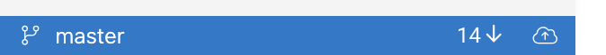
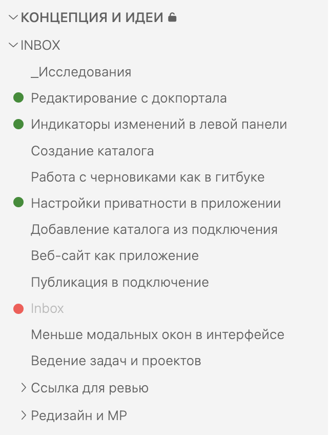

1. Я, как продакт менеджер, работая в клиентском каталоге, хочу знать, что на сервере появились новые изменения.

   [comment:alexander.machulin@ics-it.ru:2023-08-24T10|04|26.916Z]

   Для дележа ссылкой нужен отдельный юзкейс и описание логики работы, как мне кажется.

   Неочевидно и неудобно, когда тебе скинули ссылку на контент, тебе надо ещё и что-то там синхронизировать вручную.

   [answer:ekaterina.pavlova@ics-it.ru:2023-08-24T12|42|56.434Z]

   Да, тут работа по ссылке не рассматривалась. Ее отдельно нужно продумывать

   [/answer]

   [/comment]

2. Я, как продакт менеджер, работая в клиентском каталоге, хочу знать, какие изменения я забрал при синхронизации.

## Синхронизация новых изменений

1. **Получение информации об изменениях**. Каждый раз, когда вкладка или приложение становится активным, приложение запрашивает с сервера инфу об изменениях. Эта информация выводится и обновляется в строке состояния репозитория.

   [comment:alexander.machulin@ics-it.ru:2023-08-24T09|58|24.715Z]

   Нам же надо, чтобы мы и в фоновом режиме получали инфу об изменениях, чтобы на уровне ярлыка приложения вывести счётчик. Или это сейчас сразу не выйдет сделать?

   [answer:ekaterina.pavlova@ics-it.ru:2023-08-24T12|44|29.869Z]

   Зачем в фоновом? Становится активным = ты вернулся во вкладку с приложением, вернулся в локальное приложение. \
   Просто сейчас нам нужно выбрать действие, на котором будет происходить запрос. Если сделать регулярным (например, раз в минуту), приложение будет немного зависать.

   [/answer]

   [answer:alexander.machulin@ics-it.ru:2023-08-27T16|41|42.007Z]

   Чтобы когда ты откомментировала статьи, тебе не надо было мне в мессенджер писать “оставила комментарии, посмотри”.\
   Нам это 100% надо будет делать, и надо чтобы не зависало.

   [/answer]

   [answer:andrey.lastochkin@ics-it.ru:2023-08-28T08|53|05.056Z]

   Добавил бы еще к тексту “Автоматически не чаще 1 раза в минуту”, чтобы лишний раз при переключениях интернет не жрало.

   По поводу уведомлений о которых Саша писал - это лучше сделать отдельной фичей, т.к. это надо происследовать. Знаю что в гмейле есть аддины которые на иконку добавляют информацию что есть новые письма.

   [/answer]

   [/comment]

   -  1 измененный/добавленный файл = 1 изменение.

      [comment:andrey.lastochkin@ics-it.ru:2023-08-28T08|54|30.655Z]

      Скорее всего сложно будет это отслеживать. В вскод -- выводится счетчик новых коммитов. Предлагаю так же сделать, ну или пусть ребята скажут насколько сложно это делать

      [/comment]

   -  Нет изменений -- выводится 0.

      

2. **Синхронизация**. Когда пользователь кликает на значок синхронизации, счетчик обнуляется.

   [comment:andrey.lastochkin@ics-it.ru:2023-08-28T08|55|14.421Z]

   Это можно не писать. Счетчик должен всегда отображать актуалную инфу. Если мы реально обновились до последнего коммита то понятно что там должно быть 0

   [/comment]

## Подсветка изменений после синхронизации

Все статьи, которые изменились или добавились, подсвечиваются в левой панели. Подсветка пропадает, когда статья открывается.

[comment:alexander.machulin@ics-it.ru:2023-08-24T10|12|20.514Z]

Может нам в контекстное меню каталога сразу добавить опцию “Отметить всё как просмотренное”? Опция будет доступна только тогда, когда есть хотя бы одна не просмотренное изменение в каталоге.

[answer:ekaterina.pavlova@ics-it.ru:2023-08-24T12|44|49.647Z]

Это можно как следующий этап

[/answer]

[/comment]

-  Статья добавилась -- зеленый значок.

   [comment:alexander.machulin@ics-it.ru:2023-08-24T10|02|19.149Z]

   Тут надо бы сразу подумать, что будет внутри добавленной статьи? Мы же не будем там всё в зелёной заливке показывать, как это обычно делают.

   Значит, возможно, стоит визуально иконкой отделить добавленные от изменённых. Чтобы заходя в добавленную ты видел просто текст, как обычно.

   [answer:ekaterina.pavlova@ics-it.ru:2023-08-24T12|45|57.469Z]

   Да, просто сейчас в цветовом кодировании у нас есть только зеленый и красный. Потому добавление и изменение зеленые.\
   \
   Можно будет отдельно подумать, стоит ли как-то отмечать именно изменение.

   [/answer]

   [answer:andrey.lastochkin@ics-it.ru:2023-08-28T08|56|09.493Z]

   Думаю лучше его выводить не слева, а справа. Иначе на нулевом уровне понятно куда его девать, плюс еще обычно выводят после

   [/answer]

   [/comment]

-  Статья изменилась -- зеленый значок.

   [comment:andrey.lastochkin@ics-it.ru:2023-08-28T08|56|32.173Z]

   Давай лучше желтый или синий

   [/comment]

-  Статья удалилась -- красный значок. После открытия статья пропадает из левой навигации.

   [comment:alexander.machulin@ics-it.ru:2023-08-24T10|05|13.097Z]

   Переименование статьи у нас сейчас попрежнему через удаление работает?

   [answer:ekaterina.pavlova@ics-it.ru:2023-08-24T12|46|40.801Z]

   Нет, доработали. Если изменился путь и меньше 50% контента - покажет, что изменился путь. Если изменился и больше 50% контента - покажет удаление и добавление нового файла.

   [/answer]

   [answer:andrey.lastochkin@ics-it.ru:2023-08-28T08|57|08.609Z]

   Скорее всего сложно будет сделать историю с красным значком. Но давай узнаем что ребята скажут

   И еще отображается серым, как будто задизейблено, непонятно что можно кликать.

   [/answer]

   [/comment]

[comment:alexander.machulin@ics-it.ru:2023-08-23T11|54|48.723Z]

Давай попросим Инну разных вариантов сделать.\
Есть ещё вариант шрифт у изменённых или неизменённых очернять или осветлять.

[answer:ekaterina.pavlova@ics-it.ru:2023-08-24T12|47|31.147Z]

Осветлила удаление. Хочется первый вариант сделать максимально простым. А потом попросить Инну попробовать другие варианты.

[/answer]

[answer:alexander.machulin@ics-it.ru:2023-08-27T16|46|14.206Z]

Я же выше для осветлённых другой вариант описал. Удалённые лучше зачёркивать, нет?

[/answer]

[answer:alexander.machulin@ics-it.ru:2023-09-02T12|26|08.899Z]

И давай уберём иконку комментариев из левой панели. Комментарий – это тоже изменение, вот и всё. Я сейчас для себя комментарии оставляю в статье и она у меня выделяется на фоне остальных, хотя мне это не нужно.

[/answer]

[/comment]