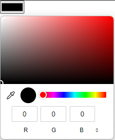
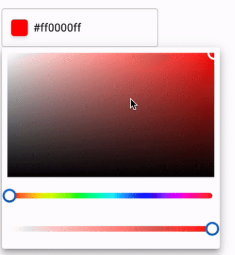
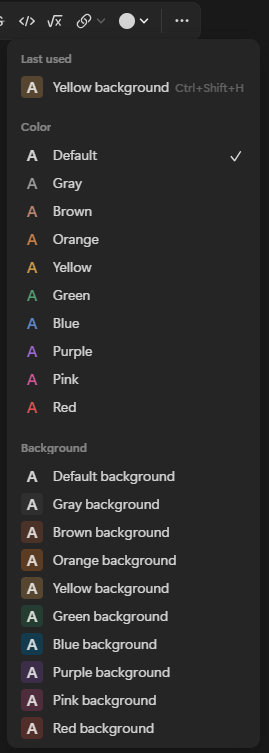
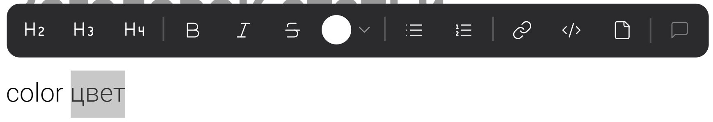

Сейчас цвет текста можно установить только через markdown: `[color:red] [/color]`. Хотелось бы иметь возможность сделать через дополнительную панель, всплывающую над выделенным текстом:

## Референсы

Но лучше попросить Эльмира сделать

:::info:true Стандартное

:::

:::info:true Material UI

[Ссылка](https://github.com/viclafouch/mui-color-input)

:::

:::info:true Notion

:::

:::info:true Моё предложение

:::

## Критерии

1. Выбор цвета доступен через дополнительную панель

2. Отображается в Markdown: `[color:#ff0000] text [/color]`

## Технические критерии

1. Цвет является не узлом, а маркой.

2. Марка цвета может смешиваться с другими марками: `[color:#ff0000]**ffff**[/color]`