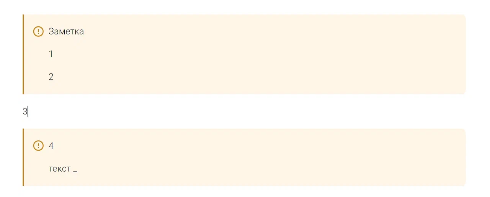
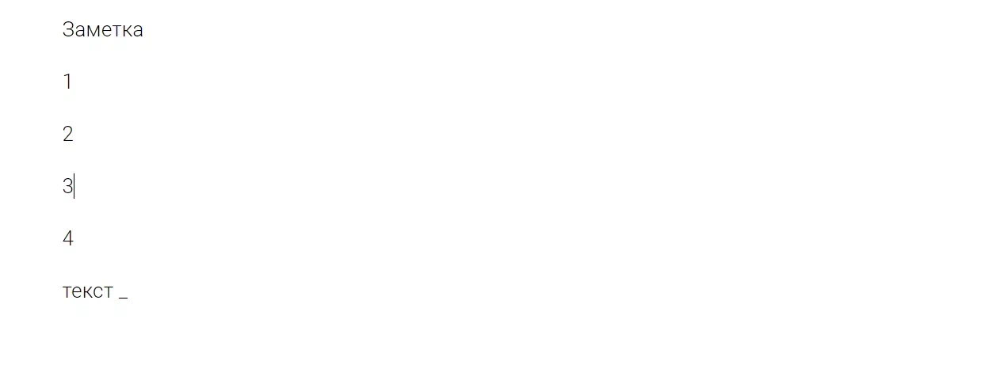

Сейчас нельзя убрать заметку и оставить ее контент или обернуть контент в заметку;

Блочные элементы с контентом - таб, таблица и заметка.

## Критерии

-  по нажатию на кнопку заметки, ее можно убрать, сохранив контент:

   -  с выделением -  выделенные узлы выйдут из заметки, разорвав ее:

      

   -  без выделения - вся заметка будет удалена, сохранив контент:

      

-  заметкой можно обернуть блочные элементы, кроме блочных элементов с контентом.

:::note 

jhghjg

:::

## Тесты

-  Оборачивание нескольких узлов в заметку;

-  Полное удаление заметки по фокусу с сохранением контента.

-  Удаление заметки по выделению с сохранением контента;

## Оценка

-  анализ: 1ч;

-  реализация: 7ч;

-  тесты: 30м.

## Саппорты

-  <https://support.ics-it.ru/issue/GXS-1898>

-  <https://support.ics-it.ru/issue/GXS-1711>

## 