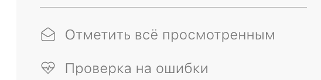
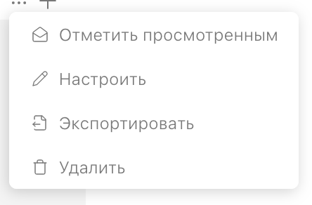

Я, работая в каталоге, хочу знать, какие статьи изменились при синхронизации.

:::hotfixes Пропозалы

1. [Уведомления при синхронизации](https://ics-it.gram.ax/docreader-team/roadmap/inbox/notification/new_article_0)

2. [Индикаторы в навигации и статье](https://ics-it.gram.ax/docreader-team/roadmap/inbox/diff/new_article_4)

:::

## [comment:xhhUn]Критерии[/comment]

1. Приложение запоминает, какие файлы, относящиеся к каталогу, были изменены (добавлены, удалены) при синхронизации

   1. Логика выборки файлов аналогична счётчику синхронизации: учитываются файлы из директории с `.doc-root.yaml` и ниже

   2. Для каждой ветки просмотренные изменения запоминаются отдельно

      **? Одно и то же изменение может быть просмотрено в master, но потом появиться в develop при синхронизации и оказаться непросмотренным**

2. В левой навигации отображаются непросмотренные изменения в виде маркеров около статьи

   **? Нарисовать дизайн, как должны выглядеть маркеры, подкорректировать цвета**

   1. Цвет маркера зависит от типа изменения статьи:

      -  Добавлена -- зелёный #16bd00§

      -  Изменена -- синий #002fff

      -  Удалена -- красный #c20600, название статьи бледное

   2. Перенос статьи обозначается удалением по старому пути и добавлением по новому

3. Изменение считается просмотренным при открытии статьи. После прочтения все маркеры у статьи пропадают

   1. Удаленные статьи отображаются в левой панели, но при нажатии на них ничего не происходит, они просто удаляются из панели

4. Если в каталоге есть непрочитанные изменения, в правой навигации присутствует кнопка “[icon:mail-open] Отметить всё просмотренным“ (**Придумать текст?**), при нажатии все изменения в текущей ветке отмечаются просмотренными, т. е. удаляется файл с изменениями из `.git/gramax/unread`

   

5. Если в категории есть статьи с непросмотренными изменениями, в контекстном меню категории первым пунктом есть кнопка “[icon:mail-open] Отметить просмотенным“ (**Придумать текст?**), при нажатии все дочерние статьи и категории отмечаются прочитанными

   

6. Изменённые при синхронизации файлы записываются в `.git/gramax/unread/<branch-name>.json`. Пример такого файла:

   ```json
   [
   	{
   		"path": "file-1",
   		"kind": "modified"
   		"from": <commit-sha>,
   		"to": <commit-sha>
   	},
   	{
   		"path": "file-2",
   		"kind": "deleted",
   		"from": <commit-sha>,
   		"to": <commit-sha>
   	},
   	{
   		"path": "file-2-renamed",
   		"kind": "added",
   		"from": <commit-sha>
   		"to": <commit-sha>
   	}
   ]
   ```

   1. Свойства `from` и `to` необходимы для отображения изменений контента статьи в будущем -- не в этой US

      1. `from` - oid коммита, на котором пользователь был на момент синхронизации

      2. `to` - oid коммита, в котором этот файл был в последний раз изменён

      3. Если один из коммитов не был найден, то diff не будет отображаться

   2. Если файл `.git/gramax/unread/<branch-name>.json` уже существовует, он дополняется

      1. Если путь существует, он заменяется новым, т.е. новые записи о непросмотренных изменениях мержаться с предыдущими

7. В левой навигации, рядом с измененной статьей (где лучше?) показется иконка (или лучше просто сделать синий маркер кликабельным?), при нажатии на которую открывается окно, в котором показывается изменение статьи, как в публикации изменений или как в истории изменений.

---

### Подсветка изменений после синхронизации

1. Я нахожусь в каталоге, у меня прочитаны все изменения, а на кнопке синхронизации [comment:3]10 новых изменений.[/comment]

2. Я нажимаю на кнопку синхронизации и получаю эти 10 изменений. Грамакс сравнивает ревизию, на которой я находилась с последней ревизией, которую я получила. [comment:2]Все изменения выводит в левой навигации.[/comment]

   -  Если статья новая -- подсвечена зеленым маркером.

   -  Если статья перенесена -- подсвечена зеленым маркером, как новая. Ее старое расположение подсвечено, как удаление.

   -  Если в статье есть изменения -- синим маркером.

   -  Если статья удалена -- красным маркером, название бледное.

### Резолв подсветки

1. Я открываю статью, которая помечена зеленым или синим маркером -- маркер пропадает.

2. [comment:1]Я открываю статью, которая подсвечена красным маркером -- статья исчезает из левой навигации.[/comment]

3. Последующие открытия статьи происходят как обычно.

4. Маркер сохраняется, пока я не открою статью: если я не открыла ни одну измененную статью и еще раз синхронизировала каталог -- остается подсветка из первой синхронизации, к ней добавляется подсветка изменений из второй синхронизации.

### Смена ветки

Подсветка изменений работает в каждой ветке изолировано: если я синхронизировала ветку master, а затем перешла в ветку dev и ее тоже синхронизировала -- в ветке dev грамакс сравнит ревизию, на которой я находилась с последней ревизией, которую я получила. [comment:uaf2g]Подсветка из master не соприкасается с подсветкой в dev.[/comment]

### Первое открытие каталога

При первом открытии пользователь не видит никаких счётчиков. Запоминание ревизий начинается с первого открытия.

### Открытые вопросы

-  Что делать с переименованием?

-  Если пользователь синхронизировался, но ещё не до конца прочитал (не всё), и ещё раз синхронизировался (появились новые изменения), то относительно какой версии считать новые изменения? Поверх текущих непрочитанных ещё добавятся новые непрочитанные?