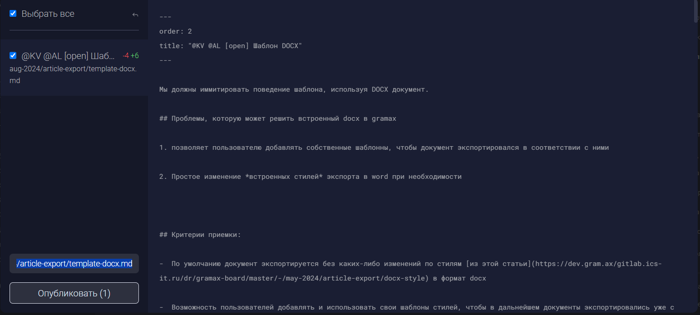
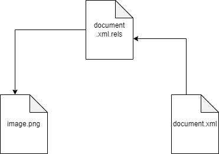
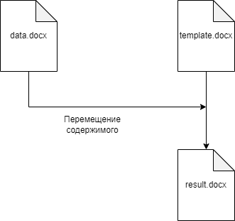
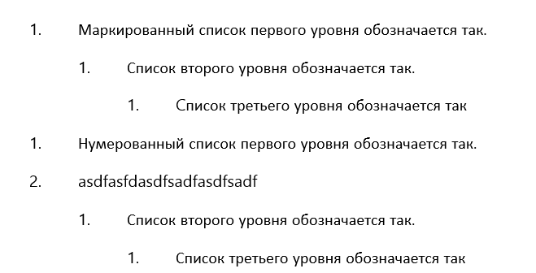
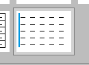
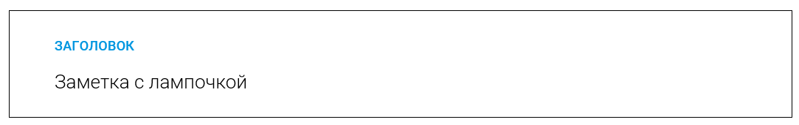

Мы должны иммитировать поведение шаблона, используя DOCX документ.

## Проблемы, которую может решить встроенный docx в gramax

1. позволяет пользователю добавлять собственные шаблонны, чтобы документ экспортировался в соответствии с ними

2. Простое изменение *встроенных стилей* экспорта в word при необходимости

## Критерии приемки:

-  По умолчанию документ экспортируется без каких-либо изменений по стилям [из этой статьи](https://dev.gram.ax/gitlab.ics-it.ru/dr/gramax-board/master/-/may-2024/article-export/docx-style) в формат docx

-  Возможность пользователей добавлять и использовать свои шаблоны стилей, чтобы в дальнейшем документы экспортировались уже с новым стилем

-  Есть возможность удалить ранее добавленный стиль или заменить его.

## Как пользователю импортировать свои шаблоны:

1. Пользователь экспортирует статью в формат DOCX.

2. Затем он может отредактировать стили документа на своё усмотрение.

3. После редактирования пользователь импортирует изменённый шаблон обратно в Gramax.

4. В дальнейшем, все документы экспортируются с использованием этого нового шаблона стилей.

## Вопросы:

1. В целом видение?

2. Редактор шаблонов?

   1. Интерфейс редактора шаблонов - как должен выглядеть интерфейс? Будет похоже на публикацию изменений?



1. Настройки?

   1. Свои стили?

   2. Сколько стилей?

   3. Стили по умолчанию? Шаблоны по умолчанию? Последний использованный шаблон?

   4. Отдельные шаблоны для статей/разделов/шаблонов?

   5. Настройки нумерации заголовков?

   6. Настройки оглавления?

   7. Если список стилей не соответствует стилям по умолчанию (есть лишние или каких-то не хватает), то выдавать предупреждение?

   8. Количество

2. Где находится кнопка?

   1. В строке с экспортом крайне справа

   2. Дальше открывается окно инструментов экспорта, в котором можно добавлять шаблоны и выбрать среди них основной, переместив его на самый верх.

   3. Добавить первый шаблон аналогичен добавить первый каталог

3. Сколько максимум шаблонов?

   1. неограниченное количество в общем и один основной, с которым происходит экспорт по умолчанию

4. Где их удалять?

   1. Будет в редакторе шаблонов

5. Можно ли делать экспорт из кнопки для экспорта статьи с не основными стилями?

6. Нужно ли выводить ошибку, если есть стили, которых нет в docx

   1. Я думаю, что нет, например, захочет пользователь засунуть как шаблон, документ по умолчанию, смысл ему выдавать ошибку? Docx js сам к этому благосклонен. В таком случает лучше выдавать предупреждение


## Структура

Структура документа `*.docx` упрощенно выглядит так



Тут видно, что `document.xml` ссылается на `document.xml.rels`, а `document.xml.rels` - на `image.png`.

`document.xml.rels` автоматически **создает новые id** для картинок, чтобы `document.xml `с легкостью к ним обращался.

На деле же всё куда сложнее, `document.xml.rels` **создает id** не только на `image.png`, но и на *множество* других файлов

### Список того, на что может ссылаться document.xml.rels

1. **Изображения**:

   -  Ссылки на изображения, используемые в документе. Обычно они находятся в папке `media`.

   -  Пример:

      ```
      <Relationship Id="rId1"
      Type="http://schemas.openxmlformats.org/officeDocument/2006/relationships/image"
      Target="media/image1.png"/>
      ```

2. **Стили**:

   -  Ссылка на файл стилей `styles.xml`, который определяет стили документа.

   -  Пример:

      ```
      <Relationship Id="rId2"
      Type="http://schemas.openxmlformats.org/officeDocument/2006/relationships/styles"
      Target="styles.xml"/>
      ```

3. **Темы**:

   -  Ссылка на файл тем `theme/theme1.xml`, который определяет цветовую тему документа.

   -  Пример:

      ```
      <Relationship Id="rId3"
      Type="http://schemas.openxmlformats.org/officeDocument/2006/relationships/theme"
      Target="theme/theme1.xml"/>
      ```

4. **Шрифты**:

   -  Ссылка на файл шрифтов `fontTable.xml`, который содержит информацию о шрифтах, используемых в документе.

   -  Пример:

      ```
      <Relationship Id="rId4"
      Type="http://schemas.openxmlformats.org/officeDocument/2006/relationships/fontTable"
      Target="fontTable.xml"/>
      ```

5. **Настройки**:

   -  Ссылка на файл настроек документа `settings.xml`.

   -  Пример:

      ```
      <Relationship Id="rId5"
      Type="http://schemas.openxmlformats.org/officeDocument/2006/relationships/settings"
      Target="settings.xml"/>
      ```

6. **Дополнительные части документа**:

   -  Могут быть ссылки на разделы (`headers`, `footers`) и другие части документа.

   -  Пример:

      ```
      <Relationship Id="rId6"
      Type="http://schemas.openxmlformats.org/officeDocument/2006/relationships/header"
      Target="header1.xml"/>
      ```

### На что ссылается document.xml

В свою очередь `document.xml` ссылается на вышеупомянутые файлы через `document.xml.rels`

Исследования других файлов **НЕ проводились**, так как это заслуживает отдельного внимания, но там примерно также.

На деле даже это является упрощением

Вот многие (но не все) файлы которые есть в word документе

## Как реализовать шаблоны

Мною придуманы следующие способы реализовать логику шаблонов

1. Изначально из шаблона программно вытаскивать все стили, в том числе `numbering.xml`, и всех остальных файлов, влияющих на форматирование, кроме `styles.xml`, потому что `docx js` умеет его парсить, и экспортировать сразу его

2. Сначала на локальном хранилище экспортировать файл с стилями по умолчанию, затем уже некоторые файлы из него



### Преимущества первого способа

-  Теоретически код будет выполнятся быстрее, так как создается только один файл

### Недостатки первого способа

-  Отсутствие простого Api для взаимодействия с содержимым, чтобы легко парсить его

-  Нужно парсить вручную множество файлов, чтобы получить результат с шаблона

-  Поэтому нужно изучить структуру всех файлов в .docx


### Преимущества второго способа

-  Теоритическая простота написания кода, нужно лишь учесть несколько файлов, их id и названия файлов

### Недостатки второго способа

-  Отсутствие Api для простого перемещения содержимого

-  Из-за чего приходится вручную отслеживать все файлы внутри `*.docx`, чтобы вовремя изменять id во всех них

-  Всё равно, нужно учесть множество “*но*”, которые могут быть выявлены только при помощи тестирования, либо досконального изучения некоторых файлов внутри `*.docx`


Есть библиотека `docx-merger`, которая занимается полным объединением двух файлов docx. Можно попробовать изучить исходный код и исключить от туда лишние действия, которые он делает.

Он буквально объединяет документы, объединяя и стили, и контент. Если в обоих документах есть стиль с одинаковым названием, он его дублирует, на копию ставит постфикс `1`


## Проблемы с шаблонами в целом

-  При приминении стилей для нумерации, слетает оформление вложенный нуменованных списоков, поэтому они будут делаться хардкором



-  Сами стили таблиц и блоков, основанных на них, не применяются к таблицам. Как это происходит?:

   -  формально, к таблице применен стиль, однако сами стили не применяются

      -  в окне стилей стиль выделен

      -  однако сам стиль не применен

   -  Поэмоту, сами стили дополнительно добавляются программно. Если нужен другой стиль таблиц, то от экспорта таблиц следует отказаться, либо вручную повторно переприменять стили после экспорта






---

:::hotfixes:true Технические детали

**Первый этап уже сделан в** [**Стили сложных блоков**](https://dev.gram.ax/gitlab.ics-it.ru/dr/gramax-board/master/-/upcoming-release/article-export/docx-style-3)

#### Как будет происходить применение шаблона DOCX

-  нужно временно сохранить где-то экспортируемый файл

-  создать копию шаблона с нужным названием

-  затем взять из временного файла document.xml и вставить в копию шаблона, при этом заменив некоторые настройки в самом файле document.xml

-  удалить временный файл

-  Сохранить результат экспорта

:::