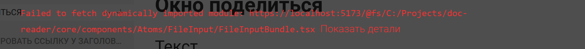
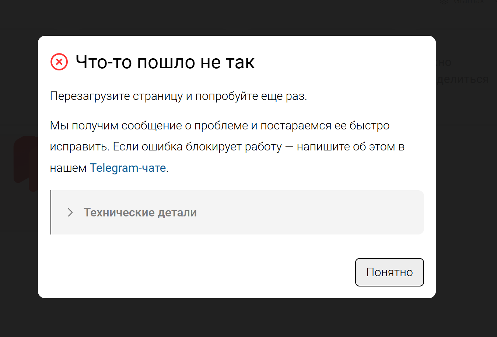

## Проблема

Сейчас в модальных окнах для ошибок React отображаются некрасивые уведомления об ошибках.

Необходимо заменить старые ошибки для модальных окон на модальное окно «Что-то пошло не так»

## Критерии

-  При возникновении React ошибки в модальном окне, на его месте отобразиться модальное окно “Что-то пошло не так”

-  Кнопка “Понятно” закрывает модальное окно