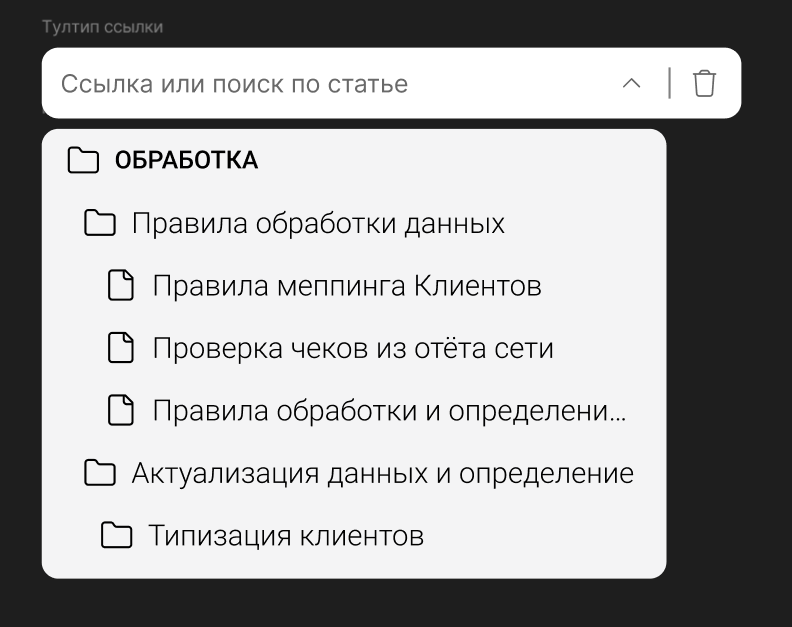
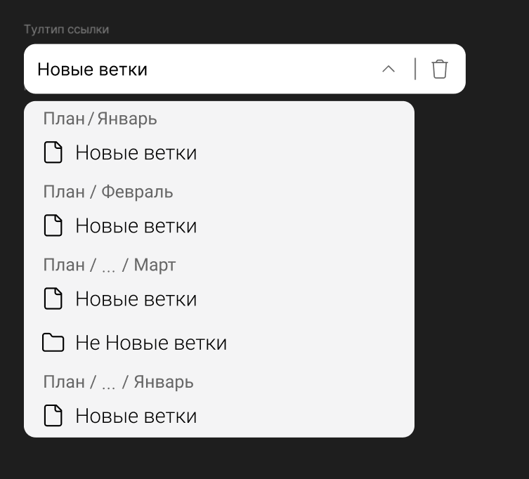
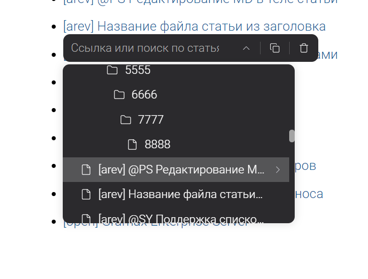
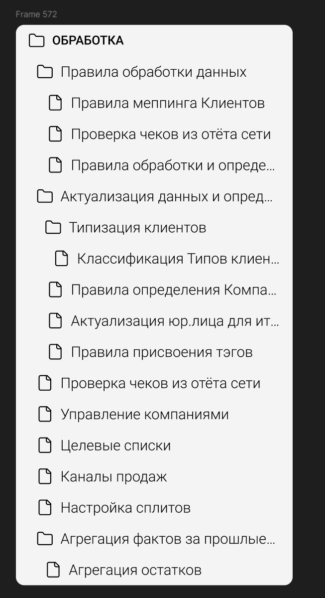
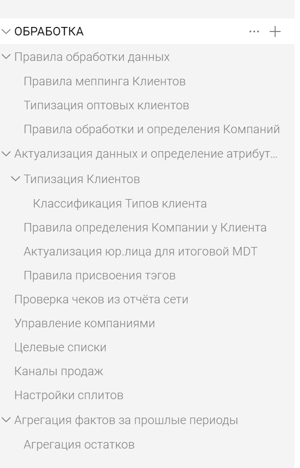

Сейчас при выборе ссылки, не видно родительские статьи, поэтому можно запутаться, когда есть статьи с одинаковыми или похожими именами.

:::info:true Макет меню без фильтра

:::

:::info:true Макет выпадающего меню с фильтром

:::

### Критерии

-  Без фильтра ссылки на статьи отображаются, как в навигация левого сайдбара.

-  При фильтрации показываются ссылки с breadcrumb над ними;

-  Ширина поиска увеличена на 30px;

-  В выпадающем меню, место под шеврон для открытия ссылок на заголовок нету, оно появляется при наведении на пукт;

:::info:true Вид максимальной вложенности

:::

:::info:true Макет иерархии ссылок



---

*  

   

*  

   



:::

### Оценка

-  анализ: 5ч;

-  реализация: 24ч;