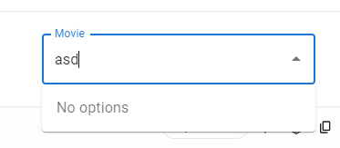
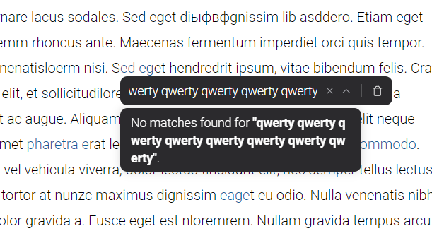
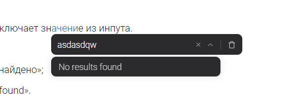

Сейчас есть замечания по тексту, который используется поиске с выпадающем меню.

### Референс

-  material-ui

:::info:true Material-ui dropdown

:::

:::info:true Текущая реализация

:::

:::info:true Пример новой реализации

[image:./ispravlenie-poiska-v-vypadayuschem-menyu-3.png::Пример 1:0,0,100,100:81:]

:::

### Критерии

-  Новый текст не включает значение из инпута.

-  Новый текст:

   -  ru: «Ничего не найдено»;

   -  en: «No results found».

### Оценка

-  анализ: 30м.

-  реализация: 1ч