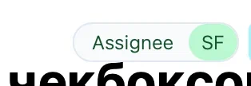

## Критерии

1. Канбан вид `view`. [Контрол](https://v0.dev/chat/mtceeJxV0sy)

2. Фильтр во `view`

   1. Множественный выбор через `checkbox`

3. В выборке не отображать все свойства, если нет выбранных

4. Текст

   1. (выбрать все)

   2. (пусто)

5. Новый дизайн для свойств

   1. Лейбл:\
      стиль - Slate\
      background - 50\
      border - 200\
      цвет - 800

   2. Значение:\
      Бекграунд - 200\
      цвет - 900

   3. Паддинги: 4px 8px

   4. [Цветовая палитра](https://tailwindcss.com/docs/customizing-colors)

      

Замечания

1. Если нет выбранного поля для группировки, то выводить текст: “Выберите поле для группировки“

2. Если не указаны фильтры, то выводить текст: “Выберите минимум одно поле для фильтрации“