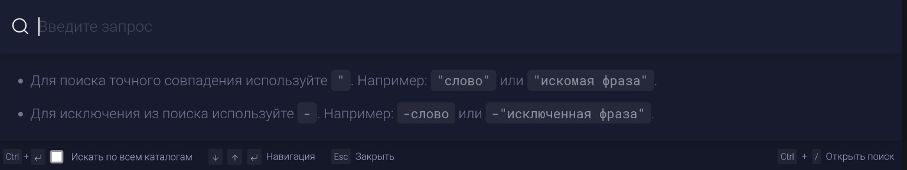

-  [Язык поиска в Gramax](https://dut-gramax.l3.cx/gramax-dumb-user/zametki-osvoeniya/yazyk-poiska-v-gramax) - у нас вроде уже в самом поиске описаны операторы поиска

   -  *Он рекомендует нам описать в доке, что поиск классный.*

-  [Русско-английский интерфейс](https://dut-gramax.l3.cx/gramax-dumb-user/zametki-osvoeniya/russko-angliyskiy-interfeys) - Паша, сказал решаемо, но потребует слишком больших трудозатрат ([ЮС](https://dev.gram.ax/gitlab.ics-it.ru/dr/gramax-board/master/-/backlog/zaprosy-yuzerov/russko-angliyskiy-interfeys))

-  [Неоптимальность главного меню](https://dut-gramax.l3.cx/gramax-dumb-user/zametki-osvoeniya/neoptimalnost-glavnogo-menyu) - Маленькая ЮС ([ЮС](https://dev.gram.ax/gitlab.ics-it.ru/dr/gramax-board/master/-/backlog/zaprosy-yuzerov/neoptimalnost-glavnogo-menyu))

-  [Полноэкранный режим всегда после перезапуска программы](https://dut-gramax.l3.cx/gramax-dumb-user/zametki-osvoeniya/polnoekrannyy-rezhim-vsegda-posle-perezapuska-pro) - про это в курсе, уже был саппорт на это [GXS-1797](https://support.ics-it.ru/issue/GXS-1797) ([ЮС](https://dev.gram.ax/gitlab.ics-it.ru/dr/gramax-board/master/-/backlog/zaprosy-yuzerov/sokhranyat-razmer-okna-posle-perezapuska))

-  [Чеклисты](https://dut-gramax.l3.cx/gramax-dumb-user/zametki-osvoeniya/cheklisty) - уже несколько месяцев хотим это сделать ([ЮС](https://dev.gram.ax/gitlab.ics-it.ru/dr/gramax-board/master/-/backlog/zaprosy-yuzerov/chekboxy))

-  [Не только VSCode](https://dut-gramax.l3.cx/gramax-dumb-user/zametki-osvoeniya/ne-tolko-vscode) - открытие каталога  можно в принципе расхардкодить, но только большой ценности в этом не вижу ([ЮС](https://dev.gram.ax/gitlab.ics-it.ru/dr/gramax-board/master/-/backlog/zaprosy-yuzerov/otkrytie-cataloga-v-drugikh-redaktorakh-pomimo-vscode))

-  [Фундаментальные идеи Gramax](https://dut-gramax.l3.cx/gramax-dumb-user/zametki-osvoeniya/fundamentalnye-idei-gramax) - насколько я понял он хочет что-то типа диздоков на философию грамакса ([ЮС](https://dev.gram.ax/gitlab.ics-it.ru/dr/gramax-board/master/-/backlog/zaprosy-yuzerov/dizdok-na-filosofiyu-gramaxa))

## Не очень понятно

-  [Автоматически скрываемые боковые панели - засада](https://dut-gramax.l3.cx/gramax-dumb-user/zametki-osvoeniya/avtomaticheski-skryvaemye-bokovye-paneli-zasada) - мне кажется, что скрываемые боковые панели это фича, но у него почему-то не было стрелочки показывающий разворачивание

   

-  [Горячие клавиши редактора](https://dut-gramax.l3.cx/gramax-dumb-user/zametki-osvoeniya/goryachie-klavishi-redaktora) - тут наверное про монастырь с другим уставом наверное

-  [Отделить хинты/подсказки от элементов управления](https://dut-gramax.l3.cx/gramax-dumb-user/zametki-osvoeniya/o) - мне не особенно понятен этот концепт детского велосипеда с четырьмя колесиками

-  [Надпись на кнопке при редактировании комментария](https://dut-gramax.l3.cx/gramax-dumb-user/zametki-osvoeniya/nadpis-na-knopke-pri-redaktirovanii-kommentariya) - мне кажется, что редактирование должно быть `edit`’ом, а не `ok` и  `save`

## Не сможем?

-  [Дефолтный браузер - Chrome, но запустился Edge](https://dut-gramax.l3.cx/gramax-dumb-user/zametki-osvoeniya/defoltnyy-brauzer-chrome-no-zapustilsya-edge) - WebView под виндой использует edge под капотом, поэтому используется edge. По поводу пунктов, возможно их стоит переделать, чтобы нельзя было открывать tauri.[localhost](http://localhost)