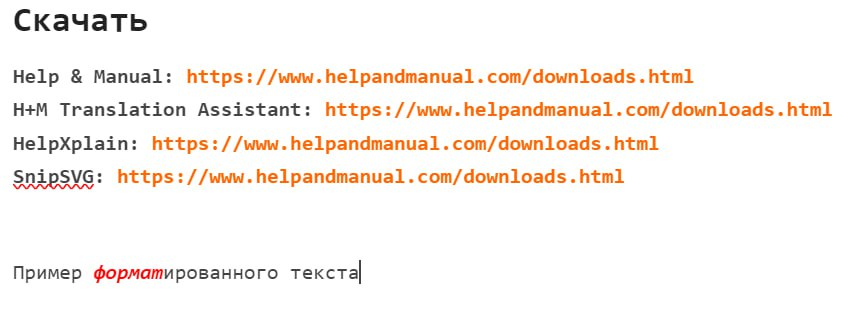
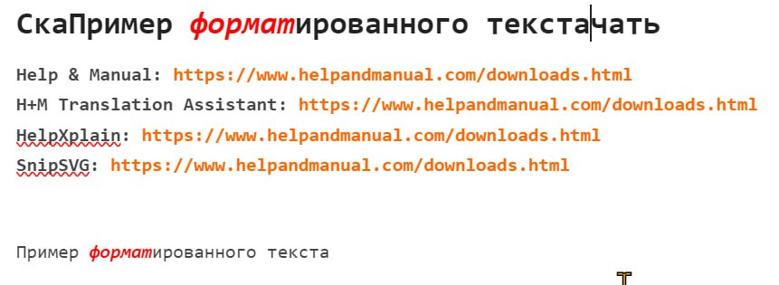
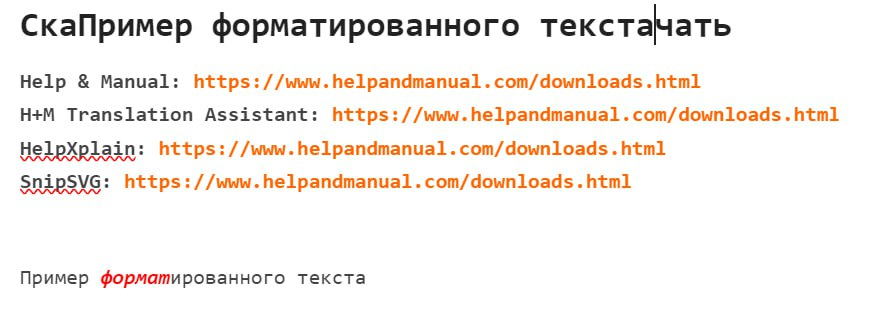

-  [Ограничения копипасты в WYSIWYG-редакторе](https://dut-gramax.l3.cx/gramax-dumb-user/zametki-osvoeniya/ogranicheniya-kopipasty-v-wysiwyg-redaktore) - попробовал на рандомном тексте, все ок, ссылки на текст, который он копировал нет

   -  *Пример текста --* [*https://www.helpandmanual.com/help/hm_whatsnew_ui.html*](https://www.helpandmanual.com/help/hm_whatsnew_ui.html)

-  [Нет функции “Вставить без форматирования”](https://dut-gramax.l3.cx/gramax-dumb-user/zametki-osvoeniya/net) - >нет функции >В Gramax по ***SHIFT-CTRL-V*** тоже можно вставить текст из буфера, но форматирование слетает до дефолтного.

   -  Исходное состояние: подготовлен хитро форматированный текст, забираем его в буфер.

      

   -  Вот мы его вставили в слово «Скачать» прямо как есть, по CTRL-V

      

   -  А вот мы его вставили по SHIFT-CTRL-V туда же, и он вставился очищенным от форматирования - просто как plain text. Но форматирование в точке вставки никто не изменил.

      

      Большое дело, реально нужная фича. В TinyMCE она точно есть, пользуюсь каждый день ей в BookStack.

      Вы не поленитесь у себя его поставить для команды:

      \- это хорошая, годная wiki, в хозяйстве пригодится.

      \- автор (ssdanbrown) давно уже налетел на многое, прибил много лишнего у себя, и продукт у него уже довольно-таки здорово вылизан. Есть, что подсмотреть.