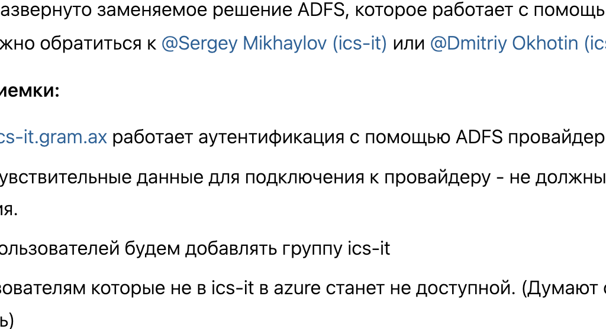

[GXS-1626](https://support.ics-it.ru/issue/GXS-1626) Разработка альтернативного механизма аутентификации на [ics-it.gram.ax](http://ics-it.gram.ax)

Компания Microsoft в 21.03.2024 объявила о блокировке Azure для корпоративных клиентов. В ближайшее время может перестать работать аутентификация Azure на <https://ics-it.gram.ax>

В компании развернуто заменяемое решение ADFS, которое работает с помощью SAML. По вопросам настройки нужно обратиться к [@Sergey Mikhaylov (ics-it)](https://support.ics-it.ru/users/sergey.mikhaylov) или [@Dmitriy Okhotin (ics-it)](https://support.ics-it.ru/users/dmitriy.okhotin).

**Критерии приемки:**

-  На <https://ics-it.gram.ax> работает аутентификация с помощью ADFS провайдера.

-  Secrets и чувствительные данные для подключения к провайдеру - не должны содержаться в коде приложения.

-  Для всех пользователей будем добавлять группу ics-it

-  Вход пользователям которые не в ics-it в azure станет не доступной. (Думают стоит выложить про это новость)

-  Токены будут работать как раньше

asdfasdf

asdfasdf

asdfasdf