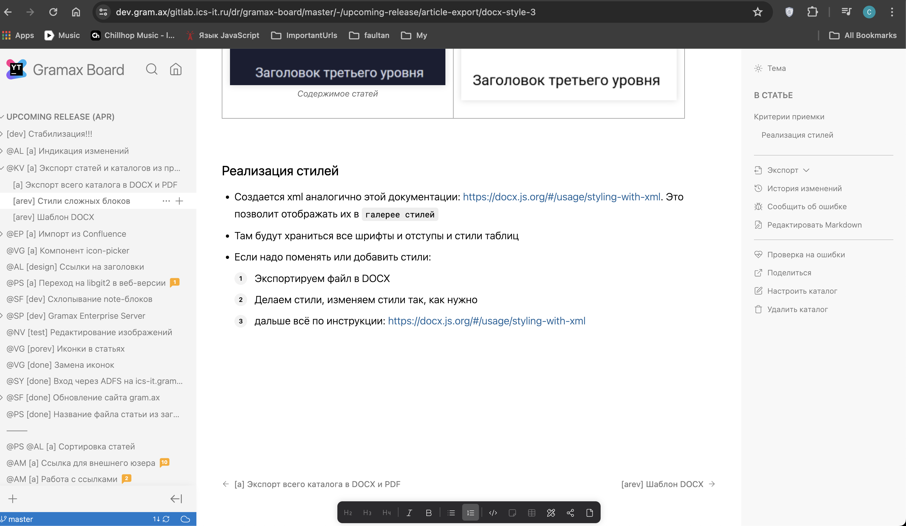

Сейчас текст статьи можно писать до самого низа статьи. Из-за этого неудобно читать и писать в конец статьи потому что этот текст внизу экрана. Хотелось бы чтобы было удобно.

**Критерии приемки:**

-  Снизу статьи всегда есть отступ с минимальной высотой в 30% от высоты экрана

   
