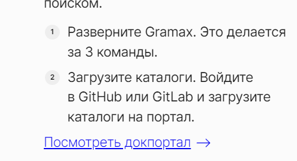

**Критерии:**

-  страница “Для бизнеса” переименована в “База знаний”;

-  установлен новый контент на страницах:

   -  Главная;

   -  База знаний;

   -  vs. confluence.

-  внутренние и внешние отступы блоков заданы в em и rem;

-  вид нумерованного списка перенесен из [app.gram.ax](http://app.gram.ax);

-  svg иконки заменены на иконки от font-awesome;

-  создан видео блок:

   -  состоит из: заголовка, текста, видео фрейма;

   -  имеет закругление 8px;

   -  для десктопной версии:

      -  видео фрейм и текст расположены на одном уровне;

      -  горизонтальный отступ = 4rem.

   -  для мобильной версии:

      -  видео фрейм находится под текстом;

      -  вертикальный отступ = 2rem.

-  добавлены видео с встроенным плеером;

Вопросы на созвон:

1. какой вид должен иметь footer?

2. на какой видео плеер будем менять фрейм от youtube?

3. что делать с страницами на английском языке?

4. у нас нет стандартов, как оформлять списки. Как оформить их на сайте?

