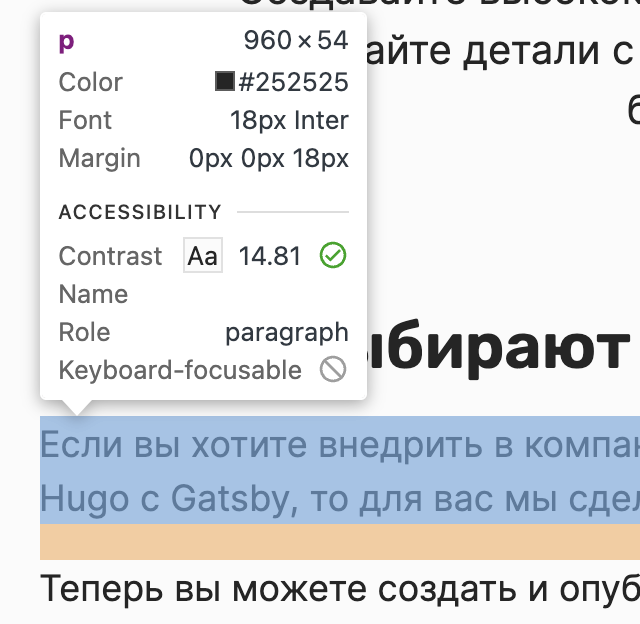
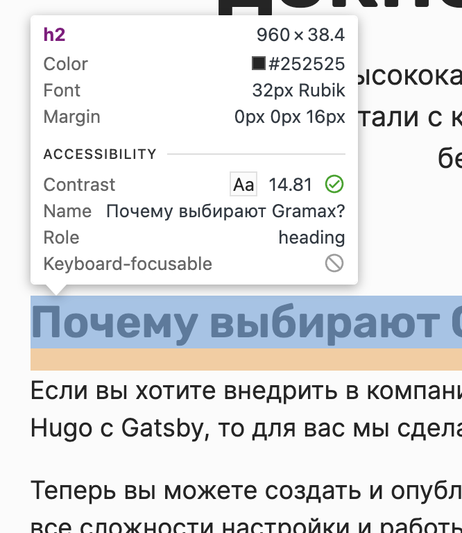
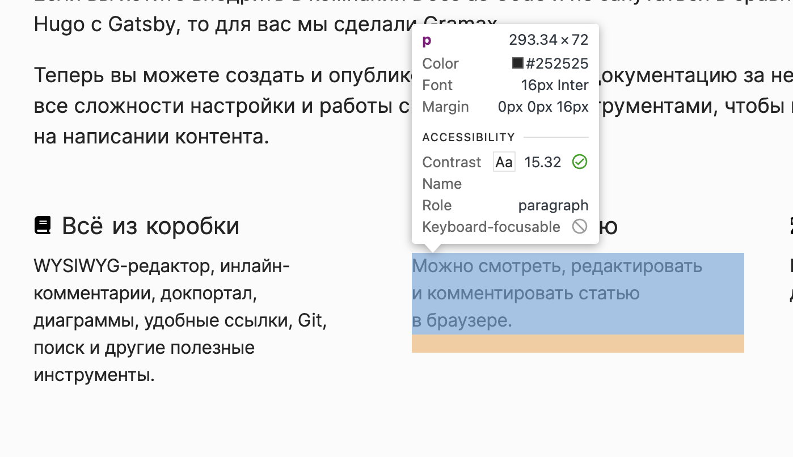
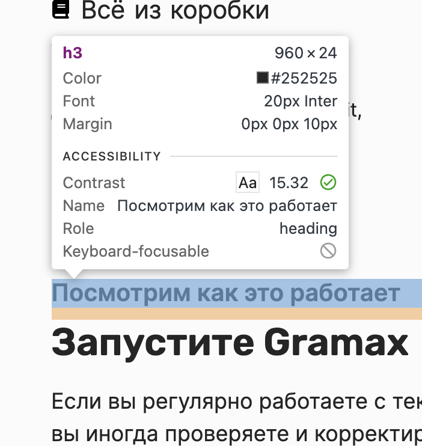
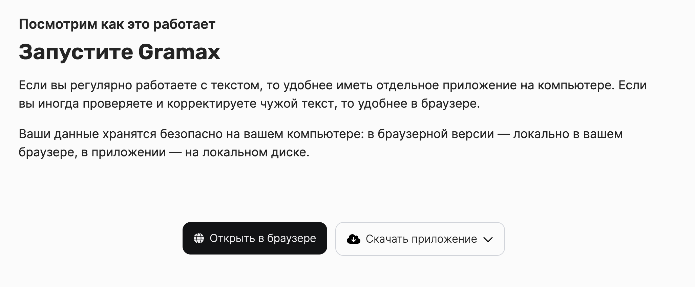
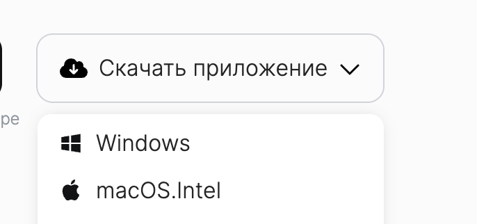
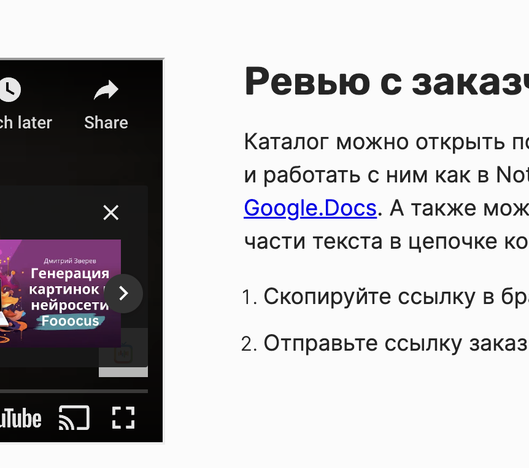
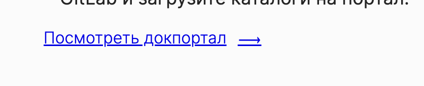

## Замечания к сайту

-  gap внутри блоков -- 0

-  line-height: 1.5.

   -  Subline: font-size: 18px

-  Все отступы задаются в em (а не в пикселях).

   

-   

-  Подписи для кнопок предлагаю убрать. А текст скорректировать до такого:

   

-  Отступ от кнопки до выпадающего меню сейчас большой. Нужно уменьшить до такого (или до нуля если так проще)

   

-  Горизонтальный gap 4rem

   

-  Картинку обновить отсюда: [https://www.figma.com/file/5tafFdSJucOWbmkqMgTORb/Gramaх-сайт?type=design&node-id=1377-10065&mode=dev](https://www.figma.com/file/5tafFdSJucOWbmkqMgTORb/Grama%D1%85-%D1%81%D0%B0%D0%B9%D1%82?type=design&node-id=1377-10065&mode=dev)

   

   

   dsd