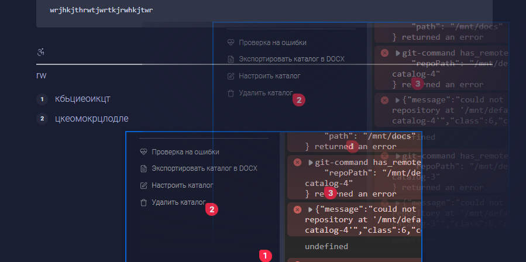

Сейчас отсутствует возможность переноса картинок и диаграмм по статье (только если вырезать и вставлять), хотелось бы иметь такую возможность. Особенности:

-  Для списков у линии видно отступ по уровню списка, куда будет картинка вставляться.

## Критерии

1. При зажатом ЛКМ на картинках, диаграммах видно линию для переноса картинки.

   

2. При отжатию ЛКМ перемещаемый элемент меняет свою позицию на точку переноса.

3. При перемещении элемента статья скроллится за курсором.

### 