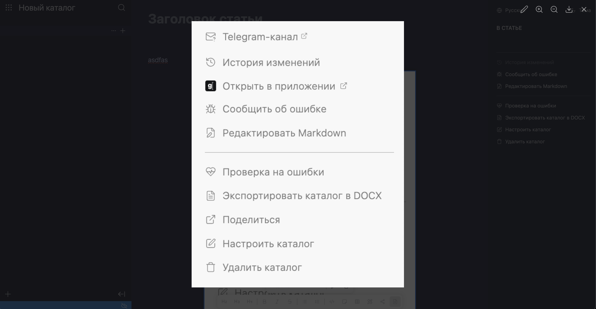
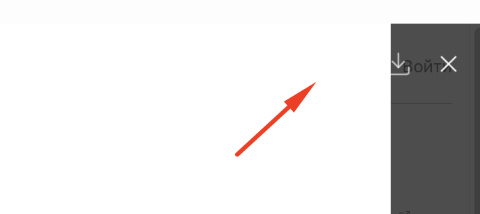

Проблемы, которые сейчас есть с картинками:

-  Необходимо переработать логику работы с картинками и диграммами в редакторе. Диаграммы должны работать также как картинки и их можно также редактировать.

-  Иногда при написании текста, следующее за ним изображение выделяется, это мешает.

-  Так же сейчас нельзя открыть диаграммы в модальном окне для просмотра, хотелось бы иметь такую возможность.

-  В модальном окне нельзя зумить в определенную область. Так же его хотелось бы передизайнить в похожый формат, как у телеграмма. Убрать кнопку “На весь экран“.

-  После вставки картинки фокус на картинке. Если я делаю ещё раз вставку при фокусе на картинке, то она заменяется.

## Критерии

1. Изменяется  модальное окно, там добавятся возможности:

   1. Зумить картинку кнопками, колесом мыши и тачпадом.

   2. Редактирования, только в редакторе

2. Дизайн полноэкранного режима поменяется

   

3. Для диаграмм доступны такие же опции, что и для картинки.

4. После вставки фокус на картинке. При повторной вставке, с фокусом на картинке, картинка заменяется.

5. Баг с фокусом, что иногда он переходит на изображение, при написании текста исправлен

   1. Как можно было воспроизвести:

      1. Написать текст

      2. Вставить картинку

      3. Установить фокус на картинку, а потом обратно на текст

      4. Написать один символ

## Тестирование

Тестов нет

### Замечания

1. \[x\] Не работает зум картинки колесом мыши.

2. \[x\] После добавления картинки фокус не на картинке.

3. \[x\] На белой картинке не видно кнопок

   
