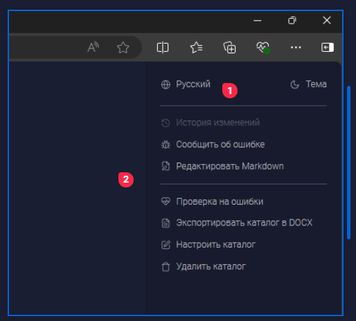

Сейчас нет возможности изменять размеры картинок, хотелось бы иметь такую возможность.

## Критерии

1. Потянув за скругленный прямоугольник, можно изменять размер картинки. Пропорции картинки всегда сохраняются оригинальные.

   

   1. Максимальный scale -- шириная статьи.

   2. Минимальный scale -- 4-5 строчек текста.

2. Хранится в Markdown следующим образом:  `[image:src:alt:title:crop:scale:objects]`

## Тестирование

Тестов нет.

## Замечания

-  В заметках, если растянуть картинку на максимальную ширину, пропадает синяя полоска.