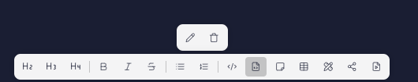

**Необходимо показать, как можно с помощью HTML решить исходную проблему**

Сейчас нет поддержки сырого HTML. Но некоторых функций у нас нет: например нельзя баннер ссылкой вставить. В сниппетах ссылки не поддерживаются. Хочется, чтобы была возможность когда надо вставить сырой контент

Также есть некоторые ограничения: например, в сниппетах ссылки не поддерживаются. Хочется, чтобы была возможность когда нужно вставить сырой контент.

Предложение:

-  В Markdown поддерживается блочный и инлайновый элемент

-  Все что внутри них рендерится на страницу в чистом виде без Escape и прочего. Поддерживаются style, script и любые другие элементы

## Открытые вопросы

-  Что если тег внутри html не закрывается, мы закрываем автоматически или ожидаем что в другом html элементе он будет закрыт? Боюсь поломается верстка если мы не будем его закрывать. С другой стороны они не смогут оборачивать наш контент так, как сами захотят.

## Другие открытые вопросы

-  у нас есть блочные элементы, которые открываются и закрываются. Закрывающиеся элементы имеют префикс /. Немного путает, что элементы которые не закрываются и закрывается выглядят одинаково. Возможно стоит использовать другой синтанксис, например \[button:Сохранить/\] или что-то аналогичное

## Критерии

1. Создан отдельный компонент для отображения HTML

   1. Поддержка любых тегов (script, style)

   2. Редактирование через Monaco редактор с подствеской синтаксиса HTML

   3. Открытие модального окна редактора через панель, как у изображений, но без подписи

      

2. Создание узла через панель инструментов.

   1. Иконка: [icon:file-code]

   2. Тултип: HTML

3. Отображается в Markdown

## Тестирование

-  На создание компонента

-  На рендер компонента на странице

## Пример для документации

[html]

    

        

            Вы можете помочь сделать работу в Docs as Code удобной, как никогда раньше. Вступайте в <a href="https://t.me/gramax_chat">сообщество Gramax в телеграм</a>, чтобы узнавать новости о Docs as Code и проекте.
        

        

            <a class="link" href="https://twitter.com/gram_ax">
                <i class="button_icon css-15fiha7 li-fw"><svg data-v-14c8c335="" xmlns="http://www.w3.org/2000/svg" width="1.5em" height="1.5em" viewBox="0 0 24 24" fill="none" stroke="currentColor" stroke-width="2" stroke-linecap="round" stroke-linejoin="round" class="lucide lucide-twitter lucide-icon customizable"><path d="M22 4s-.7 2.1-2 3.4c1.6 10-9.4 17.3-18 11.6 2.2.1 4.4-.6 6-2C3 15.5.5 9.6 3 5c2.2 2.6 5.6 4.1 9 4-.9-4.2 4-6.6 7-3.8 1.1 0 3-1.2 3-1.2z"></path></svg></i>
                Twitter
            </a>
            

                        <a class="link" href="https://t.me/gramax_chat">
                <i class="button_icon css-15fiha7 li-fw"><svg data-v-14c8c335="" xmlns="http://www.w3.org/2000/svg" width="1.5em" height="1.5em" viewBox="0 0 24 24" fill="none" stroke="currentColor" stroke-width="2" stroke-linecap="round" stroke-linejoin="round" class="lucide lucide-send lucide-icon customizable"><path d="M14.536 21.686a.5.5 0 0 0 .937-.024l6.5-19a.496.496 0 0 0-.635-.635l-19 6.5a.5.5 0 0 0-.024.937l7.93 3.18a2 2 0 0 1 1.112 1.11z"></path><path d="m21.854 2.147-10.94 10.939"></path></svg></i>
                Telegram
            </a>
            

                        <a class="link" href="https://github.com/Gram-ax/gramax">
                <i class="button_icon css-15fiha7 li-fw"><svg data-v-14c8c335="" xmlns="http://www.w3.org/2000/svg" width="24" height="24" viewBox="0 0 24 24" fill="none" stroke="currentColor" stroke-width="2" stroke-linecap="round" stroke-linejoin="round" class="lucide lucide-github lucide-icon customizable"><path d="M15 22v-4a4.8 4.8 0 0 0-1-3.5c3 0 6-2 6-5.5.08-1.25-.27-2.48-1-3.5.28-1.15.28-2.35 0-3.5 0 0-1 0-3 1.5-2.64-.5-5.36-.5-8 0C6 2 5 2 5 2c-.3 1.15-.3 2.35 0 3.5A5.403 5.403 0 0 0 4 9c0 3.5 3 5.5 6 5.5-.39.49-.68 1.05-.85 1.65-.17.6-.22 1.23-.15 1.85v4"></path><path d="M9 18c-4.51 2-5-2-7-2"></path></svg></i>
                GitHub
            </a>
        

    

[/html]