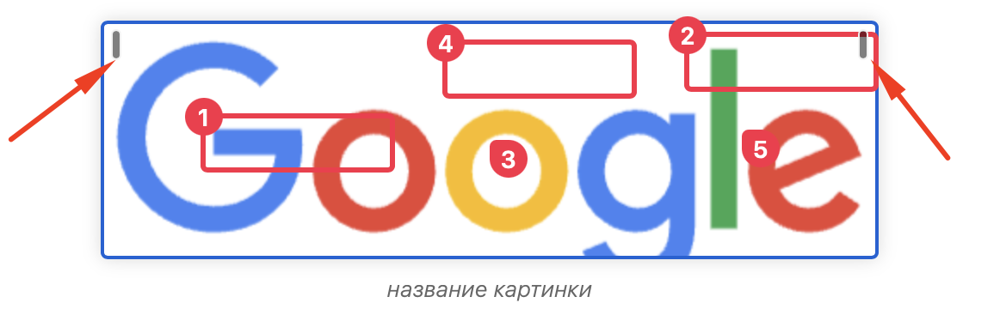

Изменение дизайна под наш стиль.

Макет: [Gramax приложение – Figma](https://www.figma.com/design/4ed1wT5Q53Q2ngP4Oex7f8/Gramax-приложение?node-id=2551-202&m=dev)

## Критерии

1. Два ресайзера, прижатых в левой и правой границе

   1. Ширина = 6px

   2. Высота

      1. Минимальная = 18px

      2. Максимальная = 48px

   3. Обводка = 1px, цвет #ffffffe5

   4. Задний фон = #00000080

2. Скругление изображений = 2px

3. Минимальный размер для ресайза = \~21px

## Замечания

-  В десктопе ручки не по центру находятся

