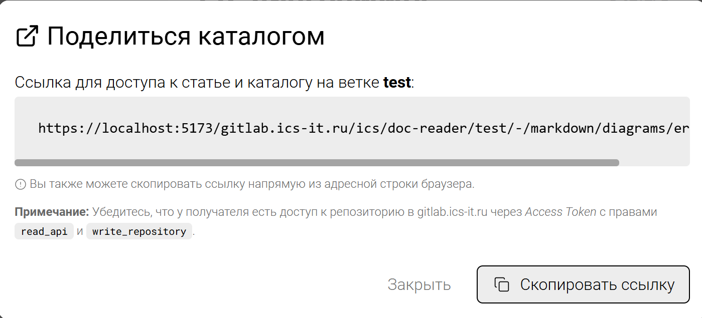
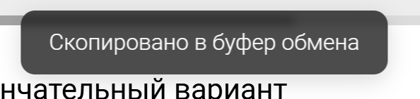

Сейчас при нажатии кнопки «Скопировать ссылку» в окне «Поделиться» пользователю не отображается сообщение о том, что ссылка скопирована.

## Критерии

-  Вид модального окна:



:::note 

«Подробнее» отсутствует в окне, потому что документация ещё не готова

:::

-  После нажатия на кнопку \[Copy link\] окно закрывается и появляется поповер сверху . Поповер висит 3 секунды  и исчезает.



:::lab:true Стили поповера

```css
 box-shadow: rgba(0, 0, 0, .15) 0px 4px 16px;
    background: rgba(0, 0, 0, 0.7);
    color: white;
    padding: 10px 20px;
    margin-top: 20px;
    border-radius: 10px;	
	backdrop-filter: blur(3px);
```

:::

Текст окна на английском:

```
# Share catalog

Link to access the article and catalog on the branch `prepare-goals`:

https://app.gram.ax/gitlab.ics-it.ru/ics/ics-docs/prepare-goals/-/beginner/products/quiz

**Note:** Make sure the recipient has access to the repository in gitlab.ics-it.ru via an *Access Token* with `read_api` and `write_repository` permissions.

[Close] [Copy link]
```

Текст окна на русском:

```
# Поделиться каталогом

Ссылка для доступа к статье и каталогу на ветке `prepare-goals`:

https://app.gram.ax/gitlab.ics-it.ru/ics/ics-docs/prepare-goals/-/beginner/products/quiz

**Примечание:** Убедитесь, что у получателя есть доступ к репозиторию в gitlab.ics-it.ru через **Access Token** с правами `read_api` и `write_repository`.
Подробнее.

[Закрыть] [Копировать ссылку]
```

### Замечания

-  В десктопе при наведении на строку со ссылкой немного увеличивается строка кода, дергается [Запись.mov](<./Запись экрана 2024-08-29 в 16.48.56.mov>).