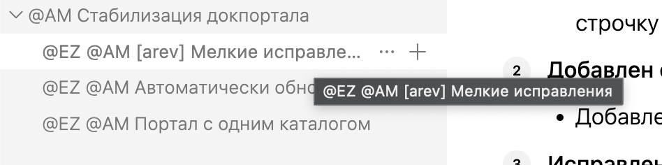

## Проблема

1. Сейчас кнопка «Копировать ссылку» у заголовка слишком большая по отношению к заголовку и слишком близко к нему. Кнопка создает пустую строку, если ей не хватает места в текущей строке.

2. На докпортале отсутствует отступ снизу как в приложении.

3. При отсутствии кнопок в правой панели разделители не убираются.

4. В левой панели, если название статьи слишком большое, невозможно увидеть полное название статьи, нужно добавить тултип.

5. На меленьких экранах сложно попасть на аннотацию, на изображении, чтобы отобразить тултип. Нужно увеличить область нажатия.

## Критерии

1. **Изменена кнопка «Копировать ссылку» у заголовка:**

   -  Слегка уменьшен отступ  от заголовка (0.4 em)

   -  Слегка уменьшен размер кнопки (0.9em -> 0.82em)

   -  Теперь при нехватке места кнопка не оставляет пустую строку, а переносится на новую строчку вместе с последним словом заголовка.

2. **Добавлен отступ снизу статьи на докпортале**

   -  Добавлен отступ аналогичный отступу в приложении

3. **Исправлен баг с отображением разделителей в правой панели**

   -  При отсутствии группы действий в правой панели, разделители скрываются

4. **Добавлен тултип для отображения названий статей в левой панели**

   -  При наведении отображается тултип с  полным названием статьи

      

5. **Увеличена область нажатия для аннотации** **в изображениях**

   -  На мобильных экранах(ширина менее 40rem/640px)  увеличена область нажатия(22px -> окружность диаметром 46px) на аннотацию для отображения тултипа.