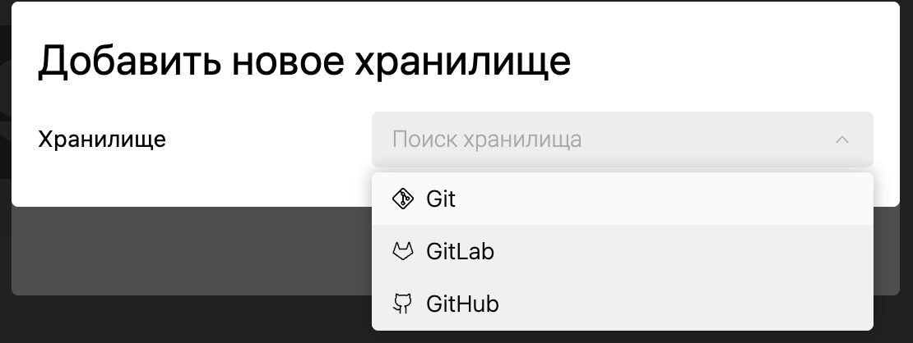
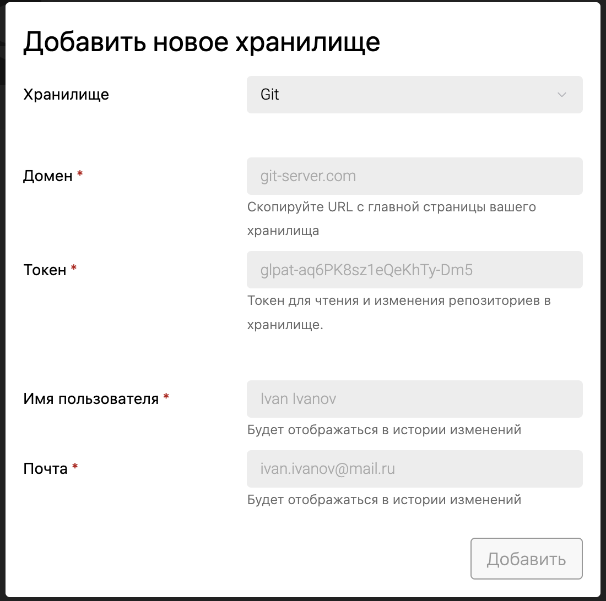
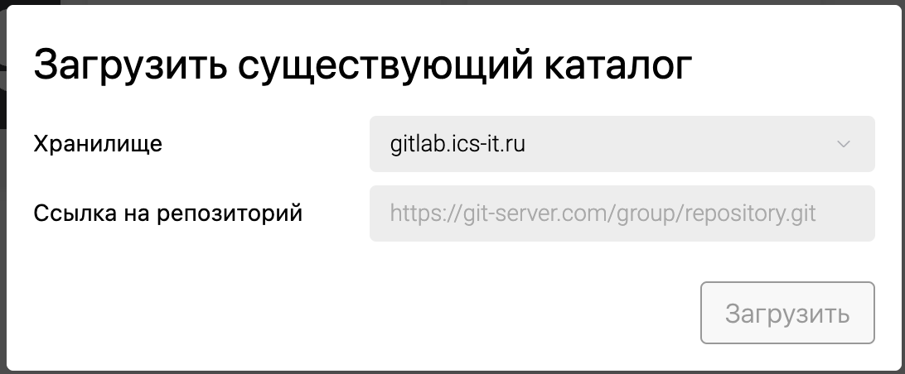

Сейчас у нас нет возможность подключать универсальное гит хранилище, хотелось бы иметь эту возможность.

## Критерии

-  Добавиться новый хранилища `Git`.

   

-  При клике на обычный Git у формы добавления этого хранилища будет как на фото ниже (только название будет просто Git). Имя пользователя и почту нужно будет заполнять вручную.

   -  Есть проверка на корректность почты. *Тултип*: Указана некорректная почта

      

-  Проверку на существование/доступ при клонировании не будет.

   -  Если что-то пойдет не так при клонировании, выйдет ошибка:

   -  *Заголовок*: Не удалось загрузить каталог

   -  *Текст*: Проверьте, существует ли репозиторий {repository url}. А также, убедитесь, что у вас есть права на его редактирование.

-  Созданный через грамакс новый каталог

   -  Нельзя будет привязать к универсальному git хранилищу, потому что мы не знаем к какой группе его нужно будет привязать

   -  Он будет виден в списке хранилищ, но задизейблен с тултипом. “Нельзя привязать к этому хранилищу“

-  Загрузить существующий каталог можно будет только по полной ссылке.

   -  Вместо выпадающего списка репозиторием будет будет поле ввода, куда нужно будет вставить/написать ссылку до репозитория. Валидация:

      

      -  Домен в хранилище и ссылке репозитория должны совпадать. *Тултип*: Домен у хранилища и репозитория не совпадает.

      -  Ссылка должна быть с https. *Тултип*: Необходимо указать ссылку формата 'https://git-server.com/group/repository.git'

      -  Ссылка может быть только поддерживаемого формата `https://github.com/group-name/rep-name.git`. *Тултип*: Необходимо указать ссылку формата 'https://git-server.com/group/repository.git'

         -  Примеры URL-ов до репоизториев в разных git серверах:

            -  GitHub: `https://github.com/group-name/rep-name.git`

            -  GitLab: `https://gitlab.com/group-name/rep-name.git`

            -  Bitbucket: `https://bitbucket.org/group-name/rep-name.git`

            -  Gitea: `https://gitea.com/group-name/rep-name.git`

            -  Gogs: `https://try.gogs.io/group-name/rep-name.git`

            -  Gitverse: `https://gitverse.ru/gitverse/roadmap`

## Тесты

-  Не надо писать, т.к. в рамках этой юс не добавляется никакой новой логики.  Добавляется только новый ui.

## Следующий этап

-  Не можем пока поддерживать

   -  Gitverse: `https://gitverse.ru/sc/gitverse/roadmap.git`

   -  Azure Repos: `https://dev.azure.com/group-name/rep-name/_git/rep-name`

   -  AWS CodeCommit: `https://git-codecommit.us-east-1.amazonaws.com/v1/repos/rep-name`

   -  Phabricator: `https://phabricator.yourdomain.com/diffusion/CAT4/rep-name.git`

-  Надо добавить возможность указывать http ссылку до репозитория

-  Надо сделать переключалку для гитлаба, чтобы была кнопка входа в gitlab.com

-  Добавить возможность привязывать созданные через грамакс каталоги в хранилище

   Не понял проблемы. В моём понимании - у хранилище есть домен и ещё имя. Например, чел хочет привязать к своему gitea хранилищу:

   1. Нажимает кнопку “Подключить хранилище”

   2. Добавляет новое хранилище:

      1. Домен - `gitea.custom-domen.com`

      2. Название - `Gitea`

      3. Вставляет свой токен, имя пользователя, почту

   3. Добавляется новое хранилище с названием Gitea (оно должно быть универсальным наверное)

   4. Чел выбирает Gitea

   5. Появляется новое поле снизу “Ссылка на удалённый репозиторий”

   6. Чел создаёт в gitea репозиторий. Копирует в новое поле сслыку на только что созданный репозиторий (под капотом это будет `git remote add {ссылка на gitea}`

   7. Каталог пушится в удалённый репозиторий

## 