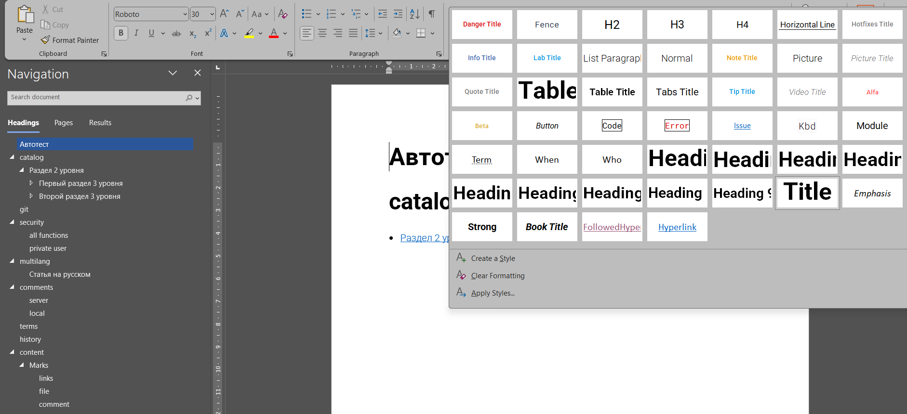
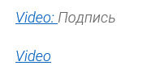
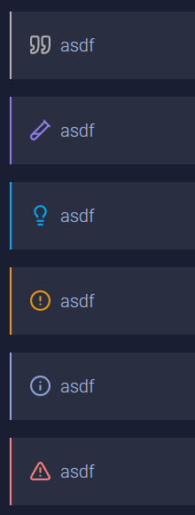
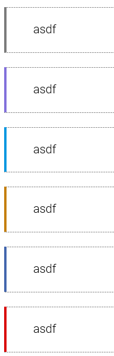
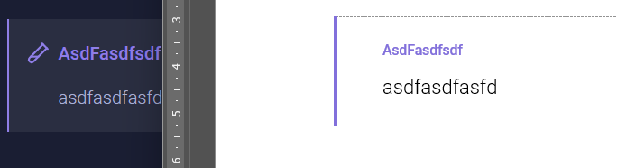

В ворде у заголовков есть нумерация, в приложении этих заголовков нет. Хотелось бы чтобы было все одинаково. Также в ворде было оглавление в начала документа, если экспортируешь раздел или каталог, что тоже не соответствует ввиду в приложении.

## Критерии

-  Избавились от оглавления и сделали весь упор ориентации по `навигации`, которая вызывается через `ctrl + f`. *Это приводит к следующим изменениям:*

-  При экспорте раздела, самый корневой экспортируемый раздел (То есть тот раздел, который мы экспортируем) имеет стиль `Title`, все дочерние стили имеют стили по возврастающей `Heading 1` `Heading 2`, `Heading 3` и т.д. Если в какой-то момент окажется, что в gramax будет бóльшая вложенность статей, то заголовки этих статей будут иметь стиль `Heading 10`, который наследует `Normal` (поэтому они не будут показываться в навигации), однако внешне они не будут отличаться от `Heading 9`,

-  Больше нет нумерации у заголовков статей

-  При экспорте каталога, его название  имеет стиль `Title`, размер которого `30пт`

   -  Исправлен баг, при котором `жирный заголовок` становится просто `жирным` (размер уменьшается). Теперь он также становиться жирным, но размер не меняется.

-  Все дочерние статьи имеют стили на `1.5пт` меньше родительского. Т.е. каждый родительский



---

*  

   

*  

   Было

*  

   Стало

---

*  

   Title

*  28

*  30

---

*  

   Heading 1

*  24\.5

*  28\.5

---

*  

   Heading 2

*  24\.5

*  27

---

*  

   Heading 9

*  24\.5

*  16\.5

---

*  

   H4

*  13\.5

*  12



-  Прошлые `Heading 2`, `Heading 3`, `Heading 4`, теперь  `H2` `H3` `H4` соответственно и  наследуются от стиля `Normal`, чтобы не показываться в навигации

-  Убрано двоеточие после видео, если у видео нет названия

-  Цвета заметок в word адаптированы к новым цветам в [comment:FYN63]редакторе[/comment]

:::note 

фывафыва

:::

:::lab 

фывафыва

:::



---

*  

   

*  

   



-  Теперь как и в редакторе, экспортируемые заголовки заметок `НЕ заглавными буквами`

## Тесты

-  в этой юс тестов не будет