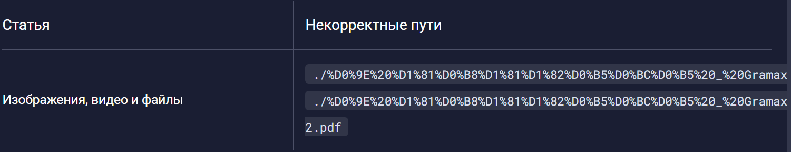
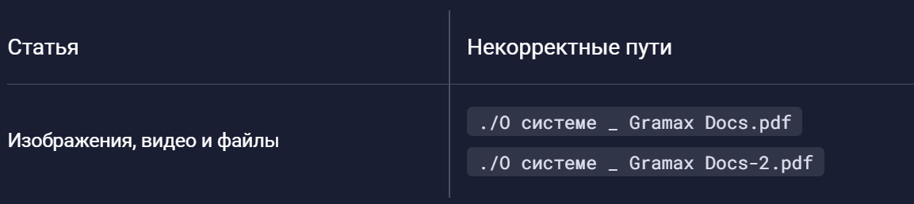

Сейчас в `resourceManager` нет нормальной обработки не английских символов (знаки препинания, русские символы) и поэтому возвращаются url-encoded строчки, что выглядит некрасиво и иногда ломает логику. И из-за этого могут происходить ситуации типа таких

## Критерии приемки

-  `resourceManager` возвращает строки состоящие из не английских символов в нормальном виде, а не в виде url-encoded строки

## Оценка

-  Анализ - ?

-  Реализация - ?