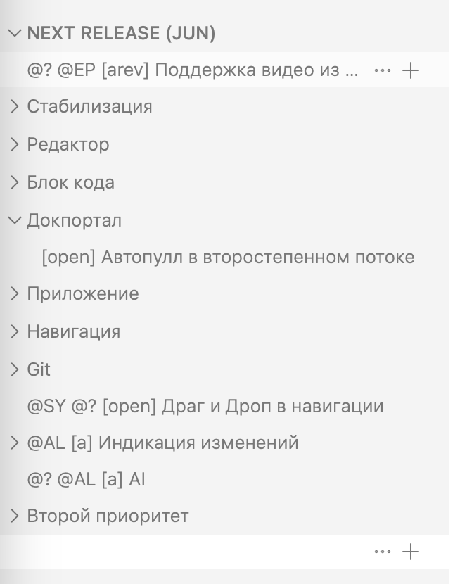
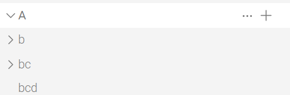
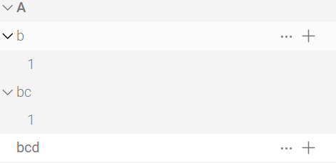

Когда жму добавить новый узел в Next Release, то раскрывается узел докпортал.

У него урл new-article, когда переименовал в другой урл, то перестал раскрываться.

## Проблема

Когда url статьи/раздела, на который ты переходишь, содержит url другого раздела, этот другой раздел раскрывается

Например при клике на статью `a/bcd`, раскрываются `a/b`и `a/bc`

\*сделано для того, чтобы, когда переходишь по `.../new-catalog/a/b/...`, раскрывались все родительские разделы `.../new-catalog`, `.../new-catalog/a` и так далее

## Критерии

не должно быть ложного раскрытия