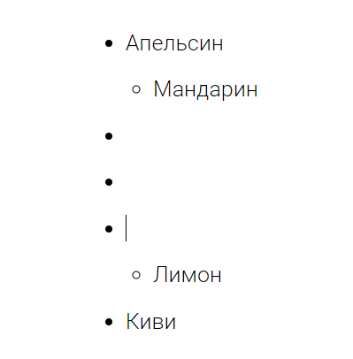
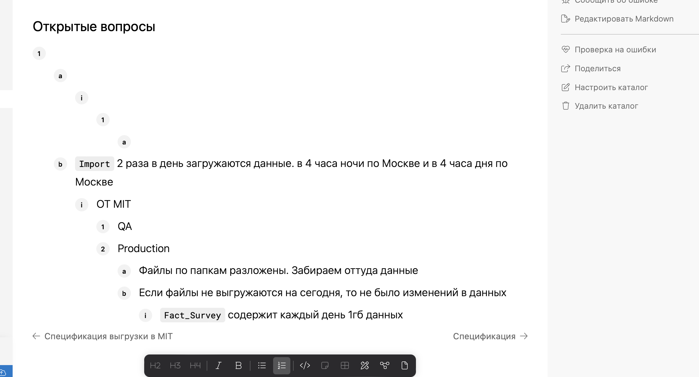

Сейчас возникают баги в работе списков, хотелось бы их исправить и покрыть е2е тестами.

### Проблемы

1. Баг по нажатию на Enter:

   <https://support.ics-it.ru/issue/GXS-1672>

   

   не разрывает список, если нажимать Enter дальше, то он создает пустые маркеры;

2. Неправильная логика удаления пустого пункта на `Enter`

   <https://support.ics-it.ru/issue/GXS-1178>

   Сейчас в gramax если в пункте списка поставить пробел и нажать `Enter`, тогда пункт удалиться, но контент в виде пробела в нем был. Word, Notion и Paper не удаляют элемент списка если в нем есть пробел.

3. Баг при удалении списка:

   <https://support.ics-it.ru/issue/GXS-1693>

   

## **Критерии**

-  хоткей [cmd:Enter] работает по логике, описанной ниже в списке;

-  удаление пунктов списка на [cmd:Backspace] не оставляет пустые пункты идущие друг за другом.

### Технические детали

1. хоткеи списков покрыты е2е тестами.

### Список хоткеев

-  **Enter:**

   -  когда курсор установлен в конец пункта и в нем есть контент, тогда - создается новый пункт в текущем списке (уровень вложенности определяет список);

   -  когда курсор установлен в контент или до него, тогда - создается новый пункт и туда  переноситься контент находящийся после курсора;

   -  когда курсор установлен в начало пункта и нету контента, тогда - понижается уровень.

      -  Если пункт списка находится на верхнем уровне - пункт удаляется.

   -  когда выделено несколько пунктов, тогда - выполняется стандартное поведение ProseMirror и браузера.

-  **Backspace:**

   -  когда курсор установлен в начало пункта, тогда - удалит текущий пункт списка перенеся контент.

      -  Если над пунктом был вышестоящий пункт, тогда - контент перемещается в выше стоящий пункт.

      -  Если пункт был на верхнем уровне, тогда контент из пункта устанавливается над списком.

   -  когда курсор установлен в контент, тогда - стандартное поведение;

### Оценка

-  Анализ: 4ч;

-  Реализация: 24 часа;

-  Тесты: 2ч.