Сейчас у нас нет отдельного элемента для отображения ошибок и предупреждений. Необходимо разработать элемент и разместить в местах, где у нас выводятся ошибки и предупреждения.

## Критерии

-  Компонент оформлен в соответствии с [макетом.](https://www.figma.com/design/4ed1wT5Q53Q2ngP4Oex7f8/Gramax-приложение?node-id=1524-25143&t=wuGxbIAUozmomwmY-0)

-  Отступы между элементами внутри компонента соответствуют системе, а не макету.

-  По умолчанию сворачиваемый блок свёрнут

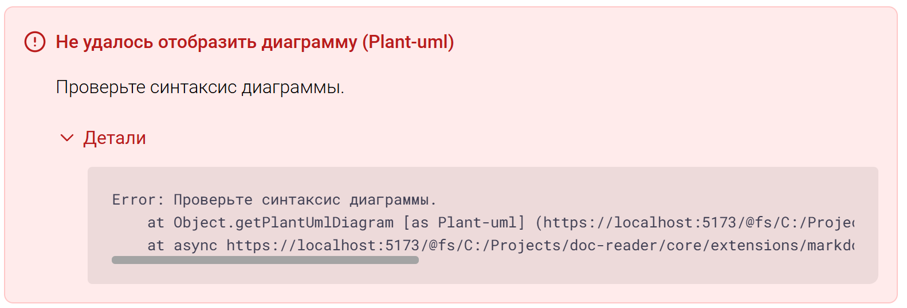

### Где используется компонент

1. При предупреждении о ненайденной статье выводиться предупреждение, состоящие из:

   -  Заголовок статьи: Проверьте, что ссылка указана верно.

   -  Код блок: *Путь к статье*

   -  Поведение: Нельзя удалить, нет фокуса

      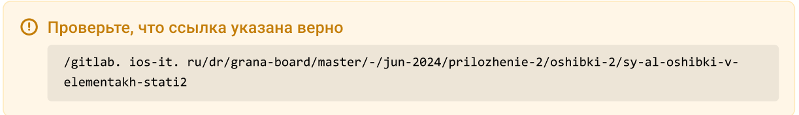

2. При предупреждении о ненайденном каталоге выводиться предупреждение, состоящее из:

   -  Заголовок : Проверьте, что ссылка указана верно.

   -  Код блок: *Путь к каталогу*

   -  Поведение: Нельзя удалить, нет фокуса

      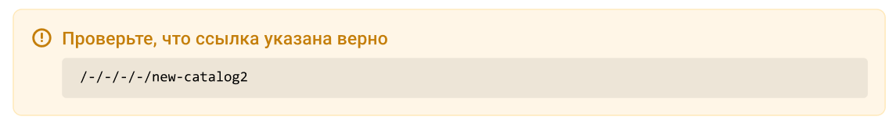

3. На месте ошибки о невозможности обработать Markdown-конструкцию выводиться ошибка, состоящая из:

   -  Заголовок: Gramax не смог обработать Markdown-конструкцию в файле статьи

   -  Текст:  Исправьте ошибку или удалите эту конструкцию в «Редактировать Markdown».

   -  Поведение: Нельзя удалить, нет фокуса

      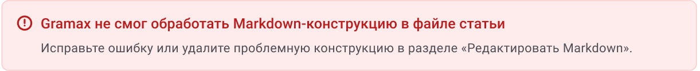

4. На месте ошибки при отрисовке сниппета  выводиться ошибка, состоящая из:

   -  Заголовок: Не удалось отобразить сниппет

   -  Текст: Проверьте, правильно ли указан путь, а также есть ли файл со сниппетом в репозитории.

   -  Поведение: Можно удалить, есть фокус

      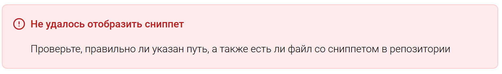

5. На месте ошибки при отрисовке диаграммы выводиться ошибка, состоящая из:

   -  Заголовок: Не удалось отобразить диаграмму (*Тип диаграммы*)

   -  Текст при ошибке:

      -  Ошибка пути: Проверьте, правильно ли указан путь, а также есть ли файл в репозитории.

      -  Синтаксис: Проверьте синтаксис диаграммы.

      -  Интернет: Проверьте подключение к интернету.

      -  Неподдерживаемые случаи: Что-то пошло не так.

   -  Сворачиваемый блок:

      -  Заголовок: Детали

      -  Код блок: *Техническая информация*

   -  Поведение: Можно удалить, есть фокус

   -  Отображается для диаграмм: PlantUML, Mermaid, diagrams.net, C4, TS-Диаграммы, ER-Диаграммы, DB-Диаграммы

      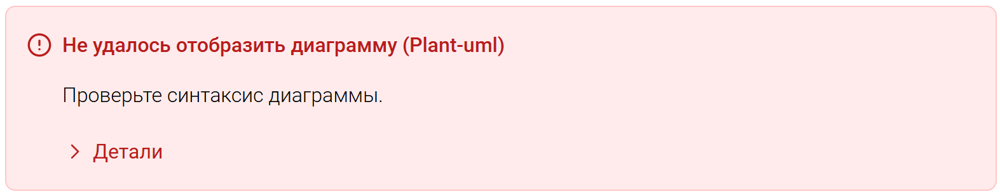

6. На месте ошибки при отрисовке DB-Таблицы выводится  ошибка, состоящая из:

   -  Заголовок: Не удалось отобразить таблицу (Db-table)

   -  Текст: *Текст ошибки*

   -  Сворачиваемый блок:

      -  Заголовок: Детали

      -  Код блок: *Техническая информация*

   -  Поведение: Можно удалить, есть фокус(квадратный)

      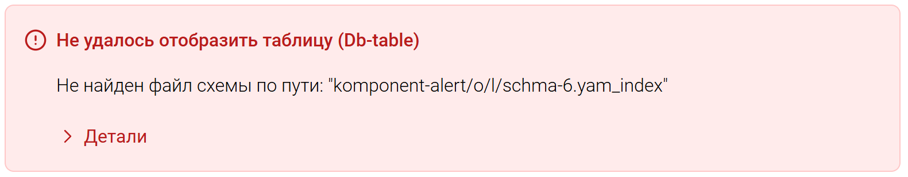

7. При вводе некорректной ссылки в элементе «Видео», окошко видео заменяется ошибкой:

   -  Заголовок: Не удалось отобразить видео

   -  Текст: Проверьте, что видео по ссылке существует и доступно для всех в интернете.

   -  Поведение: Можно удалить, есть фокус

      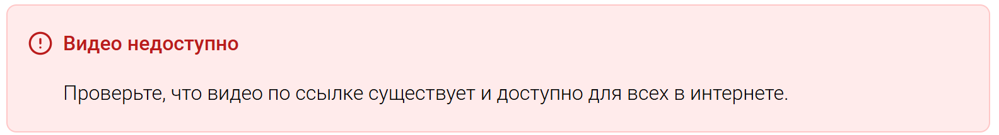

8. Если грамакс не может найти изображение, по указанному пути, то на месте изображения появляется ошибка:

   -  Заголовок: Не удалось отобразить изображение

   -  Текст: Проверьте, что оно существует и путь указан верно.

   -  Поведение: Можно удалить, есть фокус

      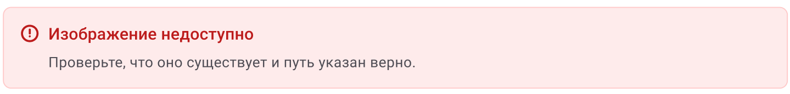

9. Про возникновении ошибки во время рендеринга статьи, вместо статьи появляется ошибка:

   -  Заголовок: Не удалось отобразить статью

   -  Текст: *Текст ошибки*.

   -  Сворачиваемый блок:

      -  Заголовок: «Детали»

      -  Код блок: *Техническая информация*

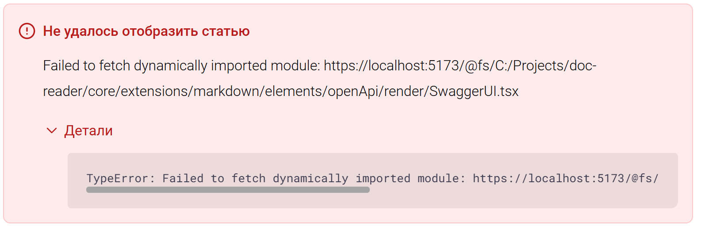

### Цвета компонента

#### Компонент предупреждения в светлой теме:

Граница: #FFE9BA

Фон: #FFF6E7

Иконка и Заголовок: #C47E0A + weight 500

Иконка и Заголовок сворачиваемого блока: #C47E0A + weght 400

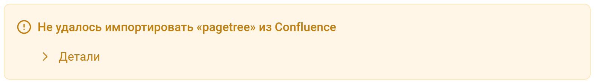

#### Компонент ошибки в светлой теме:

Граница: #FFC9C9

Фон: #FEEBEB

Иконка и Заголовок: #BC1C1C + weight 500

Иконка и Заголовок сворачиваемого блока: #BC1C1C + weight 400

#### Компонент предупреждения в тёмной теме:

Граница: #764C06

Фон: #FFFFFF 7%

Иконка и Заголовок: #EC980C + weight 500

Иконка и Заголовок сворачиваемого блока: #EC980C + weight 400

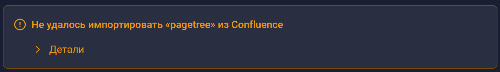

#### Компонент ошибки в тёмной теме:

Граница: #9D3713

Фон: #FFFFFF 7%

Иконка и Заголовок: #FF8080+ weight 500

Иконка и Заголовок сворачиваемого блока: #FF8080 + weight 400

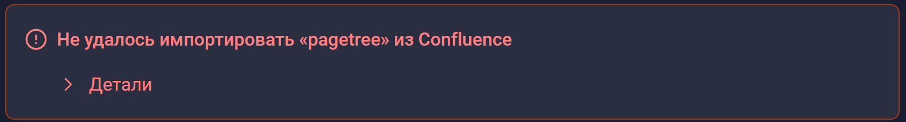

## Замечания

-  В предупреждении при импорте:

   -  в таблице в блоке кода нет прокрутки(Мак).

      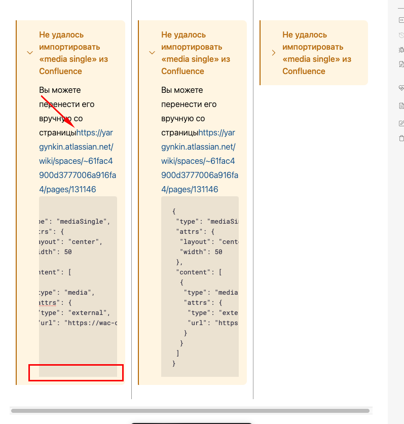

      )