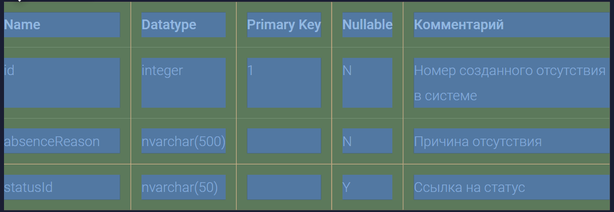
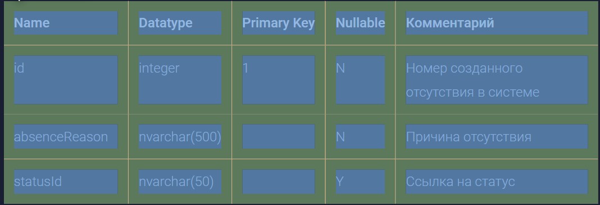

Сейчас в режиме редактирования и в режиме просмотра статьи у ячеек таблиц разные отступы:

-  в режиме просмотра: ячейки с левого/правого края без отступа слева/справа соответственно

-  в режиме редактирования: все ячейки имеют отступ 12px со всех сторон

## Критерии

-  во всех таблицах все ячейки имеют отступ 12px со всех сторон

## Исходные заявки

-  [Неправильный отступ у ячейки таблицы в режиме просмотра : GXS-1889 (](https://support.ics-it.ru/issue/GXS-1889)[ics-it.ru](http://ics-it.ru)[)](https://support.ics-it.ru/issue/GXS-1889)