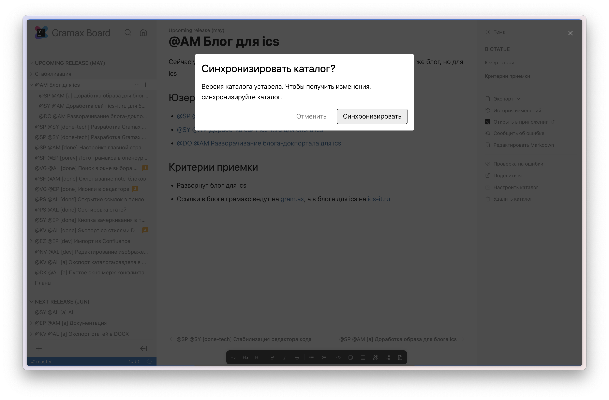

Когда открываю каталог по ссылке, то Грамакс постоянно выдаёт модальное окно, если у меня каталог неактуальный.

В этом нет необходимости, если у меня нет незакоммиченных или незапушенных изменений.

### Критерии приёмки

-  Когда открываю по ссылке каталог, в котором у меня нет незакоммиченных или незапушенных изменений, то Грамакс сразу подтягивает изменения с сервера и не показывает модальное окно.

-  Т.к. на это требуется время, то вместо текста статьи должна крутиться наша крутилка. И в синей панели тоже.

-  Если у меня есть незакоммиченные или незапушенные изменения, то выводится стандартное модальное окно “Синхронизировать каталог?”.