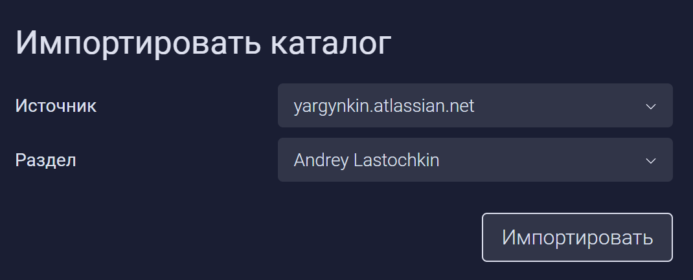
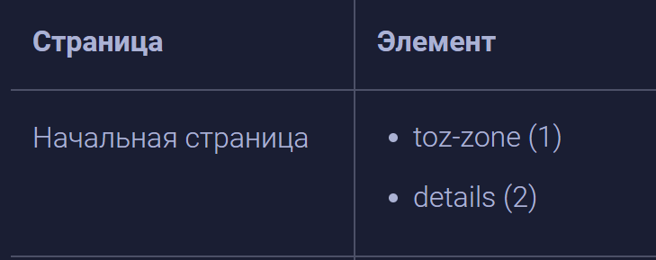
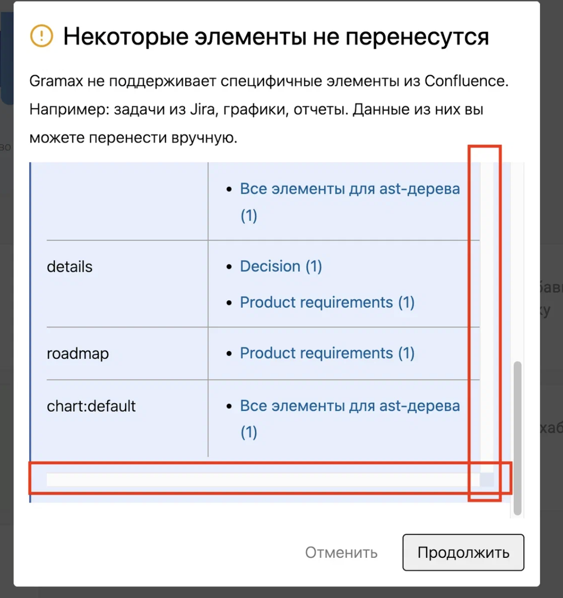
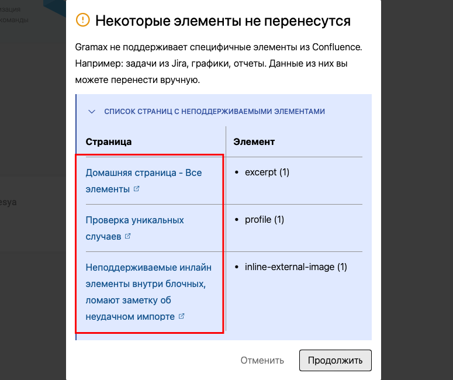

Сейчас пользователь не может узнать, какие элементы не перенесутся из Confluence, до начала импорта. Необходимо добавить диалоговое окно для неподдерживаемых элементов.

## Критерии

-  Когда  пользователь нажимает кнопку Импортировать, происходит предварительная проверка. Gramax ищет, в каких статьях есть неподдерживаемый контент.

   

-  Во время проверки  пользователю выводится окно загрузки.

   [image:./ez-ep-a-modalnoe-okno-dlya-nepodderzhivaemykh-3.png:::0,0,98.7941,99.262:]

-  Если в разделе нет неподдерживаемых элементов, сразу выполняется импорт.

-  Если есть неподдерживаемый элемент, выводится окно-предупреждение. Оно содержит:

   -  Заголовок: Некоторые элементы не перенесутся

   -  Текст: Gramax не поддерживает специфичные элементы из Confluence. Например: задачи из Jira, графики, отчеты. Данные из них вы можете перенести вручную.

   -  Заметку, в свёрнутом состоянии «СПИСОК СТРАНИЦ С НЕПОДДЕРЖИВАЕМЫМИ ЭЛЕМЕНТАМИ». В развёрнутом состоянии в заметке отображается таблица со скроллом.

      -  Таблица с колонками «Страница» и «Элемент».

         -  Страница -- страница содержащая неподдерживаемые элементы. Название страницы является ссылкой на страницу в Confluence.

         -  Элемент -- перечислены все неподдерживаемые элементы на странице. Указаны программные названия элементов (например, jirachart, pagetreesearch и т.п.). Также указано, сколько таких элементов элементов на странице. Например: Название элемента (2).

   

   -  Кнопки действия:

      -  Продолжить -- по клику происходит импорт.

      -  Отменить -- по клику  пользователя возвращает к окну “Импортировать каталог”, состояние( выбранным им ранее источник и раздел) не сохраняется.

## Замечания

\[x\] Лишние полосы прокрутки

-  \[x\]В десктопе ссылки не открываются.

   
