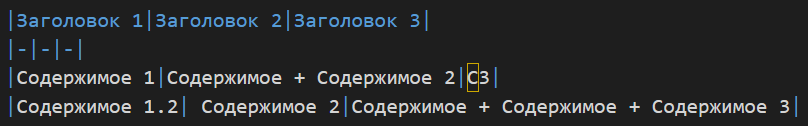
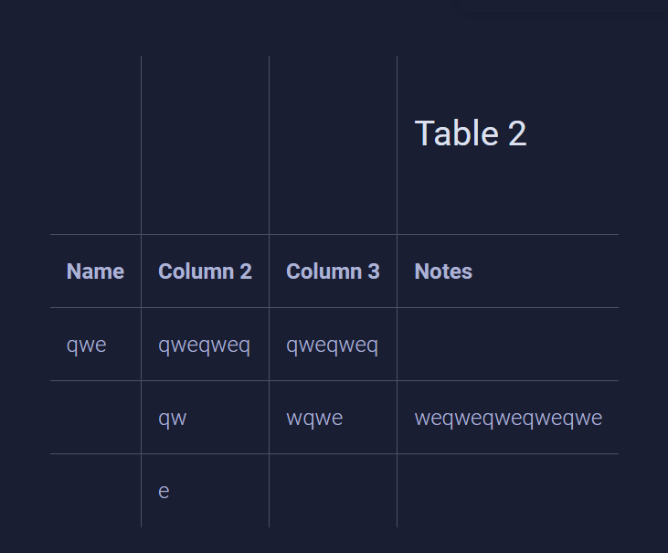
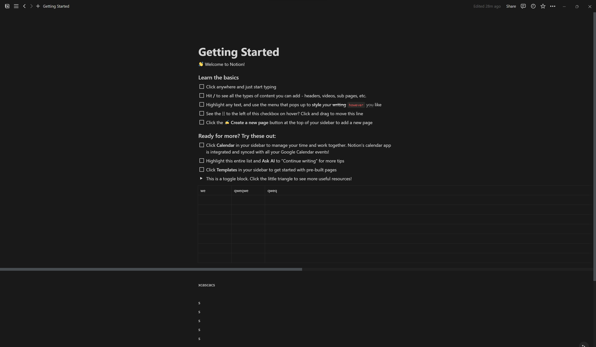
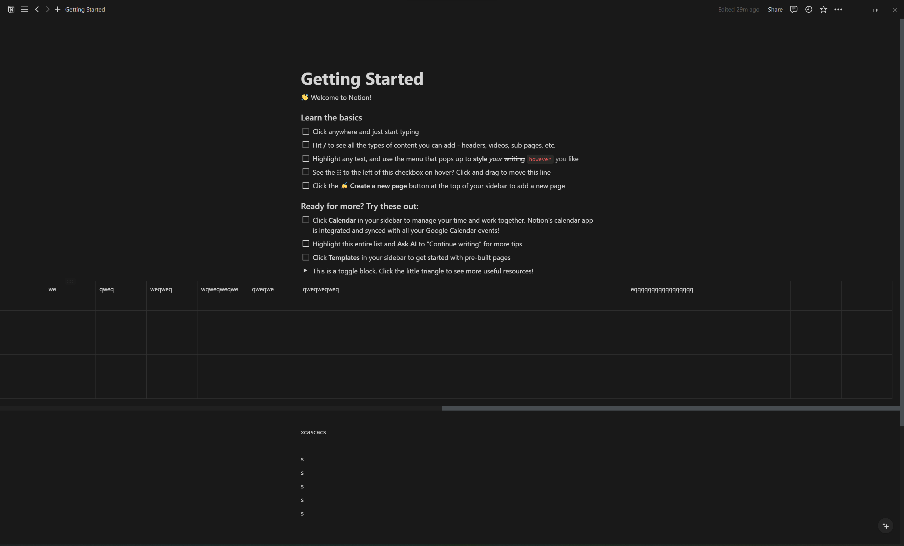
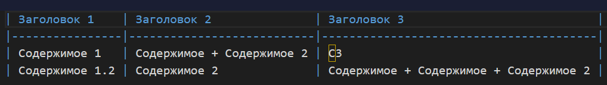
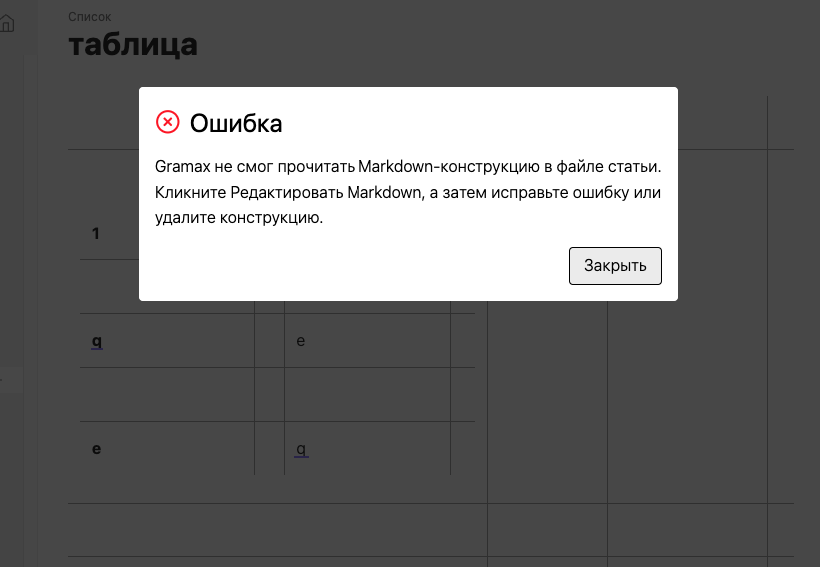
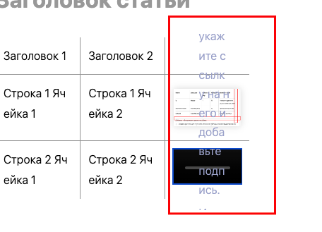

Сейчас при работе с таблицами есть проблемы:

-  Не могу добавить строку вверх или слева, находясь в верхней левой ячейке.

-  Не вставляются таблицы из десктопного экселя в сафари.

-  Неудобно работать с широкими таблицами (остаются большие поля).

-  Ширина у столбцов слишком маленькая

-  Таблицы, у которыx изменилось только содержимое парсятся в markdown некрасиво

   

## Критерии

-  Есть возможность добавить строку вверх/столбец слева, находясь в верхней левой ячейке.

   -  При добавлении такой строки/столбца, если была строка/столбец заголовка, только что добавленна строка/столбец становятся строкой/столбцом заголовка.

-  Таблицы вставляются нормально из десктопного экселя в браузере сафари и в приложении на macOS.

   :::hotfixes:true Исследование вставки из различных приложений

   Вставляется нормально: **google, yandex, notion,** **Microsoft Excel Online, desct**, **Zoho Sheet**, **ONLYOFFICE**, **Confluence**,

   -  **mdt** первые два столбца у таблиц с выбором строк пустые и столбцы с флажками

      

   -  **Airtable**

      

   -  **EtherCalc**

      

   -  **Coda**

      

   -  **ClickUp**

      

   -  **SmartSuite**

      

   :::

-  Большая таблица (та которая не влезает в ширину статьи) может занимать 90% ширины экрана, но при этом есть отступ слева, чтобы она была выровнена по левому краю в начальном положении прокрутки.

   :::hotfixes:true Как сделано в Notion

   при крайнем левом положении скрола

   

   при крайнем правом положении скрол

   

   :::

-  Минимальная ширина у столбцов -- `45px`

-  Таблицы, у которыx изменялось только содержимое парсятся в markdown подобным образом

   

## Оценка

-  Анализ -- 2ч

-  Реализация --

## Исходные заявки

-  <https://support.ics-it.ru/issue/GXS-339>

-  <https://support.ics-it.ru/issue/GXS-949>

## Замечания

1. При вставке в таблицу текста с комментарием появляется ошибка

   

   (Никата вроде исправил)

2. Ошибка при вставке таблицу в таблицу

   

   исправиться в [Баги с таблицами : GXS-1860 (](https://support.ics-it.ru/issue/GXS-1860)[ics-it.ru](http://ics-it.ru)[)](https://support.ics-it.ru/issue/GXS-1860)

3. Скопированная таблица из эксель после обновления страницы ломается [таблица.mov](./%D1%82%D0%B0%D0%B1%D0%BB%D0%B8%D1%86%D0%B0)

   Исправиться в [Баги с таблицами : GXS-1860 (](https://support.ics-it.ru/issue/GXS-1860)[ics-it.ru](http://ics-it.ru)[)](https://support.ics-it.ru/issue/GXS-1860)

4. Кнопку удаления таблицы назвать просто “Удалить“

   Исправлено

5. Можно добавлять видео в таблицу

   

   Исправиться в [Баги с таблицами : GXS-1860 (](https://support.ics-it.ru/issue/GXS-1860)[ics-it.ru](http://ics-it.ru)[)](https://support.ics-it.ru/issue/GXS-1860)