1. \[x\]В конце статьи можно добавить элемент «Вкладки», но работать будет одна вкладка. При клике на «Добавить вкладку» ничего не происходит.

2. \[-\]Добавила текст в конце статьи. Создала перед ним 2 вкладки. Удалила текст в конце статьи. Попыталась удалить «Вкладка 2» - все поехало.

   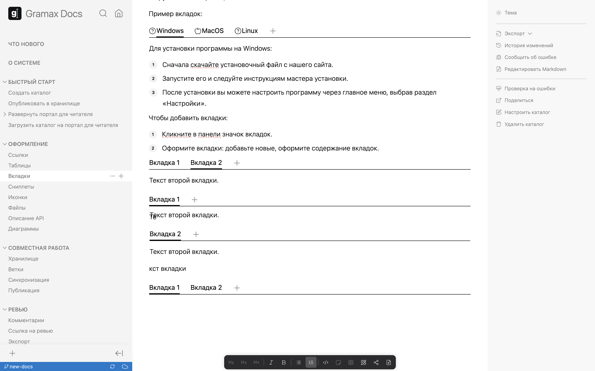

3. \[x\]В дев режиме не создаются новые вкладки, но заголовок редактируется нормально.

   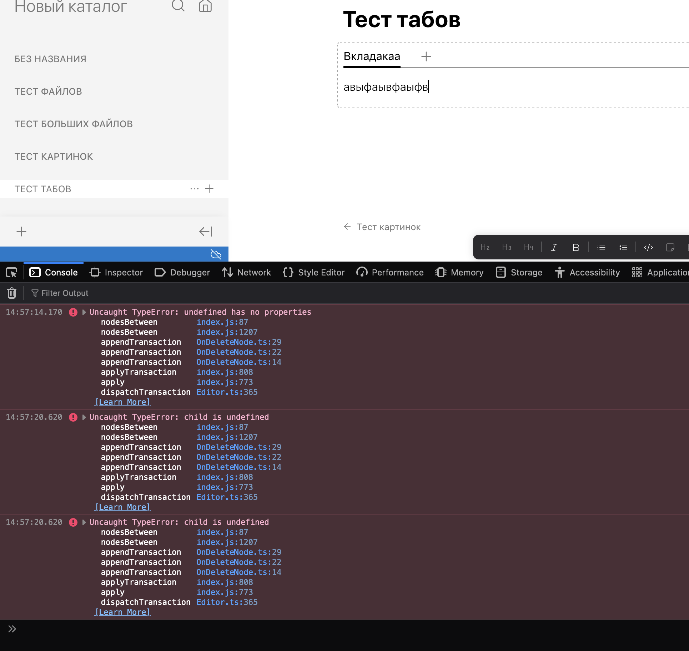

4. \[x\]На [dev.gram.ax](http://dev.gram.ax) заголовок первого таба выдаёт ошибку, при создании каждого нового parse error

   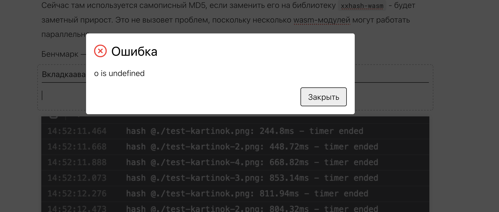

5. \[x\]Переименовать “Табы” во “Вкладки”.

6. \[x\]Из вкладки не выходит по двум энтерам. Надо, чтобы выходило.

7. \[x\]В блоке кода при нажатии enter вылетает из этого блока:

   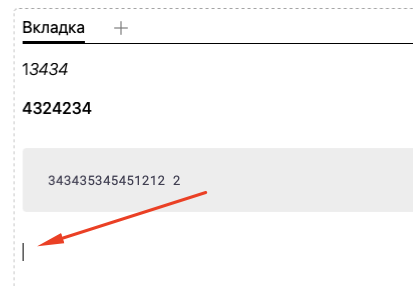

8. \[x\]Ошибка при очистке названия вкладки.

   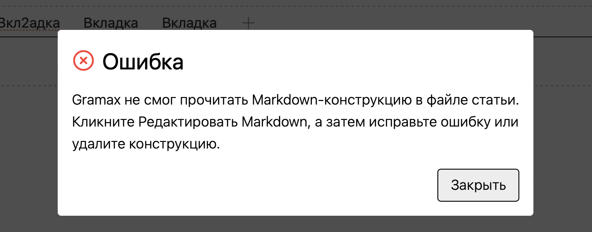

9. \[x\]Удаляю вкладку, после обновления страницы появляется обратно.

   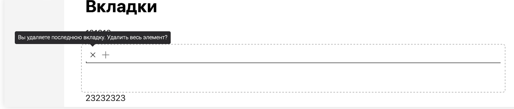

10. \[-\]При добавлении новой вкладки курсор не находится внутри вкладки

    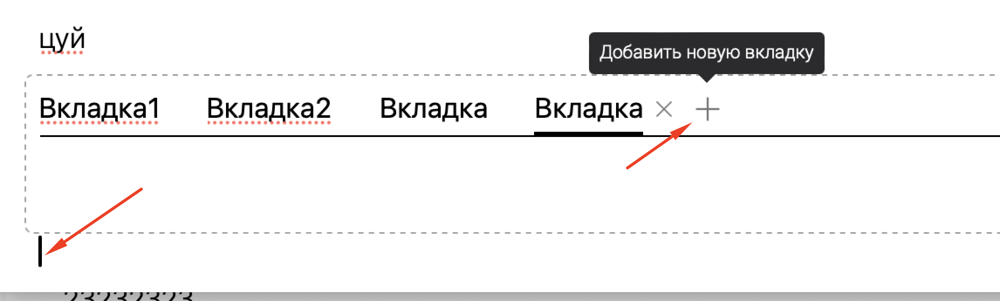

11. \[-\]Видео не приостанавливается при переходе на другую вкладку.[вкладки.mov](./%D0%B2%D0%BA%D0%BB%D0%B0%D0%B4%D0%BA%D0%B8)

12. \[-\]После обновления страницы картинка пропала.[вкладки.mov](./%D0%B2%D0%BA%D0%BB%D0%B0%D0%B4%D0%BA%D0%B8)

13. \[-\]Если удалить все данные с вкладки, то вылетает ошибка.

    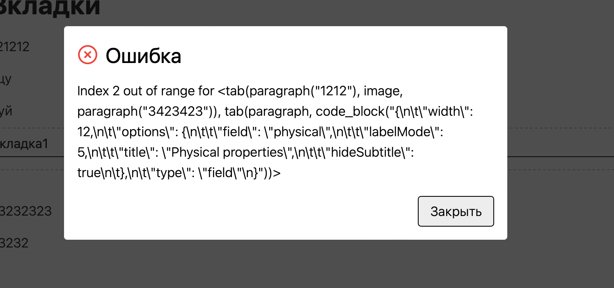

    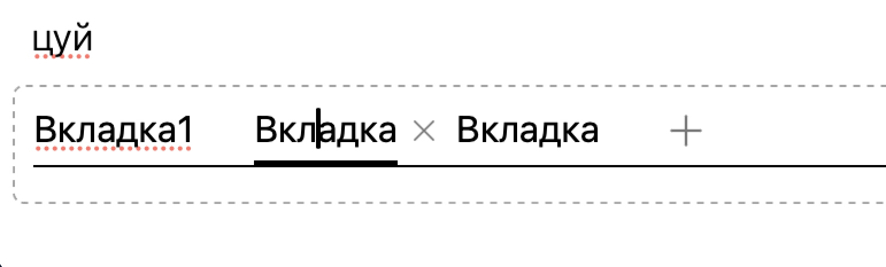

    -  После этой ошибки всё ломается -- вкладки не удаляются и не добавляются больше.

14. \[x\]Ошибка при удалении диаграмм с вкладок.

    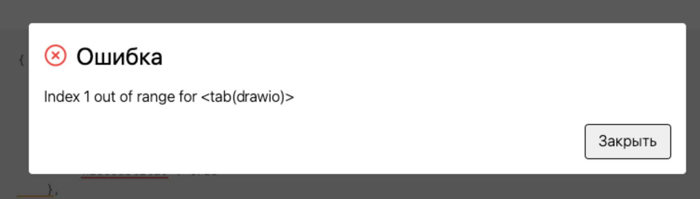

15. \[x\]Создала несколько вкладок, в первой добавила блок кода.  Поставила курсор в начало блока и нажала Delete -- ошибка. [табы.mov](./%D1%82%D0%B0%D0%B1%D1%8B)

16. \[x\]При вставке скопированного текста с комментарием вылетает ошибка

    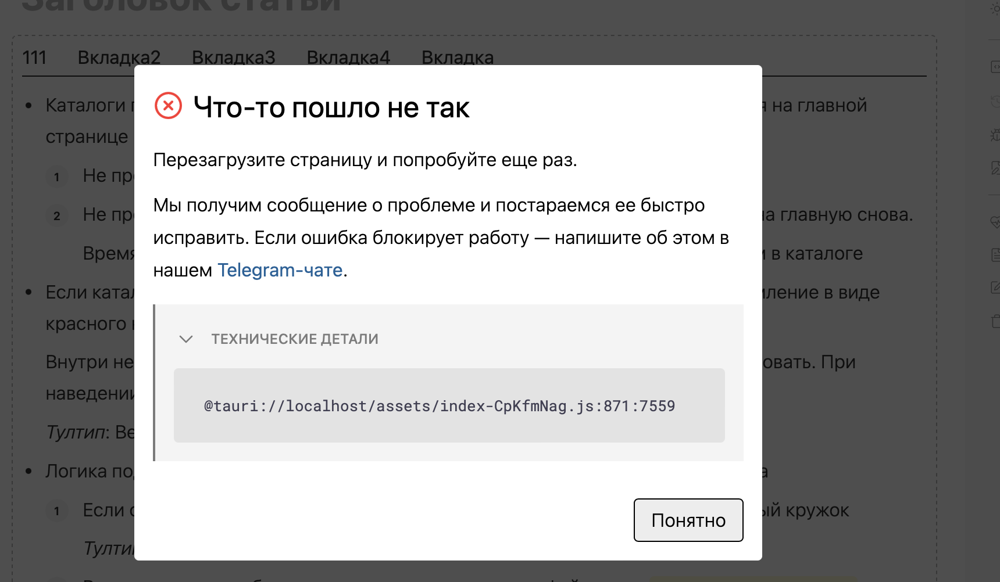
