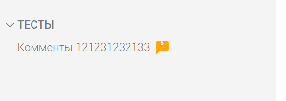
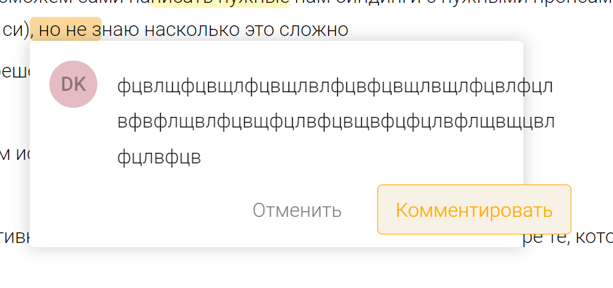
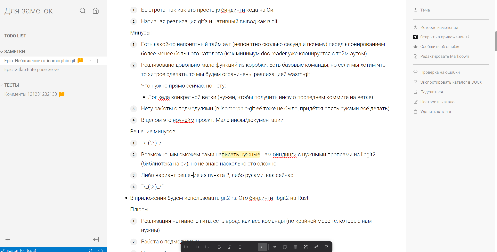
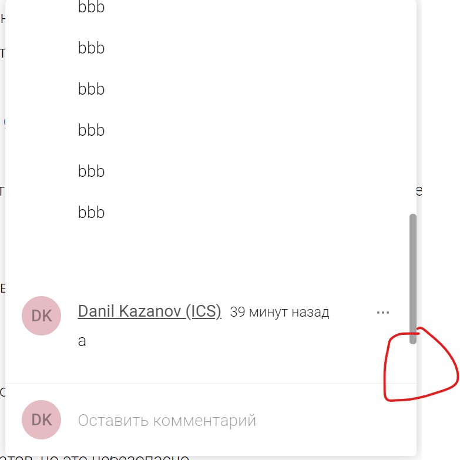
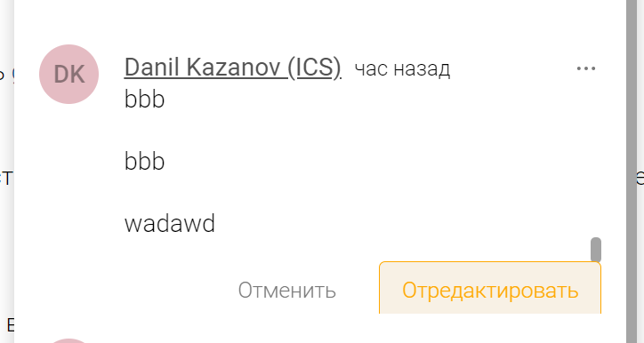
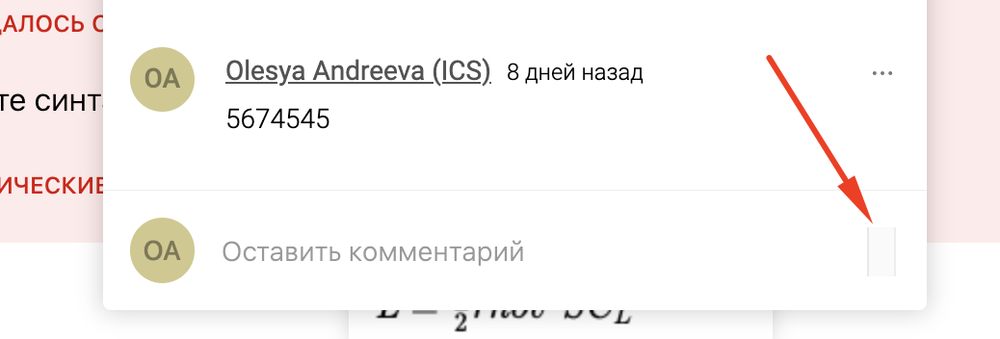
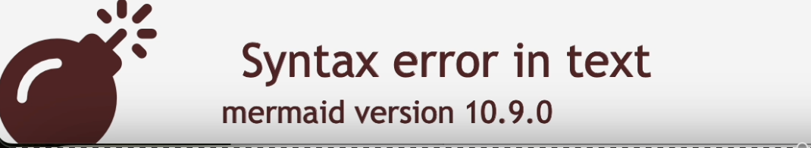
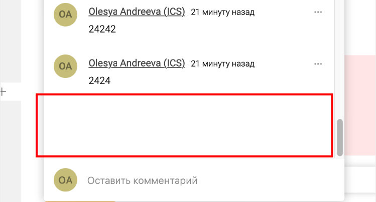
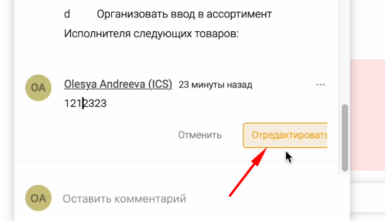

-  Периодически пропадает возможность оставлять комментарий, когда выделяю другие элементы или просто некие невидимые символы в строке. Должен мочь комментировать всё.

-  Когда пишу длинный комментарий в длинной статье, то на фоне дёргается текст статьи.

-  Нельзя оставить комментарий к одному символу.

-  Когда ставлю курсор на закомментрованную строку, то курсор становится в 2 раза больше, чем обычно.

-  Когда начинаю писать, то становится 2 строки в окне комментария.

-  Не работает копипаст комментариев.

-  Заливка комментария не должна подсвечивать пробелы в начале и в конце комментируемой фразы. Иначе комментарии на разные фразу могут сливать визуально в один комментарий и пользователь пропустит второй комментарий.

-  Когда оставили длинный комментарий, то при написании ответа на комментарий, первый коммент всегда скроллится вниз, когда пишешь текст. Скролл в первом комментарии должен быть зафиксирован.

-  Когда выделяю текст комментария и курсором вылезаю за рамки окна комментария, то окно комментария закрывается. Окно комментария не должно закрываться от движения курсора.

## Критерии:

1. Можно оставлять комментарий на большинство элементов. Исключение: компоненты, которые имеют всплывающие окна. [icon:check]

2. Возможность оставить комментарий к одному символу. [icon:check]

3. При открытии окна комментария не скроллится вниз. [icon:check]

4. Сделать открытие окна не по фокусу, а по клику на комментарий, и закрытие по клику вне окна.  [icon:check]

5. Сделать плавное появление контейнера с кнопками. [icon:check]

6. Избавиться от конфликта при мерже файлов комментариев. [icon:check]

7. Уменьшить окно комментариев в размерах. [icon:check]

#### Замечания:

1. Съехали цифры в счетчике в левой навигации

   

2. Длинный текст всё ломает

   

3. Если комментарию не хватает места снизу, он прыгом скроллит до середины статьи:

   До того, как открыл комментарий:

   

   После:

   

   (Это поведение было и раньше, скорее всего из-за того, что при открытии происходит фокус в инпут и он резко скроллит всю страницу)

4. Может при добавлении нового ответа к комментарию скроллить вниз? Иначе как-то не понятно, что то добавил новый ответ.

   

5. При редактировании ответа кнопка “Отредактировать” отрезается

   

6. Появляются ошибки при вставке скопированного текста с комментарием из браузера в приложение и наоборот

7. \[x\]Лишняя полоса

   

8. При добавлении комментариев в приложении появляется лишний блок [файл.mov](./%D1%8D%D0%BA%D1%80%D0%B0%D0%BD%D0%9B%D0%BE%D0%BC%D0%B0%D0%B5%D1%82%D1%81%D1%8F)

   

9. Иногда при удалении ответа остается пустое место, не скроллится.

   

10. Кнопка “Отредактировать“ обрезается

    
